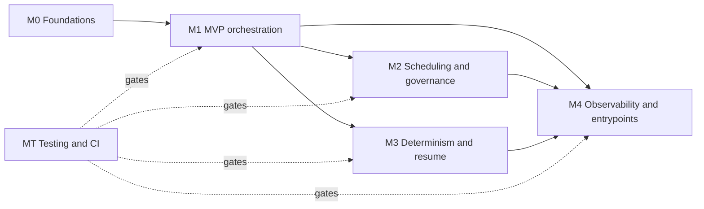

# Dynamic Workflows for OpenAI Codex — Implementation Plan

Execution plan derived from `docs/dynamic-workflows-spec.md`. It turns the spec into a sequenced, dependency-aware task graph of **73 base issue-ready tickets** across five milestones plus a cross-cutting testing track, followed by six rescue/delivery stages discovered during implementation. Each milestone is independently shippable behind `Feature::Workflow` (Experimental). This plan is the *execution* view; the spec remains the design-of-record. Section anchors (§N) refer to the spec.

> GitHub issues created from this plan reuse these ticket ids. Milestones M0–M1 are broken out as individual issues; M2–M4 and the testing track are tracked as epics whose bodies checklist their tickets.

> **Rescue reconciliation (2026-07-19).** The ticket catalog preserves the original issue IDs and normative staged work, but the reconciled descriptions below supersede any older issue body or commit note. In the active rescue tree M0–M4, UAT-1 through UAT-10, and Codex Control-UAT are implemented and focused gates are green. Two independent judges returned PASS for primary-workhorse readiness with no demonstrated Codex P0/P1 blocker. That readiness result is distinct from exhaustive Claude parity: required matched rows remain `Missing`, so exact parity signoff stays open. The implementation uses a run-local hierarchical `WorkflowBudget` in `core-workflows`, cancellation-safe ancestor reservations, and a monotonic runtime mirror; it does **not** add getters to, reconfigure, or reset the session-wide `RolloutBudget`. Detached `workflow watch` polls bounded atomic `progress.json`. UI timing uses only event-supplied integer Unix seconds. The live monitor alone is not a complete control or release exit. The canonical comprehensive `/goal` and remaining delivery/platform gates live in `.github/DYNAMIC_WORKFLOWS_RESCUE.md`.

## 1. Milestones

| Milestone | Goal | Tickets | Exit gate |
|---|---|---|---|
| **M0 · Foundations** | Feature flag, meta parser, saved-workflow loader, and a host tool that runs a workflow body once — the skeleton everything hangs off. | 7 | `core-workflows` loader unit tests pass (static-parse-without-eval; layered-root dedupe). *(Determinism-shim tests deferred to M3.)* |
| **M1 · MVP orchestration** | The 80/20 value core: `agent()` fan-out via the registering spawn path, `parallel()`, structured output, opts overrides, and the concurrency scheduler. | 13 | Integration test asserts registering-spawn side effects + opts overrides; **UAT-1-min, UAT-3, UAT-4** pass on the hermetic fixture lane. |
| **M2 · Scheduling & governance** | `pipeline()` no-barrier scheduling, the run-local hierarchical hard-ceiling governor, and one-level `workflow()` nesting. | 13 | Prelude barrier/no-barrier + reservation/cancellation + nested-budget + depth-guard units pass; **UAT-5, UAT-7, UAT-10** pass. |
| **M3 · Determinism & resume** | The highest-novelty milestone: isolate determinism harden + `(prompt,opts)` journal + prefix-replay resume. | 14 | Determinism-shim units (Date/Math/WeakRef/FinalizationRegistry throw, setTimeout removed) + journal/replay determinism pass; **UAT-6** passes. Resume ships experimental until green. |
| **M4 · Observability, controls, entrypoints & isolation** | Live monitor, agent event-stream swap, per-agent session grouping, worktree isolation, all entrypoints, completion notification, and staged workflow controls. | 20 + control stages | **UAT-1, UAT-2, UAT-8, UAT-9**, Control-UAT, completion notification, and NDJSON twins pass; no control-parity claim while a required control row is missing. |
| **MT · Testing & CI** | Fixture model, snapshots, hermetic UAT, and human-style built-TUI/Claude parity evidence. | 6 + release evidence | Deterministic gates green; every §12 capability tied to a test; fresh fixed-size PTY driver and separate judge reports preserved. |

## 2. Milestone dependency graph

M1 is the fan-out hinge: M2, M3, and M4 all build on the `agent()`/spawn path from M1 and can then proceed **largely in parallel** (they touch disjoint areas — scheduling/budget vs journal/resume vs protocol/TUI). The testing track (MT) is continuous and supplies each milestone's exit gate.

## 3. Critical path

The longest chain to full parity runs through determinism/resume and the monitor UI:

`P0-meta-parser → P0-host-tool-skeleton → P1-agentcall-runtime-types → P1-agent-callback → P1-cellactor-spawn-dispatch → P3-resume-prefix-loop → P3-uat-resume-gate` (resume); and in parallel `… → P4-run-phase-model → P4-progress-cell → P4-agent-swap-wiring → P4-monitor-focus-stack → P4-uat-monitor-swap-isolation` (observability).

**Historical starting point:** `P0-feature-flag`, `P0-meta-parser`, `P3-journal-crate-types`, `P2-budget-getters`, `P2-budget-resettable-cell`. The two budget IDs now name the reconciled run-local meter and reservation work below; do not revive their original shared-`RolloutBudget` design.

## 4. Risk-gated items (spec §13)

- **R1 (determinism/resume):** resume tickets (`P3-resume-prefix-loop`, `P3-resume-entry`, `P3-uat-resume-gate`) stay **experimental** until the harden (`P3-determinism-native-deletes`, `P3-determinism-prelude`) **and** journal/replay (`P3-journal-*`) are green. R2 (isolate concurrency) is resolved — no ticket needed.
- **R3 (budget admission races):** `P2-budget-pre-admission-throw` must land with `P2-budget-resettable-cell`'s reconciled cancellation-safe reservation work and nested ancestor tests.
- **R4 (worktree isolation):** `P4-worktree-*` is an independent workstream with crash-safe cleanup; gate on UAT-8 before enabling by default.
- **R7 (hash stability):** `P3-journal-key` must ship `key_algo_version` + canonical serialization.

### Rescue completion stages

These stages complete the parity and delivery work discovered during rescue. Keep each stage independently reviewable and below the repository's change-size limit; do not fold selected-agent control into the run-stop patch.

Live tracking: `R4-script-save` is [#61](https://github.com/kedarkolluri/codex/issues/61), `R4-run-stop` is [#62](https://github.com/kedarkolluri/codex/issues/62), `R4-pause-resume` is [#63](https://github.com/kedarkolluri/codex/issues/63), `R4-agent-controls` is [#64](https://github.com/kedarkolluri/codex/issues/64), and `R4-control-uat` is [#65](https://github.com/kedarkolluri/codex/issues/65).

| id | stage | depends on | exit evidence |
|---|---|---|---|
| `R4-run-stop` | Per-run cancellation state machine; experimental `workflow/stop`; explicit TUI selection + confirmation | detached task ownership, lifecycle cleanup | targeted/duplicate/wrong-thread/completion-race tests; stopped-state snapshots; built-TUI stop pass |
| `R4-script-save` | Exact bounded `script.js` writer in `core-workflows`; experimental `workflow/save`; TUI scope/name/conflict/overwrite flow | durable run script | traversal/symlink/reparse/non-regular/race/mode tests; exact-byte comparison; built-TUI save pass |
| `R4-pause-resume` | Durable `Paused`/`Stopped` statuses, owner thread, bounded private invocation data, pause API, new-run resume lineage | run stop, replay, lease/recovery | pause/stop/completion races; restart recovery; args/source/hash checks; built-TUI pause/resume pass |
| `R4-agent-controls` | `(runId,nodeId)` selected-agent stop/skip and bounded retry | stable run-level controls, journal/budget semantics | retry cap, deterministic ordinal/null behavior, budget/worktree cleanup, selected-row snapshots |
| `R4-control-uat` | Control-UAT across Codex and installed Claude | all control stages | separate no-context drivers/judges, exact version/hash/frames/actions, explicit divergence ledger |
| `R5-delivery` | Stable→experimental→stable schemas, targeted/full authorized tests, platform lanes, rescue snapshot/bundle, semantic rebase rehearsal | all implementation/UAT | Linux + external x86_64 Windows/Wine + macOS evidence or exact blockers; verified rescue ref/bundle; isolated upstream-main rebase report |

## 5. Ticket catalog

| id | title | M | effort | depends on |
|---|---|---|---|---|
| `P0-feature-flag` | Declare Feature::Workflow flag (Experimental) + WorkflowConfigToml | M0 | S | — |
| `P0-feature-transitive-deps` | Enforce Feature::Workflow transitively requires CodeMode + MultiAgentV2 | M0 | S | `P0-feature-flag` |
| `P0-meta-parser` | Static meta manifest parser (export const meta) without body eval | M0 | S | — |
| `P0-core-workflows-loader` | New core-workflows crate: layered-root discovery + static meta parse + dedupe | M0 | M | `P0-meta-parser` |
| `P0-workflows-watcher` | WorkflowsChanged file-watcher + ServerNotification wiring | M0 | S | `P0-core-workflows-loader` |
| `P0-host-tool-skeleton` | Workflow host tool skeleton: parse meta, run body once in the isolate | M0 | M | `P0-meta-parser`, `P0-feature-flag` |
| `P0-phase-log-globals` | phase()/log() isolate globals + RuntimeEvent::Phase/WorkflowLog | M0 | S | `P0-host-tool-skeleton` |
| `P1-agentcall-runtime-types` | Add RuntimeEvent::AgentCall, AgentCallOpts, and RuntimeState.next_agent_ordinal | M1 | S | `P0-host-tool-skeleton` |
| `P1-agent-callback` | agent() global + agent_callback with synchronous ordinal stamping | M1 | M | `P1-agentcall-runtime-types` |
| `P1-spawn-await-helper` | Shared spawn-and-await-final-message helper over the registering AgentControl spawn path | M1 | L | `P0-feature-flag` |
| `P1-cellactor-spawn-dispatch` | cell_actor SpawnAgent dispatch: route AgentCall to the spawn helper and resolve the promise | M1 | M | `P1-agent-callback`, `P1-agentcall-runtime-types`, `P1-spawn-await-helper` |
| `P1-opts-model-effort` | agent() opts.model + opts.effort overrides | M1 | S | `P1-spawn-await-helper` |
| `P1-opts-agenttype` | agent() opts.agentType role override | M1 | S | `P1-spawn-await-helper` |
| `P1-deterministic-nickname` | Deterministic subagent nickname preference (bypass rand::rng()) | M1 | S | `P1-spawn-await-helper` |
| `P1-opts-schema` | agent() opts.schema structured output (final_output_json_schema + jsonschema recheck) | M1 | S | `P1-spawn-await-helper`, `P1-cellactor-spawn-dispatch` |
| `P1-parallel-prelude` | parallel() JS prelude + 4096 item cap | M1 | S | `P1-agent-callback` |
| `P1-scheduler-semaphore` | WorkflowScheduler concurrency cap min(16, cores-2) with queued excess | M1 | M | `P1-cellactor-spawn-dispatch` |
| `P1-lifetime-cap` | Per-run lifetime cap of ~1000 agents (monotonic, never decrements) | M1 | S | `P1-scheduler-semaphore` |
| `P1-args-injection` | args injection + workflow.runId global | M1 | S | `P0-host-tool-skeleton` |
| `P1-uat-gates` | Phase-1 UAT gates: UAT-1-min, UAT-3, UAT-4 on the hermetic fixture lane | M1 | M | `P1-cellactor-spawn-dispatch`, `P1-spawn-await-helper`, `P1-opts-schema`, `P1-opts-model-effort`, `P1-opts-agenttype`, `P1-parallel-prelude` |
| `P2-pipeline-prelude` | pipeline() no-barrier JS prelude — per-item promise chains + 4096 item cap | M2 | M | `P1-agent-callback`, `P1-scheduler-semaphore` |
| `P2-budget-getters` | Run-local WorkflowBudget snapshots and effective views | M2 | S | — |
| `P2-budget-output-weight-config` | Nested workflow budget hierarchy and output-token accounting | M2 | S | `P1-args-injection`, `P2-budget-getters` |
| `P2-budget-resettable-cell` | Cancellation-safe ancestor reservations (supersedes shared-budget reset) | M2 | M | `P2-budget-getters` |
| `P2-budget-js-global` | budget JS global — native-backed live mirror | M2 | S | `P0-host-tool-skeleton`, `P2-budget-getters`, `P2-budget-output-weight-config` |
| `P2-budget-pre-admission-throw` | agent() atomic reservation and WorkflowBudgetExceeded rejection | M2 | S | `P1-cellactor-spawn-dispatch`, `P2-budget-resettable-cell`, `P2-budget-js-global` |
| `P2-budget-thread-goal-reporting` | Workflow progress budget snapshots, separate from session ThreadGoal | M2 | S | `P2-budget-getters` |
| `P2-workflow-global-callback` | workflow() JS global + RuntimeEvent::WorkflowCall bridge | M2 | M | `P1-agent-callback`, `P0-host-tool-skeleton` |
| `P2-workflow-registry-reenter` | workflow() host handler — registry load + re-enter runtime nested one level | M2 | L | `P0-core-workflows-loader`, `P0-host-tool-skeleton`, `P2-workflow-global-callback`, `P2-budget-output-weight-config` |
| `P2-workflow-depth-guard` | workflow() one-level depth guard via exceeds_thread_spawn_depth_limit | M2 | S | `P2-workflow-registry-reenter` |
| `P2-test-pipeline-uat7` | Tests — pipeline() no-barrier unit + UAT-7 | M2 | S | `P2-pipeline-prelude` |
| `P2-test-budget-uat5` | Tests — hierarchy/reservation/replay ceiling + UAT-5 | M2 | S | `P2-budget-pre-admission-throw`, `P2-budget-thread-goal-reporting`, `P2-budget-resettable-cell` |
| `P2-test-workflow-nesting-uat10` | Tests — workflow() depth-guard unit + UAT-10 | M2 | S | `P2-workflow-registry-reenter`, `P2-workflow-depth-guard` |
| `P3-determinism-native-deletes` | Harden workflow isolate globals: delete WeakRef/FinalizationRegistry, remove setTimeout/setInterval/clearTimeout | M3 | S | `P0-host-tool-skeleton` |
| `P3-determinism-prelude` | Frozen JS determinism prelude: throw on Date.now/argless Date/Math.random, preserve arg'd Date/Date.parse | M3 | M | `P0-host-tool-skeleton`, `P1-args-injection`, `P3-determinism-native-deletes` |
| `P3-journal-crate-types` | New codex-workflow-journal crate: JournalLine envelope + WorkflowRunMeta types | M3 | S | — |
| `P3-journal-key` | key.rs: blake3 canonical (prompt,opts) cache key with key_algo_version, label/phase excluded | M3 | S | `P3-journal-crate-types` |
| `P3-journal-recorder` | JournalRecorder: append-only journal.jsonl reusing RolloutRecorder machinery | M3 | M | `P3-journal-crate-types`, `P3-storage-layout` |
| `P3-journal-replay-read` | replay.rs: tail-first prefix read of journal.jsonl via ReverseJsonlScanner + hash validation | M3 | M | `P3-journal-crate-types`, `P3-journal-key` |
| `P3-storage-layout` | Private run layout: journal, exact script, canonical invocation, metadata, bounded progress, and lease | M3 | S | `P1-args-injection` |
| `P3-workflow-runs-index` | workflow_runs SQLite discovery index (codex-state migration + model) | M3 | M | `P3-storage-layout` |
| `P3-runtime-replay-state` | RuntimeState: replay cache + budget accumulator + replay_active flag | M3 | S | `P1-agentcall-runtime-types` |
| `P3-journal-write-integration` | Wire JournalRecorder into SpawnAgent dispatch: record agent_call/phase/log with child_thread_id + rollout_path | M3 | M | `P1-cellactor-spawn-dispatch`, `P0-phase-log-globals`, `P3-journal-recorder`, `P3-journal-key`, `P3-runtime-replay-state` |
| `P3-budget-readd` | WorkflowBudget replay-spend path for deterministic resume | M3 | S | `P2-budget-getters` |
| `P3-resume-prefix-loop` | agent_callback prefix-replay branch: ordinal+key match, resolve-from-cache, budget re-add, first-divergence-goes-live | M3 | L | `P1-agentcall-runtime-types`, `P1-cellactor-spawn-dispatch`, `P3-runtime-replay-state`, `P3-journal-replay-read`, `P3-journal-key`, `P3-budget-readd`, `P3-journal-write-integration` |
| `P3-resume-entry` | resumeFromRunId entrypoint: load prior journal, validate, mint fresh runId, seed replay state | M3 | M | `P0-host-tool-skeleton`, `P3-journal-replay-read`, `P3-storage-layout`, `P3-runtime-replay-state`, `P3-workflow-runs-index` |
| `P3-uat-resume-gate` | UAT-6 + journal/replay determinism tests (Phase 3 exit gate) | M3 | M | `P3-resume-prefix-loop`, `P3-resume-entry`, `P3-budget-readd`, `P3-journal-write-integration`, `P3-determinism-prelude`, `P3-determinism-native-deletes` |
| `P4-protocol-eventmsg` | Add Workflow* EventMsg cluster to protocol.rs | M4 | M | — |
| `P4-appserver-workflow-notifs` | Add workflow/* ServerNotification payloads (v2/workflow.rs) + WorkflowsChanged | M4 | M | `P4-protocol-eventmsg` |
| `P4-bespoke-event-mapping` | Map Workflow* EventMsg -> workflow/* ServerNotification in bespoke_event_handling.rs | M4 | S | `P4-protocol-eventmsg`, `P4-appserver-workflow-notifs` |
| `P4-run-phase-model` | Build the workflow run/phase model (seed meta.phases + map thread-spawn descendants + phase() cursor) | M4 | L | `P4-protocol-eventmsg`, `P1-cellactor-spawn-dispatch` |
| `P4-progress-cell` | WorkflowProgressCell persistent in-place-redrawn monitor panel | M4 | L | `P4-run-phase-model`, `P4-bespoke-event-mapping` |
| `P4-tui-notification-arms` | Wire workflow/* notification match arms in tui/src/app.rs | M4 | S | `P4-appserver-workflow-notifs`, `P4-progress-cell` |
| `P4-cli-run` | codex workflow run <name|path> --args <json> [--resume <runId>] (Subcommand::Workflow scaffold) | M4 | M | `P0-host-tool-skeleton`, `P0-core-workflows-loader` |
| `P4-cli-watch` | codex workflow watch <runId> [--json] detached live monitor | M4 | L | `P4-cli-run`, `P4-run-phase-model`, `P4-appserver-workflow-notifs`, `P3-journal-recorder` |
| `P4-cli-ls` | codex workflow ls (list runs from workflow_runs discovery index) | M4 | S | `P4-cli-run`, `P4-state-workflow-runs-index` |
| `P4-agent-swap-wiring` | Feature 2: wire workflow subagent threads into select_agent_thread / open_agent_picker | M4 | M | `P4-run-phase-model`, `P4-progress-cell` |
| `P4-monitor-focus-stack` | Feature 2: monitor-scoped focus stack for background-run swap-back | M4 | M | `P4-agent-swap-wiring`, `P4-progress-cell` |
| `P4-state-workflow-runs-index` | workflow_runs SQLite discovery index (codex-state migration) | M4 | S | `P0-feature-flag` |
| `P4-run-agents-projection` | Feature 3: run_agents projection rebuilt from authoritative journal bindings | M4 | M | `P1-cellactor-spawn-dispatch`, `P3-journal-recorder` |
| `P4-spawn-cwd-override` | Worktree isolation: SpawnAgentOptions.cwd + respect override in runtime overrides | M4 | M | `P1-cellactor-spawn-dispatch` |
| `P4-worktree-guard` | Worktree isolation: git-utils worktree_add + WorktreeGuard lifecycle | M4 | L | — |
| `P4-worktree-scheduler` | Worktree isolation: deterministic worktree alloc + workspace_roots in scheduler | M4 | M | `P4-spawn-cwd-override`, `P4-worktree-guard`, `P1-scheduler-semaphore` |
| `P4-workflow-run-tool` | Entrypoint: model-callable workflow_run tool | M4 | M | `P0-host-tool-skeleton`, `P1-cellactor-spawn-dispatch` |
| `P4-slash-workflow` | Entrypoint: SlashCommand::Workflow variant + runtime picker + monitor open | M4 | M | `P0-core-workflows-loader`, `P4-progress-cell` |
| `P4-completion-notification` | Notification::WorkflowComplete completion notification | M4 | S | `P4-appserver-workflow-notifs` |
| `P4-uat-monitor-swap-isolation` | Phase 4 UAT gates: UAT-1, UAT-2, UAT-8, UAT-9 + NDJSON twins | M4 | L | `P4-progress-cell`, `P4-agent-swap-wiring`, `P4-monitor-focus-stack`, `P4-worktree-scheduler`, `P4-workflow-run-tool`, `P4-slash-workflow`, `P4-cli-run`, `P4-cli-watch`, `P4-completion-notification` |
| `X-fixture-model-harness` | Deterministic fixture-model integration harness | MT | M | `P1-cellactor-spawn-dispatch` |
| `X-tui-snapshot-harness` | TUI snapshot test scaffolding for workflow cells | MT | M | `P4-progress-cell` |
| `X-agent-driven-uat-harness` | Agent-driven TUI UAT harness (three planes) | MT | L | `X-fixture-model-harness`, `P4-cli-watch` |
| `X-uat-scenarios` | Author the 10 UAT scenarios (UAT-1..UAT-10) | MT | L | `X-agent-driven-uat-harness` |
| `X-ci-lanes` | Hermetic CI gates + built-TUI release evidence lane | MT | M | `X-agent-driven-uat-harness` |
| `X-per-phase-gates` | Wire per-phase UAT exit gates | MT | S | `X-ci-lanes` |

## 6. Ticket detail

### M0 · Foundations

#### `P0-feature-flag` — Declare Feature::Workflow flag (Experimental) + WorkflowConfigToml  ·  _S_
**Depends on:** none  ·  **Spec:** `§9 Config / feature gating`, `§11 Phase 0`, `§15 T0.1`, `§10 features/src/feature_configs.rs`, `codex-rs/features/src/lib.rs`, `codex-rs/features/src/feature_configs.rs`

Introduce the new workflow feature flag so the whole runtime can be gated behind it. Add a `Workflow` variant to the `Feature` enum (`features/src/lib.rs:83`), a matching `FeatureSpec` entry in `FEATURE_SPECS` with `key: "workflow"` and `stage: Stage::Experimental { name: .. }` (mirroring the `CodeMode`/`CodeModeOnly` entries at `lib.rs:854,866` but Experimental so it surfaces in the `/experimental` menu per §9, not UnderDevelopment), and `default_enabled: false`. Add a `WorkflowConfigToml { enabled: Option<bool>, .. }` struct in `feature_configs.rs` alongside `CodeModeConfigToml` (`:9`) and `MultiAgentV2ConfigToml` (`:34`) with the standard `#[serde(deny_unknown_fields)]` + `FeatureConfig` impl (`enabled`/`set_enabled`). Wire the toml struct into the config plumbing that maps keys to `FeatureConfig`s (follow how `code_mode`/`multi_agent_v2` are wired at `lib.rs:677-680`). This ticket only DECLARES the flag; transitive dependency enforcement is P0-feature-transitive-deps.

_Acceptance:_
- `Feature::Workflow` exists and `feature_for_key("workflow")` resolves to it
- `Feature::Workflow.stage()` is `Stage::Experimental` and `default_enabled()` is false
- A `[features.workflow] enabled = true` TOML block deserializes into `WorkflowConfigToml` and flips the flag on via `FeatureConfig`
- Unknown fields under `[features.workflow]` are rejected (`deny_unknown_fields`)
- Unit test in `features/src/tests.rs` asserts the flag is off by default and can be enabled

#### `P0-feature-transitive-deps` — Enforce Feature::Workflow transitively requires CodeMode + MultiAgentV2  ·  _S_
**Depends on:** `P0-feature-flag`  ·  **Spec:** `§9 Config / feature gating`, `§11 Phase 0`, `§15 T0.1`, `§13 R6`, `codex-rs/features/src/lib.rs:551 normalize_dependencies`, `codex-rs/core/src/config/mod.rs:1408`

A workflow bridges the code-mode isolate and the multi-agent runtime, so `Feature::Workflow` must not be usable without both `Feature::CodeMode` and `Feature::MultiAgentV2` (§13 R6 — a workflow inherits both flag matrices). Extend `Features::normalize_dependencies` (`features/src/lib.rs:551`, which already auto-enables `CodeMode` for `CodeModeOnly` at `:555-556`) to also pull in `CodeMode` + `MultiAgentV2` when `Workflow` is enabled, and add an explicit validation in config resolution (`core/src/config/mod.rs`, near the existing `features.enabled(Feature::MultiAgentV2)` checks at `:1408,1418`) that errors with an actionable message if `Workflow` is enabled but either dependency is explicitly disabled. Decide and document the semantics (auto-enable via normalize vs hard error on explicit conflict) so the two paths do not contradict — recommended: normalize silently enables the deps when unset, and config resolution errors only when a dep is explicitly turned off while Workflow is on.

_Acceptance:_
- Enabling `Workflow` with both deps unset auto-enables `CodeMode` and `MultiAgentV2` after `normalize_dependencies` (unit test mirroring `code_mode_only_requires_code_mode` at tests.rs:117)
- Enabling `Workflow` while explicitly disabling `CodeMode` or `MultiAgentV2` produces a config-resolution error whose message names the missing dependency and how to fix it
- A config with `Workflow` off is unaffected (no forced enable of the deps)
- Existing features unit tests remain green

#### `P0-meta-parser` — Static meta manifest parser (export const meta) without body eval  ·  _S_
**Depends on:** none  ·  **Spec:** `§1`, `§2 Authoring model`, `§11 Phase 0`, `§15 T0.2`, `§10 code-mode-protocol/src/description.rs`, `codex-rs/code-mode-protocol/src/description.rs:163 parse_exec_source`

Add a parser that extracts the leading `export const meta = {name, description, phases}` pure-object literal from a workflow script WITHOUT executing the body, mirroring `parse_exec_source` (`code-mode-protocol/src/description.rs:163`). Introduce a `ParsedWorkflowMeta { name: String, description: String, phases: Vec<String> }` (phases optional/defaulting to empty) and a `parse_workflow_meta(source: &str) -> Result<ParsedWorkflowMeta, String>`. The parser must accept only a static object literal (string/array literals, no computed expressions, template strings, function calls, or references) and reject a non-literal `meta` with a clear error — this is security-critical because discovery (P0-core-workflows-loader) parses meta from untrusted files and must never eval. `phases` seeds the monitor skeleton later (§9), so preserve declaration order. Keep the parser dependency-light (string/AST-lite scan like `parse_exec_source`, or a restricted JS-literal parse) — it must not construct or run a V8 isolate.

_Acceptance:_
- Valid `export const meta = {name:'x', description:'y', phases:['a','b']}` parses into `ParsedWorkflowMeta` with phases in declared order
- Missing `name`/`description` and a non-literal `meta` (e.g. `meta = fn()`, template string, spread, variable ref) are rejected with an actionable error
- Parsing never evaluates the script body (assert no isolate/eval is invoked — e.g. a body with side-effecting/throwing code still parses meta successfully)
- Fixtures for valid and invalid `meta` covered by unit tests in the `code-mode-protocol` crate

#### `P0-core-workflows-loader` — New core-workflows crate: layered-root discovery + static meta parse + dedupe  ·  _M_
**Depends on:** `P0-meta-parser`  ·  **Spec:** `§9 Saved-workflow discovery`, `§11 Phase 0`, `§15 T0.3`, `§10 codex-rs/core-workflows/ (new crate)`, `codex-rs/core-skills/src/loader.rs:195-295 (load_skills_from_roots / skill_roots / dedupe_skill_roots_by_path)`, `core-skills/src/loader.rs:760 fail-open`

Create a new `core-workflows` crate cloning the skills loader structure (`core-skills/src/loader.rs`). Discover `*.js` / `*.workflow.js` files across the precedence-ordered roots from §9: `<repo>/.codex/workflows` (project, recommended default), `$HOME/.agents/workflows` (personal), `$CODEX_HOME/workflows`. For each candidate, statically parse ONLY the leading `export const meta` via `parse_workflow_meta` (P0-meta-parser) to build a picker/registry entry `{name, description, phases, path, scope}` — never execute the body (fail-open on parse errors like `load_skill_metadata` at `loader.rs:760`, skipping bad files rather than crashing discovery). Apply scope-precedence dedupe by path/name (mirroring `dedupe_skill_roots_by_path`, `loader.rs:291`) so a project workflow shadows a personal/global one of the same name. Expose an async `load_workflows_from_roots(...)` API and a `resolve_by_name(name)` lookup for later entrypoints. Wire the crate into the workspace `Cargo.toml` and into config/session construction the same way `core-skills` roots are assembled from the config layer stack.

_Acceptance:_
- Loader lists saved workflows by name across the three roots with correct precedence (project > personal > CODEX_HOME) and de-duplicates same-name entries by scope
- Discovery statically parses `meta` only and NEVER evaluates a body — security test: a workflow file whose body throws/has side effects is still discovered by name (fail-open on any body content)
- A file with malformed/non-literal `meta` is skipped without failing the whole discovery pass
- `resolve_by_name` returns the highest-precedence entry for a given name and its absolute script path
- Crate builds in the workspace and has unit tests over a temp-dir fixture root tree

#### `P0-workflows-watcher` — WorkflowsChanged file-watcher + ServerNotification wiring  ·  _S_
**Depends on:** `P0-core-workflows-loader`  ·  **Spec:** `§9 Saved-workflow discovery ("WorkflowsChanged => workflows/changed")`, `§10 app-server-protocol/src/protocol/common.rs (ServerNotification + WorkflowsChanged)`, `codex-rs/app-server/src/skills_watcher.rs`, `codex-rs/app-server-protocol/src/protocol/common.rs:1622 (SkillsChanged => "skills/changed")`, `codex-rs/app-server/src/request_processors/catalog_processor.rs:587`

Make the workflow registry live: when files under any workflows root change, re-discover and notify clients, exactly as skills do. Clone `app-server/src/skills_watcher.rs` into a `workflows_watcher.rs` that watches the P0-core-workflows-loader roots and, on change, re-runs discovery and emits a new `ServerNotification::WorkflowsChanged` mapped to the wire string `"workflows/changed"` (add the variant next to `SkillsChanged => "skills/changed"` at `app-server-protocol/src/protocol/common.rs:1622`, with an empty `WorkflowsChangedNotification` payload struct like `SkillsChangedNotification`). Trigger the notification from the watcher (mirroring `catalog_processor.rs:587` / `skills_watcher.rs:149`). Register the watcher in the same place the skills watcher is started.

_Acceptance:_
- `ServerNotification::WorkflowsChanged` exists, serializes to `"workflows/changed"`, and exports its TS/JSON schema like `SkillsChanged`
- Adding/removing/editing a `*.workflow.js` under a watched root triggers exactly one `WorkflowsChanged` notification and a registry re-discovery
- Watcher is started alongside the skills watcher and shuts down cleanly with the app-server
- Unit/integration test asserts a change under a temp workflows root emits the notification

#### `P0-host-tool-skeleton` — Workflow host tool skeleton: parse meta, run body once in the isolate  ·  _M_
**Depends on:** `P0-meta-parser`, `P0-feature-flag`  ·  **Spec:** `§3 (V8 host runs source once)`, `§11 Phase 0 exit`, `§15 T0.4`, `§10 core/src/tools/code_mode/execute_handler.rs (Clone)`, `codex-rs/code-mode/src/runtime/mod.rs run_runtime`, `codex-rs/code-mode-protocol ExecuteRequest.source`

Stand up the workflow host handler by cloning `core/src/tools/code_mode/execute_handler.rs` into a new `workflow` handler (behind `Feature::Workflow`). The handler: (1) accepts a workflow script (raw source in Phase 0), (2) parses `meta` via `parse_workflow_meta` (P0-meta-parser) and rejects scripts without valid meta, (3) submits the body to a FRESH code-mode isolate via the existing `code_mode_service.execute` / `run_runtime` path (the isolate already runs `ExecuteRequest.source` as an ES module once to top-level-await completion — nothing assumes a model authored it, per §3), and (4) returns the top-level result. NO `agent()`, journal, budget, worktree, or determinism harden yet — this is the run-body-once skeleton only (explicitly deferred to Phase 1+). Must not regress existing code-mode behavior (share the service; do not fork the runtime).

_Acceptance:_
- A workflow script with valid `meta` and a trivial body runs its body exactly once in a fresh isolate and returns the top-level result
- A script missing/with invalid `meta` is rejected before any isolate execution
- The handler is only reachable when `Feature::Workflow` is enabled
- All existing code-mode tests stay green (no regression to `execute_handler`/`run_runtime`)
- Integration test drives the handler with a minimal `meta`-only script end-to-end

#### `P0-phase-log-globals` — phase()/log() isolate globals + RuntimeEvent::Phase/WorkflowLog  ·  _S_
**Depends on:** `P0-host-tool-skeleton`  ·  **Spec:** `§4 phase()/log()`, `§11 Phase 0 exit (log()/phase()-only workflow runs end-to-end)`, `§15 T0.5`, `§10 code-mode/src/runtime/globals.rs + runtime/mod.rs`, `codex-rs/code-mode/src/runtime/globals.rs:14 install_globals / notify_callback`, `codex-rs/code-mode/src/runtime/mod.rs:51 RuntimeEvent`

Register the two narrator/grouping globals for workflows. In `code-mode/src/runtime/globals.rs::install_globals` add `phase(title: string)` and `log(msg: string)` globals via the existing helper-function + `set_global` machinery used for `notify` (`globals.rs:30,43`, `notify_callback`). `log()` is a thin alias over the existing `notify_callback` path (§4). Add two new `RuntimeEvent` variants in `runtime/mod.rs:51` — `Phase { title }` and `WorkflowLog { message }` — and emit them from the respective callbacks (model `phase_callback`/`log` on the existing `Notify`/`tool_callback` pattern). SCOPE: emit the runtime events only; the `WorkflowPhaseBegin/End` / `WorkflowLog` PROTOCOL EventMsg + app-server mapping + journaling are explicitly later (protocol cluster is batched in Phase 4 per §9; journaling in Phase 3), so downstream consumers can ignore the new events for now. These globals gate the workflow only (should not leak into plain code-mode exec sessions).

_Acceptance:_
- `phase('x')` emits `RuntimeEvent::Phase{title:'x'}` and `log('m')` emits `RuntimeEvent::WorkflowLog{message:'m'}` (in-isolate test asserting the event stream order matches call order)
- A `log()`/`phase()`-only workflow (no `agent()`) runs body-once end-to-end through the P0-host-tool-skeleton handler and surfaces the emitted events
- `log()` routes through the existing `notify_callback` path without duplicating notification plumbing
- Existing code-mode global tests remain green and the new globals are only installed for workflow runs

### M1 · MVP orchestration

#### `P1-agentcall-runtime-types` — Add RuntimeEvent::AgentCall, AgentCallOpts, and RuntimeState.next_agent_ordinal  ·  _S_
**Depends on:** `P0-host-tool-skeleton`  ·  **Spec:** `§3 (Why agent() is just another async bridge op)`, `§7 (Invocation ordinal)`, `§10 (runtime/mod.rs row)`, `codex-rs/code-mode/src/runtime/mod.rs`, `§15 T1.1`

Introduce the shared host-side plumbing types the agent() hook flows through, mirroring the existing ToolCall machinery so the callback and the cell_actor dispatch can be built in parallel. In codex-rs/code-mode/src/runtime/mod.rs add a RuntimeEvent::AgentCall{id, ordinal, prompt, opts} variant next to RuntimeEvent::ToolCall, a serde-deserializable AgentCallOpts struct capturing label/phase/schema/model/effort/isolation/agentType (all optional), and a next_agent_ordinal: u64 counter on RuntimeState initialized to 0. No dispatch or callback behavior here — this is purely the type surface both P1-agent-callback (emits) and P1-cellactor-spawn-dispatch (consumes) build against.

_Acceptance:_
- RuntimeEvent::AgentCall variant exists carrying id, ordinal, prompt and a typed opts payload, compiling alongside existing RuntimeEvent variants.
- AgentCallOpts deserializes every documented field (label, phase, schema, model, effort, isolation, agentType) with all fields optional; unknown fields are ignored rather than rejected.
- RuntimeState exposes next_agent_ordinal initialized to 0.
- Unit test round-trips a representative JS opts JSON object into AgentCallOpts and back.

#### `P1-agent-callback` — agent() global + agent_callback with synchronous ordinal stamping  ·  _M_
**Depends on:** `P1-agentcall-runtime-types`  ·  **Spec:** `§3 (async bridge op)`, `§7 (Invocation ordinal; callbacks.rs:61-62,71)`, `codex-rs/code-mode/src/runtime/callbacks.rs`, `codex-rs/code-mode/src/runtime/globals.rs`, `§15 T1.1`

Register the `agent` global in install_globals (globals.rs) and implement agent_callback in callbacks.rs modeled exactly on tool_callback: read (prompt, opts?), deserialize opts into AgentCallOpts, mint a v8::PromiseResolver, stamp ordinal = state.next_agent_ordinal++ SYNCHRONOUSLY before returning the promise (matching tool_callback's next_tool_call_id bump at callbacks.rs:61-62, no host round-trip in between), store the Global resolver in pending_tool_calls under a fresh id, emit RuntimeEvent::AgentCall{id, ordinal, prompt, opts}, and return the promise to JS. No host spawn wiring here — that lives in the cell_actor dispatch ticket. Because the isolate is single-threaded, this yields deterministic source-order ordinals even under Promise.all.

_Acceptance:_
- Calling agent("p") in the isolate returns a pending Promise and emits exactly one AgentCall event.
- Isolate test: Promise.all([agent(a),agent(b),agent(c)]) emits AgentCall events with ordinals 0,1,2 in source order regardless of host response arrival order.
- The resolver is retrievable by id from pending_tool_calls for later resolution.
- opts fields are carried through unchanged onto the emitted AgentCall event.

#### `P1-spawn-await-helper` — Shared spawn-and-await-final-message helper over the registering AgentControl spawn path  ·  _L_
**Depends on:** `P0-feature-flag`  ·  **Spec:** `§6 (agent() -> subagent mapping)`, `§3 (component diagram SpawnAgent)`, `codex-rs/core/src/agent/control/spawn.rs:100,230,314`, `multi_agents_common.rs:161 (build_agent_spawn_config)`, `tasks/review.rs:126 (process_review_events)`, `§13 open question 9`, `§15 T1.2`

In codex-rs/core/src/agent/control build a reusable helper that spawns a subagent through the REGISTERING path — spawn_agent_with_communication -> spawn_agent_internal -> spawn_new_thread_with_source(ThreadSource::Subagent) — using build_agent_spawn_config(base_instructions, parent_turn) so the child inherits provider/model/reasoning/developer-instructions/runtime state, then consumes the child's bridged event stream to completion (mirroring tasks/review.rs::process_review_events) and returns last_agent_message on EventMsg::TurnComplete, or None on EventMsg::TurnAborted / spawn error. This replaces wait_agent's mailbox-only signal with a direct consume-to-completion driver. Must NOT use run_codex_thread_one_shot / Codex::spawn (those skip thread registration, notify_thread_created, and the spawn edge that features 1-3 depend on). Factor the helper so both agent() and a future wait_agent could share it without mailbox semantics (open Q9). Because it uses the registering path, notify_thread_created, the agent-graph-store spawn edge, and the per-thread RolloutRecorder file all fire for free (feature-3 win to assert).

_Acceptance:_
- Helper returns Some(last_agent_message) on TurnComplete and None on TurnAborted / spawn error.
- Integration test (fixture model) asserts notify_thread_created fires, an agent-graph-store spawn edge is written, and the child's rollout-<date>-<thread_id>.jsonl exists.
- The child thread is registered in thread_manager.threads (get_thread(child_id) succeeds).
- Code path uses spawn_agent_internal and never run_codex_thread_one_shot / Codex::spawn.
- Helper signature is call-site-agnostic (reusable, not agent()-specific) per open Q9.

#### `P1-cellactor-spawn-dispatch` — cell_actor SpawnAgent dispatch: route AgentCall to the spawn helper and resolve the promise  ·  _M_
**Depends on:** `P1-agent-callback`, `P1-agentcall-runtime-types`, `P1-spawn-await-helper`  ·  **Spec:** `§3 (async bridge / cell_actor)`, `codex-rs/code-mode/src/cell_actor/mod.rs (run_cell/spawn_tool)`, `codex-rs/core/src/tools/code_mode/delegate.rs`, `codex-rs/core/src/tools/code_mode/execute_handler.rs`, `module_loader.rs (resolve_tool_response)`, `§13 R2 (isolate concurrency resolved)`, `§15 T1.2`

Wire the AgentCall event through the host to the spawn helper. Add DispatchMessage::SpawnAgent to delegate.rs and handle RuntimeEvent::AgentCall in cell_actor (mirroring the spawn_tool path): on the event, spawn one independent tokio task into the existing unbounded JoinSet that invokes P1-spawn-await-helper with the call's prompt+opts, then feed the answer back as RuntimeCommand::ToolResponse{id, result} so resolve_tool_response resolves the stored promise by id. Return-value marshalling: plain string result -> JS string; None -> JS null (agent() never throws for agent failure). Per R2 the bridge is already N-safe (id-keyed pending map, one task per call, no serializing mutex); validate the consume-to-completion loop holds no state that serializes concurrent calls.

_Acceptance:_
- End-to-end isolate test with a fixture model: await agent("p") resolves to the child's final assistant text.
- A dead/aborted agent resolves the promise to null and never throws.
- 16 concurrent agent() calls in one Promise.all each resolve independently and out-of-order by id without serialization.
- DispatchMessage::SpawnAgent is invoked exactly once per AgentCall event.
- The consume loop does not serialize concurrent in-flight agents (asserted with a stalled-child fixture).

#### `P1-opts-model-effort` — agent() opts.model + opts.effort overrides  ·  _S_
**Depends on:** `P1-spawn-await-helper`  ·  **Spec:** `§6 step 2 (Apply opts in spawn_agent order)`, `multi_agents_common.rs:234 (apply_requested_spawn_agent_model_overrides)`, `validate_spawn_agent_reasoning_effort`, `§12 (opts.model/opts.effort row)`, `§15 T1.3`

In the spawn helper's config-build step apply opts.model and opts.effort via apply_requested_spawn_agent_model_overrides (multi_agents_common.rs:234). Resolve model against ModelsManager.list_models; map 'low'|'medium'|'high'|'xhigh'|'max' onto Codex's ReasoningEffort enum; validate effort against the resolved model's supported_reasoning_levels via validate_spawn_agent_reasoning_effort and reject unsupported combinations. Omitted model/effort inherit the parent turn config.

_Acceptance:_
- Spawn-config unit test: opts.model sets the child model; opts.effort sets the child ReasoningEffort.
- An effort outside the model's supported_reasoning_levels is rejected with an actionable error.
- Omitting model/effort leaves the parent-inherited config unchanged.
- Each of 'low'..'max' maps to the correct ReasoningEffort variant.

#### `P1-opts-agenttype` — agent() opts.agentType role override  ·  _S_
**Depends on:** `P1-spawn-await-helper`  ·  **Spec:** `§6 step 2`, `codex-rs/core/src/agent/role.rs (apply_role_to_config)`, `multi_agents_v2/spawn.rs:82 (DEFAULT_ROLE_NAME fallback)`, `§12 (opts.agentType row)`, `§15 T1.3`

Resolve opts.agentType to a role via apply_role_to_config (agent/role.rs), trimmed to role_name, falling back to DEFAULT_ROLE_NAME when absent, applied in the same spawn_agent ordering as V2 spawn (multi_agents_v2/spawn.rs:82). An unknown role surfaces an error rather than silently defaulting, matching existing spawn behavior.

_Acceptance:_
- Unit test: opts.agentType='reviewer' resolves role_name='reviewer' on the child config.
- Absent agentType falls back to DEFAULT_ROLE_NAME.
- An unknown/unresolvable role surfaces an error, not a silent default.
- Role resolution runs in the documented spawn_agent apply order relative to model/effort overrides.

#### `P1-deterministic-nickname` — Deterministic subagent nickname preference (bypass rand::rng())  ·  _S_
**Depends on:** `P1-spawn-await-helper`  ·  **Spec:** `§6 (Determinism caveat)`, `registry.rs:232 (rand::rng nickname selection)`, `reserve_agent_nickname_with_preference`, `§13 open question 4`, `§15 T1.3`

AgentRegistry nickname selection uses rand::rng() (registry.rs:232), which breaks deterministic replay. Derive a preferred nickname purely from the agent's invocation ordinal/index and pass it via reserve_agent_nickname_with_preference so the assigned nickname is a pure function of the ordinal. Validate the preference path fully bypasses rand for indexed workflow agents and that collision fallback is itself deterministic (open Q4).

_Acceptance:_
- Two runs of the same fan-out assign identical nicknames per ordinal.
- No rand::rng() call is reachable on the workflow spawn path (verified by code/test).
- Nickname collisions resolve in a documented deterministic order, never randomly.
- The preferred nickname is derived only from the ordinal/index (no Date/Math/random inputs).

#### `P1-opts-schema` — agent() opts.schema structured output (final_output_json_schema + jsonschema recheck)  ·  _S_
**Depends on:** `P1-spawn-await-helper`, `P1-cellactor-spawn-dispatch`  ·  **Spec:** `§6 (Structured output)`, `turn_context.rs:138 (final_output_json_schema)`, `session/turn.rs:1096 (output_schema + output_schema_strict)`, `exec/src/cli.rs:53 + lib.rs::load_output_schema`, `value.rs::json_to_v8`, `§15 T1.4`

Thread opts.schema into final_output_json_schema on the child TurnContext (turn_context.rs:138) so build_prompt sets Prompt.output_schema + output_schema_strict=true (session/turn.rs:1096). On return, serde_json::from_str the last_agent_message and, as defense-in-depth (strict mode is engine-enforced for OpenAI providers but not guaranteed for all), re-validate against the JSON Schema with the jsonschema crate before returning. Marshal the parsed object back to JS via value.rs::json_to_v8. On parse/validation failure resolve to null per the death-is-null contract (agent() never throws for agent failure). Without opts.schema, return the plain final text string.

_Acceptance:_
- A schema fixture returns a validated JS object (not a string).
- Malformed or non-conformant JSON is rejected by the jsonschema recheck and the call resolves to null.
- Without opts.schema, agent() returns the plain final assistant text string.
- Belt-and-suspenders test proves the jsonschema recheck runs even when the engine claims strict mode.

#### `P1-parallel-prelude` — parallel() JS prelude + 4096 item cap  ·  _S_
**Depends on:** `P1-agent-callback`  ·  **Spec:** `§4 (parallel)`, `§5 (Item cap 4096)`, `codex-rs/code-mode/src/runtime/globals.rs (prelude injection)`, `§12 (parallel row)`, `§15 T1.5`

Add the parallel(thunks) helper to the injected JS prelude, implemented purely as Promise.all(thunks.map(t => t().catch(() => null))) — a position-preserving barrier where a throwing thunk resolves to null. Validate thunks.length <= 4096 before dispatch and throw a descriptive cap error otherwise. No new host op; it composes agent() promises and inherits host-side concurrency bounding from the scheduler semaphore.

_Acceptance:_
- parallel of N thunks returns an N-length array in input order.
- A thunk that throws yields null at its position without failing siblings.
- parallel awaits ALL thunks (barrier) before resolving.
- >4096 items throws a descriptive cap error before any dispatch.

#### `P1-scheduler-semaphore` — WorkflowScheduler concurrency cap min(16, cores-2) with queued excess  ·  _M_
**Depends on:** `P1-cellactor-spawn-dispatch`  ·  **Spec:** `§5 (Concurrency cap)`, `config/mod.rs:1428 (effective_agent_max_threads)`, `agent_jobs.rs:130 (normalize_concurrency)`, `agent_jobs.rs:160-315 (admit/reap loop precedent)`, `registry.rs:82 (reserve_spawn_slot backstop)`, `§15 T1.5`

Introduce a host-side WorkflowScheduler owning a tokio::sync::Semaphore(cap) where cap = min(16, available_parallelism().saturating_sub(2)), further clamped by effective_agent_max_threads via the existing normalize_concurrency clamp (agent_jobs.rs:130) — and raise that clamp for the workflow-owned subagent tree per the §5 cap-override note (default effective_agent_max_threads is 6/session default, which is below the intended workflow ceiling). Each admitted agent() acquires a permit before spawning the child and drops it on finalize; excess calls await a permit (that IS 'excess queued'). Keep AgentRegistry::reserve_spawn_slot (registry.rs:82) as the hard backstop and requeue on CodexErr::AgentLimitReached.

_Acceptance:_
- Concurrent in-flight agents never exceed cap (asserted with an instrumented fixture that stalls children).
- A 32-way parallel() with cap=8 admits at most 8 at once; the remainder queue and all complete.
- The permit is released on both success and failure/abort finalize paths.
- On AgentLimitReached from the registry backstop the call requeues rather than erroring out.
- cap reflects min(16, cores-2) with the workflow-raised effective_agent_max_threads clamp applied.

#### `P1-lifetime-cap` — Per-run lifetime cap of ~1000 agents (monotonic, never decrements)  ·  _S_
**Depends on:** `P1-scheduler-semaphore`  ·  **Spec:** `§5 (Lifetime cap)`, `§5 (Admission order step 2)`, `registry.rs:289 (try_increment_spawned)`, `registry.rs:99 (decrement on release)`, `§15 T1.5`

Add a workflow-scoped AtomicUsize lifetime_spawned on WorkflowScheduler, ceiling 1000, CAS-incremented at agent() admission BEFORE acquiring the concurrency permit (copying registry.rs:289 try_increment_spawned). It never decrements — distinct from AgentRegistry.total_count which decrements on release (registry.rs:99) — so the cap is per-run lifetime, not active count. Exceeding it throws AgentCapReached. Kept separate from the session registry so the cap is per-workflow-run.

_Acceptance:_
- The 1001st agent() admission within a run throws AgentCapReached.
- Completed/released agents do NOT free lifetime budget (counter never decrements).
- The CAS increment happens before the concurrency permit is acquired (admission-order step 2 before step 4).
- A second run starts fresh at 0 (cap is per-run, not per-session).

#### `P1-args-injection` — args injection + workflow.runId global  ·  _S_
**Depends on:** `P0-host-tool-skeleton`  ·  **Spec:** `§4 (args)`, `§7 (runId minted host-side; items.rs:414 uuid::Uuid::now_v7 pattern)`, `value.rs::json_to_v8`, `globals.rs (install_globals / build_tools_object precedent)`, `§15 T1.6`

Inject the invocation JSON value read-only as a global `args` via value.rs::json_to_v8 in install_globals, exactly as build_tools_object injects tool metadata. Mint runId host-side in Rust with uuid::Uuid::now_v7() (outside the isolate — safe per §7, following the items.rs:414 pattern) and expose it read-only as workflow.runId. The script must never derive ids/time/random itself; args is also where any script-visible timestamps/seeds must come from once time/random are disabled (Phase 3).

_Acceptance:_
- A workflow body reads args.foo and receives the value passed at invocation.
- workflow.runId returns the host-minted uuid v7 and is stable within a run.
- args and workflow.runId are read-only (assignment throws or is silently ignored, tested).
- runId is generated in Rust outside the isolate, never in JS.

#### `P1-uat-gates` — Phase-1 UAT gates: UAT-1-min, UAT-3, UAT-4 on the hermetic fixture lane  ·  _M_
**Depends on:** `P1-cellactor-spawn-dispatch`, `P1-spawn-await-helper`, `P1-opts-schema`, `P1-opts-model-effort`, `P1-opts-agenttype`, `P1-parallel-prelude`  ·  **Spec:** `§14.2 UAT-1-min / UAT-3 / UAT-4`, `§14.3 Phase 1 exit gates`, `§14.1 Layer 2 (mock_model_server.rs::create_mock_responses_server_sequence, core/tests/common/responses.rs builders)`, `agent_status_feed_tests.rs (AgentStatusThreadPreview::from_store)`, `§15 T1.7`

Land the hermetic fixture-lane tests that gate Phase 1, asserting on engine artifacts not model free text. UAT-4: a parallel() fan-out of N ordered StructuredOutput fixtures (one scripted to abort) returns N position-preserving results with the dead agent -> null, opts.schema objects pass the jsonschema recheck, and each child config reflects the requested opts.model/opts.effort/opts.agentType (asserted via the spawn-config path). UAT-3: N rollout-<date>-<thread_id>.jsonl files exist (one per subagent) each containing final Reasoning/FunctionCall/AgentMessage items per rollout policy. UAT-1-min: each spawned subagent appears as a live leaf (dot + label + token count) in the existing 'Sub-agents running' snapshot (AgentStatusHistoryCell + AgentStatusThreadPreview::from_store) with NO workflow/* events. Build fixtures with create_mock_responses_server_sequence over responses.rs SSE builders; run under a fresh CODEX_HOME tempdir with Feature::Workflow enabled.

_Acceptance:_
- UAT-4 passes: N structured results position-preserving, dead agent -> null, per-child model/effort/role asserted via the spawn-config path.
- UAT-3 passes: exactly one rollout file per subagent, each with the expected final items; child_thread_id linkage present.
- UAT-1-min passes: subagent leaves render live in the existing agent-status snapshot without any workflow/* events.
- All three run green on the hermetic fixture lane (no live model, no wall-clock, no app-server live model).

### M2 · Scheduling & governance

#### `P2-pipeline-prelude` — pipeline() no-barrier JS prelude — per-item promise chains + 4096 item cap  ·  _M_
**Depends on:** `P1-agent-callback`, `P1-scheduler-semaphore`  ·  **Spec:** `§4 (pipeline)`, `§5 (pipeline no-barrier pipelining; Item cap)`, `code-mode/src/runtime/globals.rs`

Implement the pipeline(items, ...stages) authoring hook purely in the injected JS prelude so each item is its own independent promise chain with NO barrier between stages — item A can be in stage 3 while item B is still in stage 1. Body: `items.map(i => stages.reduce((p, s) => p.then(s), Promise.resolve(i)).catch(() => null))`. A stage throw drops THAT item to null (position-preserving) without blocking siblings. No new host op — it composes agent() promises exactly like parallel(). Global concurrency stays bounded by the host-side scheduler semaphore built in P1-parallel-scheduler (min(16,cores-2) clamped by effective_agent_max_threads); the staggered-progress semantic falls out for free because the single global semaphore bounds TOTAL concurrent agents, not per-stage. Validate items.length <= 4096 in the prelude before dispatch (reuse the same cap guard as parallel()).

_Acceptance:_
- pipeline(items, ...stages) returns a Promise resolving to a position-preserving array of length items.length
- Each item advances through all stages independently with no cross-stage barrier (in-isolate test observes item A reaching stage 3 while item B is still in stage 1 given staggered agent() resolution)
- A stage that throws resolves ONLY that item's position to null; sibling items continue unaffected
- items.length > 4096 throws before any dispatch
- Total concurrent in-flight agents never exceeds the host scheduler semaphore cap (no per-stage concurrency multiplication)

#### `P2-budget-getters` — Run-local WorkflowBudget snapshots and effective views  ·  _S_
**Depends on:** none  ·  **Spec:** `§8`, `core-workflows/src/budget.rs`

Introduce `WorkflowBudgetLimit::{Unmetered,Limited(u64)}`, a run-owned `WorkflowBudget`, and a copyable snapshot `{limit, spent, remaining}`. This is independent from `AgentControl`'s ambient session `RolloutBudget`. A local snapshot reports the run's own accounting; an effective snapshot inherits an unmetered parent's view or clamps an explicit child ceiling by every ancestor.

_Acceptance:_
- zero, finite, and unmetered limits are distinct and use saturating arithmetic
- an unmetered child inherits its parent's effective view
- an explicitly limited child reports local spend while remaining is clamped by the tightest ancestor
- no session-wide `RolloutBudget` API or configuration changes

#### `P2-budget-output-weight-config` — Nested workflow budget hierarchy and output-token accounting  ·  _S_
**Depends on:** `P1-args-injection`, `P2-budget-getters`  ·  **Spec:** `§8`, `core-workflows/src/budget.rs`, `core/src/tools/code_mode/delegate`

Give every workflow invocation its own meter. A nested `workflow()` receives a child meter pointing to its parent. Record completed child output-token usage into the local run and recursively into ancestors, while keeping sibling-local spend isolated. The independently configured session budget remains a second governor and is never reset by workflow startup.

_Acceptance:_
- live and replayed output spend roll up through all workflow ancestors exactly once
- sibling-local snapshots do not include each other's local spend, while the parent snapshot includes both
- nested runs cannot escape a tighter ancestor ceiling
- starting or nesting a workflow cannot mutate the session's existing budget configuration or spend

#### `P2-budget-resettable-cell` — Cancellation-safe ancestor reservations  ·  _M_
**Depends on:** `P2-budget-getters`  ·  **Spec:** `§8 (Cancellation-safe admission)`, `core-workflows/src/budget.rs`

This issue ID originally proposed resetting a shared `RolloutBudget`; that design is superseded. Implement an RAII reservation over the run-local hierarchy instead. Acquire ancestors before descendants under one lock order, reserve an estimate before spawn, and roll back all acquired reservations if any descendant rejects. Drop releases reservations on success, cancellation, spawn error, or panic; completed usage is recorded separately.

_Acceptance:_
- parallel admissions cannot all pass from one stale remaining snapshot
- ancestor rejection or child rejection rolls back every partial reservation
- cancellation and panic release capacity without underflow
- nested concurrent reservations have one deadlock-free lock order

#### `P2-budget-js-global` — budget JS global backed by a live mirror  ·  _S_
**Depends on:** `P0-host-tool-skeleton`, `P2-budget-getters`, `P2-budget-output-weight-config`  ·  **Spec:** `§4 (budget)`, `§8`, `code-mode/src/workflow_budget.rs`

Install the read-only `budget` global from a bounded snapshot carried in `ExecuteRequest`. The isolate owns a monotonic atomic mirror; host callbacks refresh `spent` upward and `remaining` downward before resolving workflow promises. This keeps the same behavior in the in-process and stdio hosts without giving V8 direct access to core locks.

_Acceptance:_
- `budget.total`, `spent()`, and `remaining()` reflect the effective run/ancestor view
- values update after host callbacks in both in-process and stdio-host parity tests
- unmetered representation is explicit and cannot be confused with a zero ceiling
- updates are monotonic and bounded

#### `P2-budget-pre-admission-throw` — agent() atomic reservation and WorkflowBudgetExceeded rejection  ·  _S_
**Depends on:** `P1-cellactor-spawn-dispatch`, `P2-budget-resettable-cell`, `P2-budget-js-global`  ·  **Spec:** `§5`, `§8`, `core/src/tools/code_mode/delegate`

Reserve workflow capacity before the scheduler permit and spawn. If the local or any ancestor ceiling is exhausted, reject deterministically with `WorkflowBudgetExceeded`; do not mutate lifetime counters, acquire a worktree, or spawn a child. Hold the RAII reservation only for the in-flight call, reconcile actual completed output usage, refresh the runtime mirror, and then resolve the JS promise.

_Acceptance:_
- exhaustion rejects before scheduler, worktree, registry, or child-thread side effects
- parallel and nested calls respect all local and ancestor ceilings
- cancellation/error releases the reservation; completed usage is counted once
- the ambient session budget can independently abort an agent without corrupting workflow accounting

#### `P2-budget-thread-goal-reporting` — Workflow progress budget snapshots  ·  _S_
**Depends on:** `P2-budget-getters`  ·  **Spec:** `§8 (Reporting)`, `protocol/src/workflow_events.rs`, `progress.json`

Publish the effective workflow budget through workflow progress events and the bounded `progress.json` projection. Keep the session's existing `ThreadGoal`/budget status independent so clients can distinguish workflow-ceiling exhaustion from ambient session-governor exhaustion.

_Acceptance:_
- started/updated/terminal projections carry a consistent effective budget snapshot
- monitor and CLI render unmetered, explicit zero, finite remaining, and exhausted states distinctly
- workflow accounting never overwrites a session `ThreadGoal`
- snapshot and UAT coverage exercises zero, unmetered, nested, replayed, and exhausted states

#### `P2-workflow-global-callback` — workflow() JS global + RuntimeEvent::WorkflowCall bridge  ·  _M_
**Depends on:** `P1-agent-callback`, `P0-host-tool-skeleton`  ·  **Spec:** `§4 (workflow())`, `code-mode/src/runtime/callbacks.rs`, `code-mode/src/runtime/globals.rs`, `code-mode/src/cell_actor/mod.rs`

Add the workflow(nameOrRef, args) authoring hook: register the `workflow` isolate global (globals.rs) and a workflow_callback modeled on agent_callback/tool_callback — mint a v8::PromiseResolver, store the Global resolver in pending_tool_calls under an id, and emit a new RuntimeEvent (e.g. WorkflowCall{id, name, args}) that flows through the same cell_actor/callbacks async bridge. The host handler for this event is built in P2-workflow-registry-reenter. This ticket is only the isolate-side global + event plumbing (the bridge half), returning a Promise<any> to JS that resolves with the nested run's result. Reuse value.rs::json_to_v8 for the args payload and the returned value.

_Acceptance:_
- A workflow script can call `await workflow('child', args)` and receive a Promise
- Calling workflow() emits a single RuntimeEvent::WorkflowCall with a stamped id, the resolved name, and the args JSON
- The returned Promise resolves via the same resolver/response machinery used by agent()/tool callbacks (id-keyed, out-of-order safe)
- In-isolate test asserts the WorkflowCall event is emitted with the expected name/args and the promise resolves from a host response

#### `P2-workflow-registry-reenter` — workflow() host handler — registry load + re-enter runtime nested one level  ·  _L_
**Depends on:** `P0-core-workflows-loader`, `P0-host-tool-skeleton`, `P2-workflow-global-callback`, `P2-budget-output-weight-config`  ·  **Spec:** `§4 (workflow())`, `§6 (Depth)`, `core-workflows loader`, `core/src/tools/code_mode/execute_handler.rs`, `core/src/tools/code_mode/delegate.rs`

Build the host-side handler for RuntimeEvent::WorkflowCall that runs another SAVED workflow inline, one level deep. Steps: (1) resolve nameOrRef against the core-workflows loader (P0-workflows-loader) — load the named *.workflow.js script from the layered workflow roots by static-parsed meta name; (2) re-enter the runtime as a nested cell/subagent, submitting the loaded body to a fresh isolate execution via the workflow host tool (P0-host-tool), passing the caller-supplied args; (3) return the nested run's top-level result back through the WorkflowCall resolver as the workflow() promise value. The nested run spawns its agents with SubAgentSource::ThreadSpawn through the registering path so depth/registry accounting flows (depth enforcement is P2-workflow-depth-guard). Give it a child `WorkflowBudget` whose spend rolls up to the parent; never reconfigure the shared session governor. Set parent_run_id on the nested run's journal meta (journal itself is Phase 3, but thread the parent linkage now).

_Acceptance:_
- workflow('name', args) loads the named saved workflow from the core-workflows registry and executes its body once in a nested runtime
- The nested run receives the caller-supplied args and returns its top-level result to the parent workflow()'s awaited promise
- A name that does not resolve in the registry produces a surfaced error (not a silent hang)
- Nested run has an independent child ceiling clamped by its parent; session budget configuration is unchanged
- Integration test (fixture model): a depth-1 nested workflow() runs and its child run is recorded with parent_run_id set

#### `P2-workflow-depth-guard` — workflow() one-level depth guard via exceeds_thread_spawn_depth_limit  ·  _S_
**Depends on:** `P2-workflow-registry-reenter`  ·  **Spec:** `§4 (workflow() one level)`, `§6 (Depth)`, `core/src/agent/registry.rs:71`, `core/src/tools/handlers/multi_agents/spawn.rs:66`, `§2 (Non-goals: multi-level nesting)`

Enforce that workflow() nests exactly one level deep and rejects deeper nesting. Because agent()/workflow() spawn with SubAgentSource::ThreadSpawn through the registering path, next_thread_spawn_depth / exceeds_thread_spawn_depth_limit(child_depth, agent_max_depth) (registry.rs:71, multi_agents/spawn.rs:66) already gate nested spawns. Map one-level workflow() directly onto agent_max_depth so a second nesting level is rejected. A rejected deeper nesting must surface as an error on the workflow() promise (rejected, or the multi-level-nesting non-goal error), never a silent hang. Verify the depth counter increments correctly across the re-enter path from P2-workflow-registry-reenter.

_Acceptance:_
- A workflow() call at depth 1 (root workflow calling one child workflow) is admitted and runs
- A workflow() call that would create a second nesting level is rejected by exceeds_thread_spawn_depth_limit / next_thread_spawn_depth
- The rejection surfaces as an error to the script (promise rejects / error result), not a silent hang or deadlock
- Unit test asserts depth-1 admitted and depth-2 rejected mapped onto agent_max_depth

#### `P2-test-pipeline-uat7` — Tests — pipeline() no-barrier unit + UAT-7  ·  _S_
**Depends on:** `P2-pipeline-prelude`  ·  **Spec:** `§14.1 (Prelude JS semantics)`, `§14.4 UAT-7`, `§14.3 (Phase 2 gates)`, `app-server/tests/common/mock_model_server.rs`

Add the Phase-2 exit gate tests for pipeline(). (1) In-isolate prelude unit test: pipeline no-barrier staggering (item A in stage 3 while item B in stage 1), a stage throw drops that item to null without blocking siblings, and the 4096 item cap throws. (2) UAT-7 (§14.4): dispatch a pipeline(items, ...stages) workflow with staggered fixture latencies against the deterministic SUT fixture model (create_mock_responses_server_sequence), assert staggered progress is observable and a stage throw drops only that item to null. Driven via the hermetic app-server/deterministic-driver lane per §14.2.

_Acceptance:_
- Prelude unit test asserts no-barrier staggering, per-item null-on-throw isolation, and 4096 cap
- UAT-7 passes on the gating fixture lane: staggered per-item stage progress observed
- A stage throw in one item leaves sibling items unaffected and yields null only at that item's position
- Test is hermetic (no live model, deterministic SSE fixtures)

#### `P2-test-budget-uat5` — Tests — budget getters/config/ceiling unit + UAT-5  ·  _S_
**Depends on:** `P2-budget-pre-admission-throw`, `P2-budget-thread-goal-reporting`, `P2-budget-resettable-cell`  ·  **Spec:** `§14.1 (Budget ceiling)`, `§14.4 UAT-5`, `§14.3 (Phase 2 gates)`, `core/tests/common/responses.rs (ev_completed_with_tokens)`

Add the Phase-2 budget exit gates. (1) Unit/integration tests cover local/effective snapshots, zero versus unmetered, nested ancestor roll-up, sibling isolation, parallel reservation races, cancellation/panic release, replay spend, and proof that workflow startup leaves the ambient session governor unchanged. (2) UAT-5 (§14.4): fixture output-token counts exhaust `budget.total`; assert deterministic rejection at the expected ordinal, an exhausted workflow progress snapshot, and no further subagents spawn. Fixed fixture usage makes the boundary identical every run.

_Acceptance:_
- Tests cover nested/sibling accounting, reservations, cancellation, replay, zero/unmetered, and ambient-budget independence
- UAT-5 passes: `agent()` rejects at the deterministic ordinal where effective workflow capacity is exhausted
- The workflow progress budget snapshot, not a rewritten session ThreadGoal, surfaces exhaustion
- No subagents spawn after the ceiling throw
- Ceiling-throw ordinal is byte-identical across repeated runs (fixed ev_completed_with_tokens fixtures)

#### `P2-test-workflow-nesting-uat10` — Tests — workflow() depth-guard unit + UAT-10  ·  _S_
**Depends on:** `P2-workflow-registry-reenter`, `P2-workflow-depth-guard`  ·  **Spec:** `§14.1 (workflow() depth guard)`, `§14.4 UAT-10`, `§14.3 (Phase 2 gates)`, `core/src/agent/registry.rs:71`

Add the Phase-2 nested-workflow exit gates. (1) Registry depth-guard unit test: nested workflow() at depth 1 admitted; a second nesting level rejected by exceeds_thread_spawn_depth_limit / next_thread_spawn_depth mapped onto agent_max_depth. (2) UAT-10 (§14.4): dispatch a workflow whose body calls workflow('child', args) — the depth-1 nested run executes and journals its child run with parent_run_id set; a second scenario nesting two levels has the depth-2 attempt rejected by the depth guard, surfaced as an error (not a silent hang). Run against the deterministic fixture model on the hermetic lane.

_Acceptance:_
- Depth-guard unit test asserts depth-1 admitted, depth-2 rejected
- UAT-10 passes: depth-1 nested workflow() runs and its child run is recorded with parent_run_id set
- The depth-2 nesting attempt is rejected and surfaced as an error to the script, not a silent hang
- Test is hermetic (deterministic SUT fixture, no live model)

### M3 · Determinism & resume

#### `P3-determinism-native-deletes` — Harden workflow isolate globals: delete WeakRef/FinalizationRegistry, remove setTimeout/setInterval/clearTimeout  ·  _S_
**Depends on:** `P0-host-tool-skeleton`  ·  **Spec:** `§7 (Determinism hardening)`, `§7 (Neutralize wall-clock timers)`, `§10 code-mode/src/runtime/globals.rs`, `§13 R1`, `code-mode/src/runtime/globals.rs`, `code-mode/src/runtime/timers.rs`

`install_globals` (`code-mode/src/runtime/globals.rs:14-19`) today only deletes `console`/`Atomics`/`SharedArrayBuffer`/`WebAssembly` and actively installs `setTimeout`/`clearTimeout` helpers backed by an OS thread that sleeps real time and enqueues `RuntimeCommand::TimeoutFired` (`timers.rs:39-42`), which the command loop drains interleaved with `ToolResponse` in wall-clock arrival order (`mod.rs:234-256`). For workflow runs this timer interleaving is a nondeterminism the Date/Math shims cannot fix (it lives in host-side command ordering), so a script that branches on 'did the timer fire before agent-2 resolved' diverges on resume even with an unchanged agent prefix (R1). This ticket hardens the native (Rust) half of the determinism prelude, gated to workflow isolate runs only so ordinary code-mode keeps timers/WeakRef: (a) extend the delete list with `WeakRef` and `FinalizationRegistry` (default-present in bare V8, GC-order nondeterministic); (b) do NOT install `setTimeout`/`setInterval`/`clearTimeout`/`clearInterval` in the workflow isolate (remove them entirely per the §7 v1 resolution — workflows orchestrate via `await agent()`/`parallel()`/`pipeline()`, and any sleep need is served by args-provided delays). Must be feature-gated (`Feature::Workflow`) so non-workflow code-mode behaviour is unchanged.

_Acceptance:_
- In a workflow isolate, evaluating `WeakRef` and `FinalizationRegistry` throws/is undefined (assert both are unavailable)
- `setTimeout`, `setInterval`, `clearTimeout`, `clearInterval` are undefined/throw in a workflow isolate; no OS timer thread is spawned for a workflow run
- A non-workflow code-mode isolate is unaffected: `setTimeout`/`WeakRef` still behave as before (regression guard)
- Unit tests in the `code-mode` `#[cfg(test)]` module cover each removed/deleted global

#### `P3-determinism-prelude` — Frozen JS determinism prelude: throw on Date.now/argless Date/Math.random, preserve arg'd Date/Date.parse  ·  _M_
**Depends on:** `P0-host-tool-skeleton`, `P1-args-injection`, `P3-determinism-native-deletes`  ·  **Spec:** `§7 (Determinism hardening)`, `§2 (Determinism)`, `§10 code-mode/src/runtime/module_loader.rs`, `§14.1 Layer 1 (Determinism shims)`, `code-mode/src/runtime/module_loader.rs`, `code-mode/src/runtime/globals.rs`

Add a frozen JS bootstrap prelude, compiled as a classic `v8::Script` and run BEFORE `evaluate_main_module` (`module_loader.rs`, main-module evaluation at `mod.rs:202`), for workflow isolate runs. The prelude must: replace `Math.random` with a throwing stub (with an opt-in `args.seed`-derived splitmix64 PRNG installed ONLY when the script explicitly requests a seed); replace `Date.now` with a throw; and wrap the `Date` constructor so argless `new Date()`/`Date()` throw while explicit-arg `new Date(x)` and `Date.parse(x)` survive (scripts still parse timestamps handed in via `args`). Doing the argless-vs-args distinction in JS is far cleaner than in native V8. The prelude object graph must be frozen so a script cannot restore the live globals. Time/random/ids must only ever come from `args` or the host-minted `workflow.runId` (T1.6).

_Acceptance:_
- `Date.now()`, argless `new Date()`, argless `Date()`, and `Math.random()` all throw inside a workflow isolate
- `new Date(x)` and `Date.parse(x)` continue to work (arg'd construction/parse survive) — asserted with explicit fixtures
- With no `args.seed`, `Math.random` throws; with an explicit `args.seed`, a deterministic splitmix64 PRNG returns the same sequence across two runs with the same seed
- The prelude runs before the main module evaluates and its shims cannot be overwritten/deleted by the script (frozen)
- Unit tests (in-isolate eval) per §14.1 Layer 1 cover throw and survive cases

#### `P3-journal-crate-types` — New codex-workflow-journal crate: JournalLine envelope + WorkflowRunMeta types  ·  _S_
**Depends on:** none  ·  **Spec:** `§7 (Journal format)`, `§10 codex-rs/workflow-journal/ (new crate)`, `§13 R8`, `protocol.rs:3141 (why NOT to extend RolloutItem)`

Scaffold the new `codex-rs/workflow-journal` crate and define its serde types. Do NOT extend `RolloutItem` (`protocol.rs:3141`) — it is conversation-shaped and every rollout consumer would have to handle new variants. Instead define standalone types: `WorkflowRunMeta` for line 0 (`{type:run_meta, run_id, parent_run_id, resumed_from_run_id, owner_thread_id, script_hash, args_hash, name, budget_total, key_algo_version, created_at, execution_fingerprint}`) and a `JournalLine` envelope `{timestamp, ordinal, type, ...}` with variants `agent_bound` (`{ordinal, child_thread_id, rollout_path}`), `agent_call` (`{ordinal, attempt, key, prompt_hash, opts:{model,effort,agentType,isolation,schema_hash}, phase, label, child_thread_id, rollout_path, status, control_reason, return, tokens_spent, completion_seq}`), `phase` (`{ordinal:null, title}`), and `log` (`{ordinal:null, message}`). `status` records the natural outcome; `attempt` and `control_reason` audit Skip/Retry without rewriting the logical ordinal. `return` round-trips string, validated object, or null identically. Timestamps are host-supplied (never the isolate). Add the crate to the workspace `Cargo.toml` members.

_Acceptance:_
- `workflow-journal` crate compiles and is a workspace member
- `WorkflowRunMeta`, pre-turn `agent_bound`, and every terminal/control `JournalLine` variant round-trip through serde_json byte-stably (serialize→deserialize→serialize equality)
- `return` field losslessly round-trips a string, a nested object, and `null`
- No changes are made to `RolloutItem`/`protocol.rs`
- Field names/casing match the §7 journal format sample exactly

#### `P3-journal-key` — key.rs: blake3 canonical (prompt,opts) cache key with key_algo_version, label/phase excluded  ·  _S_
**Depends on:** `P3-journal-crate-types`  ·  **Spec:** `§7 ((prompt,opts) cache key)`, `§10 codex-rs/workflow-journal/ key.rs`, `§13 R7`, `§14.1 Layer 1 (Cache-key stability)`

Implement `key.rs` in `workflow-journal`: `key = blake3(canonical_json({prompt, model, effort, agentType, isolation, schema}))`. Canonicalize with sorted object keys and a stable JSON-Schema serialization so the hash is byte-stable across serialization permutations (R7). `label` and `phase` are deliberately EXCLUDED so cosmetic re-labeling does not bust cache. Bump/store a `key_algo_version` constant so hash changes across Codex versions are detectable (recorded in `run_meta`). Also expose the `prompt_hash` and `schema_hash` helpers the journal `agent_call` entry records.

_Acceptance:_
- Two `opts` objects differing only in JSON key order or schema-serialization order produce the identical key
- Changing `label` or `phase` does NOT change the key; changing `prompt`/`model`/`effort`/`agentType`/`isolation`/`schema` DOES change the key
- `key_algo_version` is exported and a bump changes the computed key for the same input
- Pure-function unit tests cover sorted-key and schema-serialization permutations per §14.1 Layer 1

#### `P3-journal-recorder` — JournalRecorder: append-only journal.jsonl reusing RolloutRecorder machinery  ·  _M_
**Depends on:** `P3-journal-crate-types`, `P3-storage-layout`  ·  **Spec:** `§7 (build a dedicated codex-workflow-journal crate)`, `§7 (Journal format)`, `§10 codex-rs/workflow-journal/ JournalRecorder`, `rollout/src/recorder.rs`, `rollout/src/recorder.rs:1792 (newline-terminated append)`

Implement `JournalRecorder` in `workflow-journal`, cloning the rollout recorder's proven append-only JSONL machinery: a background mpsc JSONL writer with monotonic `ordinal_state` and the newline-terminated append discipline (`rollout/src/recorder.rs`, append discipline at `:1792`). Reuse the infrastructure — do not reuse `RolloutItem`. The recorder writes line 0 = `WorkflowRunMeta`, then appends `agent_call`/`phase`/`log` `JournalLine`s to `$CODEX_HOME/workflows/runs/<runId>/journal.jsonl`. Provide async append methods and a flush/close that guarantees each line is newline-terminated and durable before completion is reported (the journal write is the durability boundary for run→agent linkage per §7).

_Acceptance:_
- `JournalRecorder::new(runId)` writes the `run_meta` line as line 0 exactly once
- `agent_call`/`phase`/`log` appends land as newline-terminated JSONL lines in the run dir, in append order
- A concurrent burst of appends (from a parallel batch) produces well-formed, one-line-per-record JSONL with no interleaving/torn lines
- Flush/close guarantees all buffered lines are on disk before returning
- Unit tests read the file back and assert line 0 is `run_meta` and subsequent lines parse as `JournalLine`

#### `P3-journal-replay-read` — replay.rs: tail-first prefix read of journal.jsonl via ReverseJsonlScanner + hash validation  ·  _M_
**Depends on:** `P3-journal-crate-types`, `P3-journal-key`  ·  **Spec:** `§7 (Resume algorithm step 1)`, `§7 (build a dedicated codex-workflow-journal crate)`, `§10 codex-rs/workflow-journal/ replay.rs`, `rollout/src/reverse_jsonl_scanner.rs`, `§14.1 Layer 1 (Journal read/replay)`

Implement `replay.rs` in `workflow-journal`: load a prior run's `journal.jsonl` tail-first via `ReverseJsonlScanner` (`rollout/src/reverse_jsonl_scanner.rs`) into an ordered `entries[0..M]` vector indexed by ordinal, parse line 0 into `WorkflowRunMeta`, and validate `script_hash`/`args_hash`/`key_algo_version` plus the effective non-secret `execution_fingerprint` against the current run (a structural or provider/router/model/role change produces early divergence, not a panic). A legacy run without the fingerprint diverges at ordinal 0. Expose a lookup by ordinal returning the entry's `key`, `status`, `return`, and `tokens_spent` for the resume loop. This is the pure read/validation half; the live replay branch itself is P3-resume-prefix-loop.

_Acceptance:_
- A journal with M entries loads into an ordinal-indexed `entries` structure with correct `run_meta`
- `key_algo_version`/`script_hash`/`args_hash`/`execution_fingerprint` mismatch is surfaced as a divergence flag (not a panic), so replay falls back to live at the right point; missing legacy fingerprints diverge at ordinal 0
- Lookup by ordinal returns the recorded key/status/return/tokens_spent
- Property/fuzz test over random parallel/pipeline shapes confirms entries reconstruct in deterministic ordinal order (§14.1 Layer 1)
- Reads work correctly on a partially-written/truncated tail (last line ignored gracefully)

#### `P3-storage-layout` — Private workflow run layout with journal, exact script/invocation, metadata, progress, and lease  ·  _S_
**Depends on:** `P1-args-injection`  ·  **Spec:** `§7 (Storage layout)`, `§9 (Saved-workflow discovery / re-invoke by scriptPath)`, `§10 codex-rs/workflow-journal/`, `items.rs:414 (uuid now_v7 pattern)`

Establish the private per-run layout under `$CODEX_HOME/workflows/runs/<runId>/`: authoritative `journal.jsonl`, exact `script.js`, bounded private canonical `invocation.json`, `meta.json`, hard-bounded atomic `progress.json`, and the live-owner `lease.lock`. Enforce private directory/file modes, mint the UUIDv7 host-side, and share path helpers across recorder, resume, discovery, detached watch, and recovery. Acquire the lease and durably publish script/invocation/meta before exposing the run as running.

_Acceptance:_
- Starting a workflow creates a private run directory with exact `script.js`, canonical `invocation.json`, and `meta.json` durably published before body execution
- `runId` is a `uuid now_v7` minted host-side and matches `workflow.runId` injected into the isolate
- Path helpers resolve every private artifact from a `runId`, honor `CODEX_HOME`, reject unsafe path types, and enforce 0700/0600 Unix modes under a permissive umask
- A completed run's `script.js` is byte-identical to the submitted program (re-invoke-by-scriptPath works)

#### `P3-workflow-runs-index` — workflow_runs SQLite discovery index (codex-state migration + model)  ·  _M_
**Depends on:** `P3-storage-layout`  ·  **Spec:** `§7 (Storage layout — workflow_runs SQLite index)`, `§9 (codex workflow ls)`, `§10 codex-rs/state/migrations/ + state/src/model/`, `state/src/model/agent_job.rs`, `state/src/lib.rs:99-103`, `§13 R8`

Add a rebuildable `workflow_runs` discovery/control projection. Store run/name/script identity, `parentRunId`, `ownerThreadId`, `resumedFromRunId`, workflow-specific status, recovery attempts, publication state, and creation time. Replay never depends on SQLite: journal plus private invocation are authoritative. Provide transition-safe upsert/query/rebuild APIs and keep legacy nullable owners readable but uncontrollable.

_Acceptance:_
- New migration applies cleanly on a fresh DB and is idempotent under the migration test harness
- Starting a run inserts a `workflow_runs` row; completion updates its `status`
- List/query-by-name returns runs newest-first for the `codex workflow ls` / picker path
- Deleting and rebuilding the table from `runs/*/meta.json` reproduces identical rows (projection is rebuildable)
- Replay path has zero dependency on this table (asserted by a replay test run with the table absent)

#### `P3-runtime-replay-state` — RuntimeState: replay cache + budget accumulator + replay_active flag  ·  _S_
**Depends on:** `P1-agentcall-runtime-types`  ·  **Spec:** `§7 (Resume algorithm step 2)`, `§10 code-mode/src/runtime/mod.rs (replay cache, budget accumulator)`, `code-mode/src/runtime/mod.rs`, `code-mode/src/runtime/callbacks.rs:61-62`

Extend `RuntimeState` (`code-mode/src/runtime/mod.rs`) with the fields the resume loop needs, alongside the existing `next_agent_ordinal` (added in T1.1): `replay_entries` (the ordinal-indexed prior journal from P3-journal-replay-read), `replay_active: bool` (starts true on resume, set false at first divergence and never re-enabled), an `M` prefix length, and a replay budget accumulator used to re-add journaled `tokens_spent` during prefix replay. Seed these at runtime construction for a resumed run and leave them empty/false for a fresh run. This is the plumbing ticket; the replay decision logic is P3-resume-prefix-loop.

_Acceptance:_
- `RuntimeState` exposes `replay_entries`, `replay_active`, prefix length, and a replay budget accumulator
- Fresh (non-resume) runs initialize with `replay_active=false` and empty entries — no behaviour change to Phase 1 fan-out
- Seeding from a loaded journal populates entries indexed by ordinal
- Once set to false, `replay_active` cannot be re-enabled within a run (guarded)

#### `P3-journal-write-integration` — Wire JournalRecorder into SpawnAgent dispatch: record agent_call/phase/log with child_thread_id + rollout_path  ·  _M_
**Depends on:** `P1-cellactor-spawn-dispatch`, `P0-phase-log-globals`, `P3-journal-recorder`, `P3-journal-key`, `P3-runtime-replay-state`  ·  **Spec:** `§7 (Journal format / authoritative run→agent link)`, `§5 (Admission order step 7)`, `§10 core/src/tools/code_mode/delegate.rs (journal read/write incl. child_thread_id + rollout_path)`, `§9 feature 3`, `§13 R8`

Integrate `JournalRecorder` into the logical `agent()` control loop so every finalized source ordinal records its attempt history, `(prompt,opts)` key, prompt hash, canonical options, phase/label, exact child identity and rollout path, natural/control terminal reason, return value, aggregate spend, and completion order. User Retry creates fresh attempt/child records while retaining the logical node and source ordinal; Skip and retry-cap exhaustion settle the logical call as audited `null`. Route `phase()`/`log()` markers to matching journal lines. The journal remains the authoritative run→agent link independent of graph and SQLite projections.

_Acceptance:_
- Each completed `agent()` writes exactly one `agent_call` line with a non-empty `child_thread_id` and an absolute `rollout_path` that points at an existing subagent rollout file
- A dead/aborted agent records `status:null` with `return:null`; an error records `status:error`
- `tokens_spent` on the line equals the child's metered output-token spend for that call
- `phase()`/`log()` emit matching `phase`/`log` journal lines
- Integration test (fixture model) reconstructs the full run member-transcript set from `journal.jsonl` alone with the graph store absent

#### `P3-budget-readd` — WorkflowBudget replay-spend path for deterministic resume  ·  _S_
**Depends on:** `P2-budget-getters`  ·  **Spec:** `§8 (Resume determinism of budget)`, `§7 (Resume algorithm step 3)`, `core-workflows/src/budget.rs`

Add journaled `tokens_spent` to the resumed run's `WorkflowBudget` hierarchy without running a live child. Refresh the isolate mirror before resolving each cached promise. This path is distinct from live completion accounting and must transition to live execution without double-counting at the divergence ordinal.

_Acceptance:_
- replayed spend charges the resumed run and each workflow ancestor exactly once
- after replaying k cached entries, the effective snapshot equals the original run after its first k calls
- admission rejects at the same ordinal in resumed and uninterrupted executions
- No double-counting when replay transitions to live at the divergence ordinal
- tests cover nested, zero-limited, unmetered, and cancellation-adjacent replay paths

#### `P3-resume-prefix-loop` — agent_callback prefix-replay branch: ordinal+key match, resolve-from-cache, budget re-add, first-divergence-goes-live  ·  _L_
**Depends on:** `P1-agentcall-runtime-types`, `P1-cellactor-spawn-dispatch`, `P3-runtime-replay-state`, `P3-journal-replay-read`, `P3-journal-key`, `P3-budget-readd`, `P3-journal-write-integration`  ·  **Spec:** `§7 (Resume algorithm step 3-4)`, `§7 (Invocation ordinal / cache key)`, `§5 (Admission order step 3)`, `module_loader.rs:66-101 (resolve_tool_response resolve path)`, `code-mode/src/runtime/callbacks.rs:61-62`

Implement the core prefix-replay decision inside the `agent()` admission path (`agent_callback` in `code-mode`, wired through the `SpawnAgent` dispatch). At ordinal `i` with computed key `k`: if `replay_active && i < M && entries[i].key == k && entries[i].status == completed`, resolve the promise directly from `entries[i].return` — reusing `module_loader::resolve_tool_response`'s resolve path (`:66-101`) — append the entry to the NEW run's journal, and re-add `entries[i].tokens_spent` via the replay-only `add_spent` (P3-budget-readd) so `spent()`/`remaining()` and the ceiling throw track the original; NO subagent is spawned. Otherwise set `replay_active = false` (never re-enables), dispatch live via `RuntimeEvent::AgentCall`, and append a fresh entry. Because the ordinal is stamped synchronously in source order (`callbacks.rs:61-62`) and the isolate is single-threaded, a parallel batch issues several ordinals synchronously and each is served from cache the instant its ordinal is issued — reproducing barrier/no-barrier semantics with no special-casing. Key on invocation ordinal, NEVER completion order. This is the admission-order step-3 journal check from §5.

_Acceptance:_
- Identical script + args → every ordinal is a full-prefix cache hit with NO subagent spawns (assert zero fixture-model hits)
- Edited script → the longest unchanged prefix resolves from cache and the first changed/new call plus everything after runs live (assert the divergence ordinal)
- A cached entry whose `status != completed` forces divergence at that ordinal
- `replay_active` flips to false at first divergence and never re-enables even if a later ordinal's key coincidentally matches
- A `Promise.all`/parallel batch during replay resolves each cached ordinal in source order (deterministic), matching the original run's results position-for-position
- Budget `spent()`/`remaining()` after the replayed prefix are byte-identical to the original run

#### `P3-resume-entry` — resumeFromRunId entrypoint: load prior journal, validate, mint fresh runId, seed replay state  ·  _M_
**Depends on:** `P0-host-tool-skeleton`, `P3-journal-replay-read`, `P3-storage-layout`, `P3-runtime-replay-state`, `P3-workflow-runs-index`  ·  **Spec:** `§7 (Resume algorithm step 1-2)`, `§2 (Resume)`, `§9 (codex workflow run --resume <runId>)`, `§10 core/src/tools/code_mode/execute_handler.rs / delegate.rs`

Wire the `resumeFromRunId` host parameter through the workflow host tool (`execute_handler.rs`/`delegate.rs`, cloned in T0.4). On resume: load the prior run's `journal.jsonl` tail-first via P3-journal-replay-read into `entries[0..M]`, validate `script_hash`/`args_hash`/`key_algo_version` (mismatch → early divergence, not a hard failure), mint a FRESH `runId` (itself resumable, new `runs/<runId>/` dir and `workflow_runs` row), and seed `RuntimeState` with `replay_entries` + `replay_active = true` + prefix length `M` before evaluating the body. Expose it via the `codex workflow run --resume <runId>` CLI path and the `workflow_run` tool. The resumed run records `resumed_from_run_id` = the source runId in its `run_meta`; `parent_run_id` remains reserved for ordinary nested-`workflow()` ancestry.

_Acceptance:_
- `--resume <runId>` loads the prior journal and seeds a resumed run whose `run_meta.resumed_from_run_id` = the source runId without changing its nesting parent
- A fresh `runId` and new `runs/<runId>/` dir + `workflow_runs` row are created for the resumed run (the resume is itself resumable)
- `script_hash`/`args_hash`/`key_algo_version` mismatch produces early divergence (live from ordinal 0) rather than an error
- A resumed run over an unchanged script/args replays the entire prefix from cache and completes with no new subagent spawns
- Resume path succeeds with the `workflow_runs` SQLite table absent (JSONL is authoritative)

#### `P3-uat-resume-gate` — UAT-6 + journal/replay determinism tests (Phase 3 exit gate)  ·  _M_
**Depends on:** `P3-resume-prefix-loop`, `P3-resume-entry`, `P3-budget-readd`, `P3-journal-write-integration`, `P3-determinism-prelude`, `P3-determinism-native-deletes`  ·  **Spec:** `§14.3 (Phase 3 exit gates)`, `§14.2 UAT-6`, `§14.1 Layer 1 (Journal read/replay, Determinism shims)`, `§13 R1`

Land the Phase-3 gating tests on the hermetic fixture lane so resume can ship (experimental until these are green, R1). Includes: (a) determinism-shim unit tests (§14.1 Layer 1 — `Date.now`/argless `Date`/`Math.random`/`WeakRef`/`FinalizationRegistry` throw; arg'd `Date`/`Date.parse` survive; timers removed); (b) journal/replay determinism unit + property tests (identical-script full-prefix cache hit with no re-spawn; edited-script longest-unchanged-prefix then live tail; ordinal determinism over random parallel/pipeline shapes); (c) UAT-6 — run UAT-4's fan-out with fixed fixture token counts (`ev_completed_with_tokens`), kill after k of N, relaunch `--resume <runId>`, and assert the first k resolve from journal with NO new fixture hits, only the N−k divergent tail re-dispatches live, and budget `spent()`/`remaining()` is byte-identical to the uninterrupted run.

_Acceptance:_
- Determinism-shim unit tests pass (throw + survive cases, timers gone)
- Identical-script replay test: full prefix served from cache, zero mock-model hits
- Edited-script replay test: longest unchanged prefix replays, first divergence onward runs live at the asserted ordinal
- UAT-6 passes on the hermetic fixture lane: k cached, N−k live, budget byte-identical to the uninterrupted run
- Property/fuzz test over random parallel/pipeline shapes confirms ordinal determinism
- All Phase-3 gating tests run with no live model and no wall-clock (honour the §7 determinism contract)

### M4 · Observability, entrypoints & isolation

#### `P4-protocol-eventmsg` — Add Workflow* EventMsg cluster to protocol.rs  ·  _M_
**Depends on:** none  ·  **Spec:** `§9 New protocol events`, `§10 codex-rs/protocol/src/protocol.rs`, `protocol.rs:1457-1476`

Add one stable `EventMsg::Workflow(WorkflowEvent)` seam in `codex-rs/protocol/src/protocol.rs`, placed next to the `CollabAgent*` family. Define the exhaustively tagged `WorkflowEvent` union in a focused private module, reusing `ReasoningEffortConfig` and `TokenUsage`. Payload variants: `RunBegin{run_id, name, phases, args_digest}`, `RunEnd{run_id, status, spent, total}`, `PhaseBegin/End{run_id, phase_index, title}`, `GroupBegin{run_id, group_id, parent_node_id, kind: parallel|pipeline, item_count}`, `GroupEnd{run_id, group_id, kind, item_count}`, `AgentBegin{run_id, node_id, parent_node_id, label, phase, model, effort}`, `AgentUpdated{run_id, node_id, token_usage, tool_call_count}`, `AgentEnd{run_id, node_id, status, token_usage, tool_call_count, returned_null}`, `Log{run_id, message}`. `node_id` and `group_id` share a deterministic per-run topology counter (never Date.now/random); explicit group parentage preserves topology when async group lifetimes overlap. `phase_index` is a separate deterministic phase ordinal; `RunBegin.phases` carries the full statically-declared `meta.phases` list up front. Add `From` impls as needed. This is the protocol foundation the app-server notifications and the TUI monitor consume while limiting upstream exhaustive-match churn to one top-level arm.

_Acceptance:_
- The single top-level `EventMsg::Workflow(WorkflowEvent)` variant sits adjacent to the CollabAgent* family; its tagged nested union exhaustively covers all ten payload variants from §9 and reuses `ReasoningEffortConfig`/`TokenUsage`
- `node_id`, `group_id`, and `phase_index` are platform-independent integer fields; deterministic allocation is owned and tested by `P4-run-phase-model`, not fabricated in the transport-only protocol crate
- `WorkflowRunBegin.phases` round-trips the declared meta.phases list
- serde round-trip (serialize+deserialize) unit test passes for every new variant
- No existing EventMsg consumer breaks (protocol crate + downstream compile green)

#### `P4-appserver-workflow-notifs` — Add workflow/* ServerNotification payloads (v2/workflow.rs) + WorkflowsChanged  ·  _M_
**Depends on:** `P4-protocol-eventmsg`  ·  **Spec:** `§9 App-server notifications`, `§10 app-server-protocol/src/protocol/v2/workflow.rs`, `§10 app-server-protocol/src/protocol/common.rs`, `common.rs:1613`

Create `codex-rs/app-server-protocol/src/protocol/v2/workflow.rs` (modeled on `v2/notification.rs`) holding the `workflow/*` wire payload structs: `workflow/started`, `workflow/phase/changed`, `workflow/group/started|completed`, `workflow/agent/started|updated|completed`, `workflow/log`, `workflow/completed`. The group pair is required to preserve empty groups and nested/overlapping topology. Use `#[serde(rename_all="camelCase")]`, derive `JsonSchema`, and enable ts-rs TS export. Reuse the generated `CollabAgentStatus` enum for node status. Every payload carries `threadId`; lifecycle payloads carry app-server-observed integer Unix-seconds timestamps. Mark every workflow progress notification experimental so the fork can evolve it until M4/MT gates pass; opted-in SDK clients still receive typed progress from experimental schema generation. Add the corresponding `ServerNotification` variants (macro at `app-server-protocol/src/protocol/common.rs:1613`); the existing `WorkflowsChanged => "workflows/changed"` variant remains next to `SkillsChanged`. Batch all workflow/* variants into this one PR to avoid repeated JSON+TS schema churn.

_Acceptance:_
- `v2/workflow.rs` defines camelCase, JsonSchema-deriving payload structs for all nine workflow/* notifications and reuses `CollabAgentStatus` for status
- New `ServerNotification` variants added under the workflow/* wire namespace and the `WorkflowsChanged => "workflows/changed"` variant added alongside `SkillsChanged`
- Generated TS bindings (ts-rs) include the new workflow payload types; the schema-export test/regen passes
- Notification wire names match §9 exactly (workflow/started, workflow/phase/changed, workflow/group/{started,completed}, workflow/agent/{started,updated,completed}, workflow/log, workflow/completed)

#### `P4-bespoke-event-mapping` — Map Workflow* EventMsg -> workflow/* ServerNotification in bespoke_event_handling.rs  ·  _S_
**Depends on:** `P4-protocol-eventmsg`, `P4-appserver-workflow-notifs`  ·  **Spec:** `§9 App-server notifications`, `§10 app-server/src/bespoke_event_handling.rs`

Add one `EventMsg::Workflow(event)` arm in `codex-rs/app-server/src/bespoke_event_handling.rs` and map the nested `WorkflowEvent` union exhaustively into its `workflow/*` wire notifications (P4-appserver-workflow-notifs). `AgentUpdated{token_usage, tool_call_count}` rolls up the two numbers the tree needs from the subagent's own thread TokenCount/tool events. This is the seam that turns runtime events into client-facing notifications without repeated top-level match churn.

_Acceptance:_
- Every nested `WorkflowEvent` variant has an exhaustive mapping arm producing the correct workflow/* ServerNotification
- A unit/integration test drives a synthetic Workflow* EventMsg through the handler and asserts the emitted ServerNotification payload fields match
- Unmapped/unknown variants fail the compile (exhaustive match) so future Workflow* variants can't be silently dropped

#### `P4-run-phase-model` — Build the workflow run/phase model (seed meta.phases + map thread-spawn descendants + phase() cursor)  ·  _L_
**Depends on:** `P4-protocol-eventmsg`, `P1-cellactor-spawn-dispatch`  ·  **Spec:** `§9 Feature (1) Run/phase model`, `§9 Run-scoping note`, `§10 agent-graph-store/src/local.rs`, `thread_processor.rs:2600,2628`

Implement the run/phase data model that backs both the TUI monitor panel and `codex workflow watch`. Seed the tree up front from the statically-parsed `meta.phases` (carried on `WorkflowRunBegin.phases`) so every declared phase renders `pending` before execution reaches it. Map the live thread-spawn tree onto the declared phases: enumerate the workflow root thread plus descendants via `agent-graph-store` `list_thread_spawn_descendants` (`agent-graph-store/src/local.rs`) and attach each as an agent leaf under the phase active at spawn time; runtime `phase(title)` markers advance the active-phase cursor. A `phase()` title with no match in `meta.phases` appends a new phase node; a run with neither `meta.phases` nor any `phase()` collapses to a single implicit "root" group. Run-scope the global `subscribe_running_assistant_turn_count` count by intersecting with the run's `list_thread_spawn_descendants` set (that set is non-empty precisely because §6 uses the registering spawn path). Produces phases -> (group nodes ->) agent leaves with upcoming/pending phases shown ahead of the cursor. This is a shared library used by both the TUI cell (P4-progress-cell) and the CLI watcher (P4-cli-watch), not tied to either renderer.

_Acceptance:_
- Given a `meta.phases` list and zero started agents, the model yields every declared phase in `pending` state in declared order
- Spawned subagents (from `list_thread_spawn_descendants`) attach as leaves under the phase active at their spawn time; `phase(title)` markers advance the active cursor pending->active->done
- A `phase(title)` with no declared match appends a new phase node; a run with no phases collapses to one implicit root group
- Run-scoping intersects the global running-turn count with the run's descendant set so counts reflect only this run
- Model is renderer-agnostic (no ratatui/TUI imports) and unit-tested with synthetic Workflow* event sequences
- Group and agent topology IDs come from one deterministic per-run source-order counter; constructing the same synthetic event sequence twice yields identical IDs, and `parent_node_id` resolves within that shared namespace

#### `P4-progress-cell` — WorkflowProgressCell persistent in-place-redrawn monitor panel  ·  _L_
**Depends on:** `P4-run-phase-model`, `P4-bespoke-event-mapping`  ·  **Spec:** `§9 TUI live progress tree`, `§9 Feature (1) Interactive`, `§10 tui/src/app/agent_status_feed.rs`, `§10 tui/src/app/thread_events.rs`, `§14.1 Layer 3`

Add a `WorkflowProgressCell` in `codex-rs/tui/src/app/agent_status_feed.rs` as a persistent, in-place-redrawn monitor panel keyed by `run_id` (NOT the one-shot scrollback `AgentStatusHistoryCell`). It renders the P4-run-phase-model tree: workflow name -> phases (pending/active/done, with agent count, rolled-up token total, elapsed) -> (group nodes ->) agent leaves (status dot, label, live token count, tool-call count). Reuse `multi_agents.rs` helpers (`agent_picker_status_dot_spans`, `format_agent_picker_item_name`), `render/line_utils::prefix_lines` for indentation, and `AgentStatusThreadPreview::from_store` for per-agent leaf content sourced from the per-thread buffers in `tui/src/app/thread_events.rs` (`ThreadEventStore`/`ThreadEventChannel`). Bound height with four full projections plus compact overflow cards and an explicit saturation summary. Re-render on each workflow/* notification via `request_redraw`. Elapsed/duration derives only from event-supplied integer Unix seconds; the client does not consult a local wall clock. The panel can attach to a background run at any time from buffered state.

_Acceptance:_
- Insta snapshot test (extending `agent_status_feed_tests.rs`) shows the `meta.phases` skeleton rendering `pending` BEFORE any agent starts, then per-phase pending->active->done with per-agent rows (dot, label, live tokens, tool-call count)
- Panel redraws in place on each workflow/* notification (frame N+1 mutates the same region; it is NOT appended to scrollback like AgentStatusHistoryCell)
- Finished phases collapse to one summary line so total height stays bounded under a large agent count
- Elapsed/duration uses only event-supplied integer Unix seconds; no local Date/Instant wall-clock derivation in the cell
- Attaching the panel to a run started earlier in the session renders its current tree from buffered stores

#### `P4-tui-notification-arms` — Wire workflow/* notification match arms in tui/src/app.rs  ·  _S_
**Depends on:** `P4-appserver-workflow-notifs`, `P4-progress-cell`  ·  **Spec:** `§9 Background execution`, `§10 tui/src/app.rs`, `tui/src/app.rs:253-290`

Add the `workflow/*` notification match arms in `codex-rs/tui/src/app.rs` so incoming workflow ServerNotifications are routed to the `WorkflowProgressCell` monitor panel and trigger `request_redraw`. The TUI stays a pure notification consumer (app.rs:253-290); the primary session remains interactive while the workflow runs in the background app-server task.

_Acceptance:_
- Each workflow/* ServerNotification variant has a match arm in app.rs that updates the monitor panel state and requests a redraw
- A test injects a workflow/agent/updated notification and asserts the panel's model reflects the new token/tool counts
- No workflow/* variant falls through to a catch-all that drops it silently

#### `P4-cli-run` — codex workflow run <name|path> --args <json> [--resume <runId>] (Subcommand::Workflow scaffold)  ·  _M_
**Depends on:** `P0-host-tool-skeleton`, `P0-core-workflows-loader`  ·  **Spec:** `§9 Entrypoint decision (3)`, `§10 codex-rs/cli/src/main.rs`, `cli/src/main.rs:124`

Add a `Subcommand::Workflow` to the clap `Subcommand` enum in `codex-rs/cli/src/main.rs:124` (mirroring `Exec`/`Cloud`) with a `run <name|path> --args <json> [--resume <runId>]` action for non-interactive/CI launch. It resolves the workflow by name via the `core-workflows` loader (P0-core-workflows-loader) or by path, then submits the body to the workflow host tool (P0-host-tool). This ticket establishes the `codex workflow` subcommand scaffold that `watch` and `ls` extend.

_Acceptance:_
- `codex workflow run <name>` resolves a saved workflow via the core-workflows loader and executes it; `codex workflow run <path.js>` executes a script by path
- `--args <json>` is parsed and injected as the workflow `args`; invalid JSON errors clearly
- `--resume <runId>` is accepted and forwarded to the resume path (behavior owned by Phase 3; flag plumbing lands here)
- `assert_cmd` CLI test (per `codex-rs/cli/tests/*.rs`) runs a trivial log()/phase() workflow end-to-end and exits 0
- Subcommand is gated behind Feature::Workflow

#### `P4-cli-watch` — codex workflow watch <runId> [--json] detached live monitor  ·  _L_
**Depends on:** `P4-cli-run`, `P4-run-phase-model`, `P4-appserver-workflow-notifs`, `P3-journal-recorder`  ·  **Spec:** `§9 Feature (1) Invocation non-interactive`, `§9 Completed runs remain viewable`, `§10 cli/src/main.rs`, `common.rs:621-638`, `thread_processor.rs:2600,2628`

Add `codex workflow watch <runId> [--json]` under the `codex workflow` subcommand (`cli/src/main.rs:124`) for non-interactive/CI/detached-terminal monitoring. The workflow event boundary reduces every event into the hard-bounded atomic `runs/<runId>/progress.json` projection; a watcher in another process polls that file and redraws only changed frames. `--json` emits the same changed frames as newline-delimited JSON (the NDJSON twin used by CI/UAT), with no ANSI control sequences or text separators. Missing/corrupt projections fall back explicitly to terminal `meta.json`, the journal's authoritative `child_thread_id` + `rollout_path` bindings, and fixed-total-byte tails of child rollout files. The in-session TUI continues to consume typed `workflow/*` app-server notifications directly; both renderers share the same event-derived topology semantics. Completed runs therefore remain viewable independent of live graph-store edges.

_Acceptance:_
- `codex workflow watch <runId>` on a RUNNING run renders the live phase+agent tree and updates it as subagents progress
- `--json` emits newline-delimited JSON of the same tree, one line per update, stable/engine-emitted (no model free text)
- `codex workflow watch <runId>` on a COMPLETED run reconstructs and renders the finished tree from journal.jsonl (child_thread_id/rollout_path) alone, even with graph-store edges absent
- Run-scoping: only the target run's threads/turns appear (descendant-set intersection), not other concurrent runs
- CI test asserts the NDJSON stream shows a phase transitioning pending->active->done

#### `P4-cli-ls` — codex workflow ls (list runs from workflow_runs discovery index)  ·  _S_
**Depends on:** `P4-cli-run`, `P4-state-workflow-runs-index`  ·  **Spec:** `§9 Entrypoint decision (3) codex workflow ls`, `§7 workflow_runs SQLite index`, `§10 cli/src/main.rs`

Add `codex workflow ls` under the `codex workflow` subcommand to list prior runs from the `workflow_runs` SQLite discovery index (P4-state-workflow-runs-index): runId, name, scriptHash, scriptPath, parentRunId, status, created_at. Discovery only — never reads/replays JSONL.

_Acceptance:_
- `codex workflow ls` prints prior runs (runId, name, status, created_at) from the workflow_runs index newest-first
- Empty index prints an empty/`no runs` message and exits 0
- assert_cmd CLI test seeds two runs in a temp CODEX_HOME and asserts both listed
- No JSONL journal is read to produce the listing (index-only)

#### `P4-agent-swap-wiring` — Feature 2: wire workflow subagent threads into select_agent_thread / open_agent_picker  ·  _M_
**Depends on:** `P4-run-phase-model`, `P4-progress-cell`  ·  **Spec:** `§9 Feature (2)`, `§10 tui/src/app/session_lifecycle.rs`, `§10 app-server/src/thread_state.rs`, `session_lifecycle.rs:348,262,10`, `thread_processor.rs:3033`

Wire the workflow monitor's agent leaves and the agent picker to the existing drill-in/swap attach path so a user can watch any running subagent's live event stream and swap back. Selecting a leaf in `WorkflowProgressCell` raises `AppEvent::SelectAgentThread` (`tui/src/app_event.rs:153`, dispatched at `event_dispatch.rs:1905`) for that subagent's `thread_id`, reusing `select_agent_thread` -> `attach_live_thread_for_selection` (`tui/src/app/session_lifecycle.rs:348,262`), which calls `thread/resume` (`app-server/src/thread_state.rs:48`, atomic history backfill + live subscribe) and falls back to `thread/read` if resume fails. Populate `open_agent_picker` (`session_lifecycle.rs:10`) from the run's `list_thread_spawn_descendants`, and extend `previous_agent_shortcut`/`next_agent_shortcut` (`tui/src/multi_agents.rs`) to cycle workflow monitor agents. Detach via `thread/unsubscribe`. Attaching to a child never drops the parent subscription (subscriptions are independent per thread). Live attach works because §6 spawns via the registering path (child is in `thread_manager.threads`, so `resume_running_thread`'s `get_thread(...).is_ok()` check at `thread_processor.rs:3033` passes). No new transport/buffering — pure wiring.

_Acceptance:_
- Selecting an agent leaf in the monitor raises AppEvent::SelectAgentThread for that subagent thread_id and attaches its LIVE stream via thread/resume (not a cached snapshot)
- open_agent_picker lists exactly the run's subagent threads from list_thread_spawn_descendants, in stable first-seen spawn order (agent_navigation ordering)
- previous/next agent shortcuts cycle workflow monitor agents
- Detaching a child issues thread/unsubscribe and the parent subscription remains active (parent channel still present in thread_event_channels)
- UAT-2 deterministic-driver test: after select into a still-running child, active_thread_id == child and >=1 live delta rendered; after swap-back active_thread_id == primary

#### `P4-monitor-focus-stack` — Feature 2: monitor-scoped focus stack for background-run swap-back  ·  _M_
**Depends on:** `P4-agent-swap-wiring`, `P4-progress-cell`  ·  **Spec:** `§9 Feature (2) Swap-back target for background runs`, `§10 tui/src/app/thread_routing.rs`, `thread_routing.rs:57-104,190`

Add a monitor-scoped focus stack in `codex-rs/tui/src/app/thread_routing.rs` so drilling into a workflow subagent and pressing Esc/back returns to the MONITOR PANEL, not the user's foreground chat thread. The reused primitive (`activate_thread_channel`/`store_active_thread_receiver`, thread_routing.rs:57-104) restores the previously-foregrounded thread's receiver — correct only when the user drilled in from a workflow they were already foregrounding. For a background-launched workflow (via workflow_run tool or `codex workflow run` while the user is in their own session), the user's session thread — not the monitor — is the previous foreground, and the monitor is a panel/cell, not a thread. So when a leaf is selected from `WorkflowProgressCell`, push a return target that is the monitor panel itself (run_id + scroll state), not thread_routing's previous foreground thread; Esc/back detaches the child (`thread/unsubscribe`) and pops back to the monitor panel. Only when the workflow root IS the user's foreground thread does this degenerate to plain thread<->thread swap and `sync_active_agent_label` (thread_routing.rs:190) applies unchanged. This is the single place feature 2 needs more than verbatim reuse.

_Acceptance:_
- Drilling into a subagent of a BACKGROUND run then pressing Esc/back returns to the monitor panel (run_id + scroll restored), not the user's foreground chat thread
- Drilling in from a workflow root that IS the foreground thread degenerates to the existing thread<->thread swap-back with sync_active_agent_label footer unchanged
- Esc/back issues thread/unsubscribe for the child and the parent subscription survives
- UAT-2 asserts background-run swap-back lands on the monitor panel (not the user's foreground thread)

#### `P4-state-workflow-runs-index` — Wire the Phase-3 workflow_runs projection into M4 discovery and controls  ·  _S_
**Depends on:** `P3-workflow-runs-index`  ·  **Spec:** `§7 Storage layout workflow_runs`, `§9 entrypoints and controls`, `§10 state/src/model`, `state/src/lib.rs:99-103`

Reuse the single `workflow_runs` SQLite projection created by `P3-workflow-runs-index`; do not create a duplicate table or parallel model. This M4 ticket wires that projection into `workflow ls`, picker/history, recovery, and authenticated mutation, and adds only the transition-safe fields required by those consumers. New and nested runs use their current root thread; Resume retains the same authorized owner while recording lineage separately. Legacy null owners remain readable but uncontrollable. Replay never needs SQLite; the projection remains rebuildable from private durable runs.

_Acceptance:_
- No second `workflow_runs` table/model is introduced; any new columns extend the Phase-3 projection through forward migrations
- Start, completion, recovery, and control transitions update status/owner/lineage/publication fields atomically
- The shared query API returns runs newest-first for `codex workflow ls`, picker/history, and authenticated controls
- The index remains rebuildable and absent from the replay authority path

#### `P4-run-agents-projection` — Feature 3: run_agents projection over list_thread_spawn_descendants  ·  _M_
**Depends on:** `P1-cellactor-spawn-dispatch`, `P3-journal-recorder`  ·  **Spec:** `§9 Feature (3) Topology + recoverability`, `§9 Layout`, `§10 agent-graph-store/src/local.rs`, `§10 state/migrations + state/src/model`, `§11 Phase 4c`

Add the run-scoped `run_agents` projection (feature 3 completion / §11 Phase 4c) so tooling and `codex workflow watch` can enumerate all transcripts for a run. For each `runId` it records invocation ordinal, member subagent `thread_id`, and the absolute path of the rollout file (`rollout-<date>-<thread_id>.jsonl`). Rebuild the SQLite projection directly from the run journal's pre-turn `agent_bound` records and terminal `agent_call` linkage; `agent-graph-store` spawn edges may be cross-checked but are not required. The journal remains AUTHORITATIVE and the projection is a convenience index over the same facts. The per-agent rollout files themselves already ship in Phase 1 (each `agent()` spawns via `spawn_new_thread_with_source(ThreadSource::Subagent)` with its own RolloutRecorder); this ticket only adds the run-level grouping.

_Acceptance:_
- `run_agents` projection returns, for a given runId, every member subagent thread_id and its absolute rollout_path
- Projection is rebuildable purely from list_thread_spawn_descendants + journal, and a test rebuilds it from scratch and matches the live projection
- Grouping is durable via the journal even if agent-graph-store edges are unavailable (test drops edges, journal-only reconstruction still enumerates all transcripts)
- `codex workflow watch <runId>` on a completed run uses the projection/journal to enumerate all per-agent rollout files

#### `P4-spawn-cwd-override` — Worktree isolation: SpawnAgentOptions.cwd + respect override in runtime overrides  ·  _M_
**Depends on:** `P1-cellactor-spawn-dispatch`  ·  **Spec:** `§6 isolation:'worktree' (step 1)`, `§10 core/src/agent/control.rs`, `§10 core/src/tools/handlers/multi_agents_common.rs`, `control.rs:66`, `multi_agents_common.rs:224`

Enable a per-child cwd, which no spawn path sets today. Add `cwd: Option<AbsolutePathBuf>` to `SpawnAgentOptions` (`codex-rs/core/src/agent/control.rs:66`) and change `apply_spawn_agent_runtime_overrides` (`codex-rs/core/src/tools/handlers/multi_agents_common.rs`, currently hard-copies `config.cwd = turn.cwd` at multi_agents_common.rs:224) to RESPECT an override when present instead of unconditionally copying `turn.cwd`. This is the prerequisite plumbing that lets the scheduler point a worktree-isolated agent at a fresh cwd (open issue #18969).

_Acceptance:_
- `SpawnAgentOptions` gains `cwd: Option<AbsolutePathBuf>`
- `apply_spawn_agent_runtime_overrides` uses the override cwd when set and falls back to turn.cwd when None
- Spawn-config unit test: with cwd override set, the child config.cwd is the override; with None, it remains turn.cwd
- No behavior change for existing spawn callers that pass cwd: None

#### `P4-worktree-guard` — Worktree isolation: git-utils worktree_add + WorktreeGuard lifecycle  ·  _L_
**Depends on:** none  ·  **Spec:** `§6 isolation:'worktree' (step 2)`, `§10 codex-rs/git-utils/src/*`, `§14.1 Worktree lifecycle`

Add a `git-utils` helper `worktree_add(repo_root, dest) -> WorktreeGuard` using `git worktree add --detach`, plus a Drop/finalizer that runs `git worktree remove` IFF the worktree is unchanged versus a baseline snapshot (reuse `git-utils/src/baseline.rs` / `info.rs`). Cleanup-on-unchanged must be robust to child crashes (dirty worktrees are retained, never force-removed). Files live under `codex-rs/git-utils/src/*`.

_Acceptance:_
- `worktree_add(repo_root, dest)` creates a detached worktree and returns a WorktreeGuard
- On drop/finalize, an UNCHANGED worktree (dirty-check vs baseline via baseline.rs/info.rs) is removed with `git worktree remove`
- A DIRTY worktree is retained on drop, not removed/force-removed
- Guard is robust to child crash: a partially-written/dirty worktree is left intact and never corrupts the parent repo
- git-utils unit tests cover create + unchanged-remove + dirty-retain + crash-simulation

#### `P4-worktree-scheduler` — Worktree isolation: deterministic worktree alloc + workspace_roots in scheduler  ·  _M_
**Depends on:** `P4-spawn-cwd-override`, `P4-worktree-guard`, `P1-scheduler-semaphore`  ·  **Spec:** `§6 isolation:'worktree' (step 3)`, `§13 R4`, `§13 Open question 8`, `§14 UAT-8`

In the workflow scheduler, for `opts.isolation == 'worktree'`, allocate a DETERMINISTIC worktree dir (index-derived name — no Date.now/Math.random so replay is stable), call `worktree_add` (P4-worktree-guard), set the resulting path as the child cwd via `SpawnAgentOptions.cwd` (P4-spawn-cwd-override), and add it to `permissions.workspace_roots` so the sandbox permits writes. This makes parallel file-mutating agents conflict-free. Decide cleanup ownership (host handler on completion vs session-scoped shutdown — open Q8) and document it.

_Acceptance:_
- Each isolation:'worktree' agent gets a distinct, deterministic (index-derived) worktree cwd — identical across a re-run/replay with the same ordinals
- The worktree path is set as the child cwd and added to permissions.workspace_roots so writes are sandbox-permitted
- Parallel file-mutating agents each write in their own worktree with no cross-agent conflicts
- Clean worktrees are removed on completion; dirty ones retained (via WorktreeGuard)
- UAT-8 passes: distinct deterministic cwds, conflict-free parallel mutations, clean removal

#### `P4-workflow-run-tool` — Entrypoint: model-callable workflow_run tool  ·  _M_
**Depends on:** `P0-host-tool-skeleton`, `P1-cellactor-spawn-dispatch`  ·  **Spec:** `§9 Entrypoint decision (1)`, `§10 core/src/tools/... multi_agents_v2`, `§4 workflow(nameOrRef, args)`

Register a structured model-callable `workflow_run` tool alongside the code-mode spawn/wait handlers. This is the primary, load-bearing entrypoint that lets the authoring model launch workflows mid-turn. It resolves an exact statically discovered saved-workflow name, accepts bounded JSON args and an optional canonical resume run ID, and explicitly rejects inline source and arbitrary filesystem paths. The separate JS `workflow(name, args)` global remains the native composition hook inside a workflow isolate. Runs transfer to a session-owned background task that emits workflow/* events while the primary session stays interactive.

_Acceptance:_
- `workflow_run` tool is registered next to the multi_agents_v2 spawn/wait handlers and callable by the model mid-turn
- Invoking it launches an exact saved workflow as a background session task emitting workflow/* events and immediately returns a durable `{runId,status:"running"}` result
- Inline source/path fields and non-canonical resume IDs are rejected before filesystem path construction
- The JS `workflow(name, args)` hook composes saved workflows independently inside the isolate (one-level nesting; depth guard enforced upstream)
- Integration test (fixture model) launches a fan-out workflow via workflow_run and asserts it completes and emits workflow/started..completed

#### `P4-slash-workflow` — Entrypoint: SlashCommand::Workflow variant + runtime picker + monitor open  ·  _M_
**Depends on:** `P0-core-workflows-loader`, `P4-progress-cell`  ·  **Spec:** `§9 Entrypoint decision (2)`, `§10 tui/src/slash_command.rs + chatwidget/slash_dispatch.rs`, `slash_dispatch.rs:421`

Add ONE `SlashCommand::Workflow` variant to `codex-rs/tui/src/slash_command.rs` (the enum is compile-time strum, order-sensitive, DO NOT ALPHA-SORT — so named workflows cannot each be a variant). `/workflow` with no arg opens a runtime-populated picker (exact `SlashCommand::Skills -> open_skills_menu` pattern in `chatwidget/slash_dispatch.rs:421`), listing saved workflows from the core-workflows loader (P0-core-workflows-loader). `/workflow <name> [json]` dispatches by name with the rest of the line as args and opens the WorkflowProgressCell monitor panel (P4-progress-cell) for the running run.

_Acceptance:_
- A single `Workflow` variant added to the strum SlashCommand enum without alpha-sorting the enum
- `/workflow` with no arg opens a runtime-populated picker of saved workflows (Skills-menu pattern) sourced from the core-workflows loader
- `/workflow <name> [json]` runs the named workflow with the remainder parsed as args and opens the monitor panel for the running run
- slash-command dispatch test (precedent slash_commands.rs) covers no-arg picker and name+args dispatch

#### `P4-completion-notification` — Notification::WorkflowComplete completion notification  ·  _S_
**Depends on:** `P4-appserver-workflow-notifs`  ·  **Spec:** `§9 Background execution + completion notification`, `§10 tui/src/chatwidget/notifications.rs`, `tui/src/tui.rs:690`, `§14.1 Completion notification`

Add `Notification::WorkflowComplete{name, status, agents, spent}` in `codex-rs/tui/src/chatwidget/notifications.rs`, raised on the `workflow/completed` notification, reusing the coalesced desktop-notification path (`tui.notify()`, `tui/src/tui.rs:690`) and the `tui_notifications` allowlist. Give it HIGHER priority than `AgentTurnComplete(0)` since the user is typically away during a background workflow.

_Acceptance:_
- `workflow/completed` raises `Notification::WorkflowComplete{name, status, agents, spent}` through the coalesced tui.notify() path
- The notification is gated by the `tui_notifications` allowlist
- Its priority is strictly higher than AgentTurnComplete(0)
- Notification unit test (precedent notifications.rs tests) asserts the fields and priority

#### `P4-uat-monitor-swap-isolation` — Phase 4 UAT gates: UAT-1, UAT-2, UAT-8, UAT-9 + NDJSON twins  ·  _L_
**Depends on:** `P4-progress-cell`, `P4-agent-swap-wiring`, `P4-monitor-focus-stack`, `P4-worktree-scheduler`, `P4-workflow-run-tool`, `P4-slash-workflow`, `P4-cli-run`, `P4-cli-watch`, `P4-completion-notification`  ·  **Spec:** `§14.2 UAT scenarios UAT-1/2/8/9`, `§14.3 Phase 4 exit gates`, `§14.1 Layer 3`

Author the Phase 4 gating UAT scenarios on the in-process real-TUI stack (`make_test_app_with_channels` + `start_embedded_app_server_for_picker` + `make_test_tui`) against fixture SUT models, plus each scenario's NDJSON twin. UAT-1: live monitor of a running workflow — phase skeleton from meta.phases renders pending BEFORE any agent starts, phases transition pending->active->done, panel redraws in place (full-frame VT100Backend snapshot). UAT-2: drill-into a still-running child (select_agent_thread) and swap back, asserting active_thread_id transitions, >=1 live delta via thread/resume, parent subscription survives, and background-run swap-back returns to the monitor panel. UAT-8: worktree isolation — distinct deterministic cwds, conflict-free parallel mutations, clean removal. UAT-9: entrypoint parity — same scenario via workflow_run tool, /workflow slash, and codex workflow run produce journal.jsonl equivalent after normalizing per-run fields (runId, child_thread_id, rollout_path, timestamps via normalize_snapshot_paths) and identical verdict. Also add the WorkflowComplete notification unit test. Gating lane is hermetic (deterministic driver 2a + deterministic-assertion judge).

_Acceptance:_
- UAT-1 passes: meta.phases skeleton renders pending before any agent starts; pending->active->done transitions; in-place redraw (frame N+1 mutates same region, not appended to scrollback); full-frame VT100 snapshot is the acceptance frame
- UAT-2 passes: active_thread_id==child after swap-in with >=1 live delta; after swap-back active_thread_id==primary, monitor restored, parent subscription survived; background-run swap-back returns to monitor panel
- UAT-8 passes: distinct deterministic worktree cwds, conflict-free parallel mutations, clean worktrees removed
- UAT-9 passes: journal.jsonl equivalent (after normalizing runId/child_thread_id/rollout_path/timestamps) and identical verdict across all three entrypoints
- Each scenario has an NDJSON twin (codex workflow watch --json) with protocol-only assertions via TestAppServer; all run on the hermetic fixture lane

### MT · Testing & CI

#### `X-fixture-model-harness` — Deterministic fixture-model integration harness  ·  _M_
**Depends on:** `P1-cellactor-spawn-dispatch`  ·  **Spec:** `§14.1 Layer 2`, `app-server/tests/common/mock_model_server.rs`, `app-server/tests/common/test_app_server.rs`, `core/tests/common/responses.rs`

Build the shared hermetic integration harness workflow tests run on: a SeqResponder mock responses server (create_mock_responses_server_sequence) fed by the responses.rs SSE builders, driven through TestAppServer. No live model. This is the substrate for all Phase 1+ integration and UAT tests.

_Acceptance:_
- A helper spins up an ordered SSE fixture + TestAppServer and runs an agent()/parallel() workflow end to end
- Per-response token counts settable via ev_completed_with_tokens
- Registering-spawn side effects (notify_thread_created, spawn edge, rollout_path) assertable

#### `X-tui-snapshot-harness` — TUI snapshot test scaffolding for workflow cells  ·  _M_
**Depends on:** `P4-progress-cell`  ·  **Spec:** `§14.1 Layer 3`, `tui/src/test_backend.rs`, `tui/src/app/agent_status_feed_tests.rs`

Scaffolding to render WorkflowProgressCell and agent-swap views into a VT100Backend and assert with insta goldens, using make_test_app_with_channels/make_test_tui and normalize_snapshot_paths.

_Acceptance:_
- A snapshot test renders the monitor cell deterministically
- thread_id/path normalization keeps goldens stable

#### `X-agent-driven-uat-harness` — Agent-driven TUI UAT harness (three planes)  ·  _L_
**Depends on:** `X-fixture-model-harness`, `P4-cli-watch`  ·  **Spec:** `§14.2`

The headline UAT harness has three evidence planes: a deterministic fixture SUT; the hermetic in-process real-App driver used as a merge gate; and a fresh fixed-size PTY/tmux run of the built `codex` binary operated by a no-context human-style agent. A separate judge agent receives only sanitized frames/transcript and the rubric. Equivalent disposable scenarios run against a pinned Claude build for the parity matrix.

_Acceptance:_
- Scenario runner drives a workflow via the real in-process TUI and emits a schema verdict
- Gating lane is fully hermetic (no live model)
- Built-TUI driver and judge are separate roles; a fresh preserved pass is required release/parity evidence even if non-gating CI

#### `X-uat-scenarios` — Author the 10 UAT scenarios (UAT-1..UAT-10)  ·  _L_
**Depends on:** `X-agent-driven-uat-harness`  ·  **Spec:** `§14.2 UAT scenarios`

Author fixtures + assertions for all 10 acceptance scenarios incl. the three observability features (UAT-1 monitor, UAT-2 stream-swap, UAT-3 per-agent session), fan-out/schema (UAT-4), budget (UAT-5), resume (UAT-6), pipeline (UAT-7), worktree (UAT-8), entrypoint parity (UAT-9), nesting (UAT-10). Each with an NDJSON twin.

_Acceptance:_
- Each scenario has fixture_responses.json + scenario.md + a Rust deterministic assertion
- Each has a headless NDJSON twin via workflow watch --json

#### `X-ci-lanes` — CI lanes: hermetic gating + nightly non-gating  ·  _M_
**Depends on:** `X-agent-driven-uat-harness`  ·  **Spec:** `§14.2`, `codex-rs/.config/nextest.toml`

Wire the hermetic gating lane (fixture SUT + deterministic driver + deterministic assertions) into required CI. Maintain a non-gating automation lane for the built-TUI driver/judge where practical, but require a fresh fixed-size Codex PTY pass and separate judge report before a Codex release/readiness handoff. Repeat matched scenarios against the pinned installed Claude build for exhaustive comparator signoff; a missing Claude row does not erase an independently evidenced Codex-readiness PASS. Configure nextest test-groups/slow-timeout for serialization.

_Acceptance:_
- Gating lane runs on every PR and is deterministic
- Codex release evidence records its version/hash, terminal dimensions, exact actions, frames, checkpoints, exit status, and separate driver/judge verdicts; exhaustive parity evidence adds the equivalent Claude record and permits no required `Missing` rows

#### `X-per-phase-gates` — Wire per-phase UAT exit gates  ·  _S_
**Depends on:** `X-ci-lanes`  ·  **Spec:** `§14.3`

Bind each milestone's exit gate to its named UAT/unit tests so a phase cannot be marked done until its scenarios pass (Phase 1: UAT-1-min/3/4; Phase 2: UAT-5/7/10; Phase 3: UAT-6; Phase 4: UAT-1/2/8/9).

_Acceptance:_
- Each phase's exit gate maps to concrete passing tests in CI
