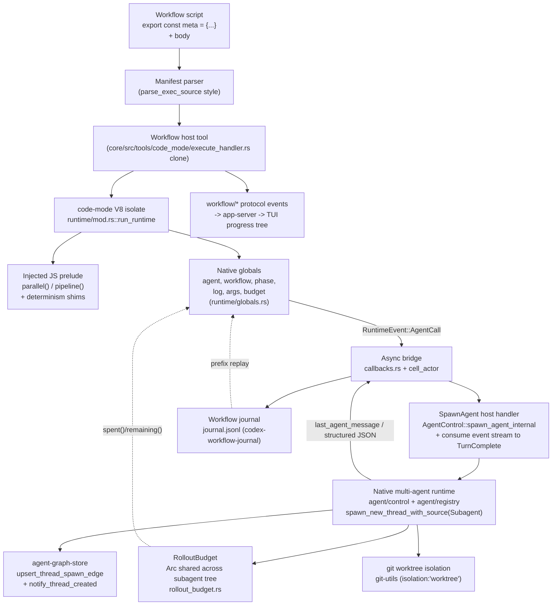

# Dynamic Workflows for OpenAI Codex — Engineering Spec

## 1. Summary

We are adding **Dynamic Workflows** to Codex at feature parity with Claude Code's Workflow runtime: a host-authored JavaScript program that begins with a pure `export const meta = {name, description, phases}` literal, is executed **once** to completion by a host JS engine (not as a chat turn), and orchestrates a fleet of subagents through a small deterministic hook surface — `agent()`, `parallel()`, `pipeline()`, `phase()`, `log()`, `args`, `budget`, `workflow()`. Runs are backgrounded, journaled per `runId`, and resumable by longest-unchanged-prefix replay.

**The chosen approach is to bridge two subsystems Codex already ships:** the `codex-rs/code-mode` V8 isolate becomes the deterministic workflow engine, and the native multi-agent runtime (`codex-rs/core/src/agent/control` + `agent/registry` + `thread_manager`) becomes the `agent()` fan-out backend. The workflow host is thin: it registers new isolate globals that dispatch through the *existing* promise/resolver async bridge, drives subagents through the *existing* multi-agent spawn path (`AgentControl::spawn_agent_internal`, which registers each child thread, fires `notify_thread_created`, and writes the spawn edge), meters tokens through the *existing* `RolloutBudget`, and adds two genuinely new layers — a determinism harden of the isolate and a `(prompt,opts)`-keyed journal + prefix-replay loop. We explicitly reject the out-of-core Node/Python SDK harness (`sdk/typescript/src/thread.ts`) because it cannot deliver single-isolate deterministic replay, an in-process hard token ceiling, or the "one program the host runs" contract that *defines* parity.

---

## 2. Goals / Non-goals

### Goals (v1 parity scope)

- **Authoring model**: parse `export const meta = {name, description, phases}` statically; run the body once as an ES module in a fresh V8 isolate.
- **Hooks**: `agent(prompt, opts?)`, `parallel(thunks[])`, `pipeline(items, ...stages)`, `phase(title)`, `log(msg)`, `args`, `budget{total, spent(), remaining()}`, `workflow(nameOrRef, args)`.
- **agent() opts**: `label`, `phase`, `schema` (forced StructuredOutput + validated object), `model`, `effort('low'..'max')`, `isolation:'worktree'`, `agentType`. `null` on death/skip.
- **Execution semantics**: concurrency cap `min(16, cores-2)` with excess queued; lifetime cap ~1000 agents; max 4096 items per `parallel`/`pipeline`; `pipeline` is no-barrier (item A in stage 3 while B in stage 1); `parallel` is a barrier.
- **Determinism**: `Date.now()`, argless `new Date()`, `Math.random()` disabled inside the isolate.
- **Resume**: `resumeFromRunId` replays the longest unchanged prefix of `agent()` calls from a `journal.jsonl` keyed by `(prompt, opts)`; first divergence onward runs live.
- **Budget**: hard token ceiling; `agent()` throws once `spent >= total`.
- **Surfacing**: background execution, completion notification, script persisted and re-invocable by `scriptPath` or saved name. (The live progress tree is owned by the dedicated "Live monitor view" goal below — Surfacing = background/notify/persist; Monitor view = live tree.)
- **Live monitor view (parity)**: a `codex workflow watch <runId>` subcommand plus a TUI attach that render a live, in-place-updating progress tree of phases + agents for *running* background workflows — the Codex analog of Claude Code's `/workflows` live progress tree. The tree is **seeded up front from the statically-declared `meta.phases`** so pending phases are visible ahead of execution (`pending → active → done`), and it remains viewable for completed runs (§9). Built on the aggregate app-server subscriptions (`subscribe_thread_created`, `subscribe_running_assistant_turn_count` in `app-server/src/request_processors/thread_processor.rs:2600,2628`) and the per-thread `Item*`/`Turn*` notifications already buffered per thread (`tui/src/app/thread_events.rs`, `tui/src/app/app_server_events.rs:143-158`). These aggregate feeds see workflow subagents **because** `agent()` spawns through the registering spawn path (§6), which is the only path that fires `notify_thread_created` and writes the spawn edge.
- **Agent event-stream swap (parity)**: from the monitor or an agent picker, drill into any specific running (sub)agent and watch **its** live event stream — tool calls, reasoning deltas, command output, MCP progress — as it streams, then swap back to the monitor without losing the parent subscription (§9). Grounded in the app-server per-thread subscription primitive `thread/resume` (`app-server/src/thread_state.rs:48`) + the existing TUI focus/attach path (`select_agent_thread` → `attach_live_thread_for_selection`, `tui/src/app/session_lifecycle.rs:348,262`), with a monitor-scoped focus stack for background runs (§9 feature 2).
- **Per-agent session saving (parity)**: every subagent persists its **own full rollout/session file** — the complete event stream (final reasoning, tool calls, tool output, messages), not just its journaled return value — because each `agent()` spawns a first-class thread via `spawn_new_thread_with_source(ThreadSource::Subagent)` (`core/src/agent/control/spawn.rs:230-329`) with its own `RolloutRecorder`-backed file (`rollout/src/recorder.rs`), linked to the workflow root both by `agent-graph-store` spawn edges (`agent-graph-store/src/local.rs`) and by the per-call `child_thread_id` + `rollout_path` recorded in the run journal (§7), and discoverable per run (§9).
- **Feature-gated** behind a new `Feature::Workflow`.

### Non-goals (out of scope for v1)

- Multi-level workflow nesting. `workflow()` is **one level deep** only (depth guard rejects deeper).
- `Promise.race`/first-wins branching on `parallel()` results across resume — v1 authoring model **forbids racing** on fan-out results (see §7). Barrier/no-barrier only.
- Distributed/multi-host execution. A run lives on one host.
- Journal compaction/retention tuning — uncompressed JSONL in v1.
- A full workflow **control** UI — pause/resume/stop/restart/save keybindings à la Claude's `/workflows` footer. The v1 monitor view (§9) is **read-only watch + agent event-stream drill-in**; run control stays completion-notify plus the existing per-agent/thread cancel paths. (Read-only monitor and agent-stream swap ARE in v1 scope — only interactive run-control keybindings are deferred.)
- Non-git isolation backends (only `isolation:'worktree'`).
- Byte-reproducible V8 (JIT-disabled) builds — determinism is at the `agent()`-result level, not machine-code level.

---

## 3. Chosen architecture

**Decision: reuse the `codex-rs/code-mode` V8 host as the deterministic workflow engine, driving the native multi-agent runtime via the registering `AgentControl` spawn path (`spawn_agent_internal` → `spawn_new_thread_with_source`) for `agent()` fan-out — consuming each child's event stream to completion rather than using `wait_agent`'s mailbox.**

### Why the V8 host already fits

`codex-rs/code-mode/src/runtime/mod.rs::run_runtime` compiles the `source` string as an ES module (`module_loader.rs::evaluate_main_module` → compile → instantiate → evaluate), runs a microtask checkpoint, and drives the top-level-await promise to `Fulfilled`/`Rejected` via a `RuntimeCommand`/`RuntimeEvent` loop. Nothing in that path assumes the source was model-authored — `ExecuteRequest.source` is just a `String` (`code-mode-protocol`), so a host-authored workflow script is admitted identically. Tool calls are already deterministically ordered by a monotonic `RuntimeState.next_tool_call_id`, and the isolate runs on one dedicated OS thread. That is precisely the deterministic skeleton the parity spec demands.

### Why `agent()` is just another async bridge op

`callbacks.rs::tool_callback` is the template for every host-await hook: it mints a `v8::PromiseResolver`, stores the `Global` resolver in `RuntimeState.pending_tool_calls` under an id, emits `RuntimeEvent::ToolCall{id,...}`, and returns the promise to JS. The cell actor (`cell_actor/mod.rs::run_cell`) receives the event, spawns a tokio task that calls the host delegate, and feeds the answer back as `RuntimeCommand::ToolResponse{id,result}`, which `module_loader.rs::resolve_tool_response` resolves into the stored promise. **`agent()` is structurally identical**: a new `agent_callback` mints a resolver, stores it, and emits a new `RuntimeEvent::AgentCall{id, prompt, opts}`. The bridge is capability-agnostic; a "spawn subagent" op is just a different event variant flowing through the same resolver/response machinery. This is the single strongest reusable asset in the codebase.

### Why this beats the out-of-core SDK harness

The SDK path (`sdk/typescript/src/thread.ts` + `outputSchemaFile.ts`) can spawn schema-constrained threads over JSON-RPC, but it runs in Node/Python with **live `Date`/`Math`/IO**, no single-isolate replay, and no in-process budget governor. It structurally cannot deliver deterministic-resume, a hard token ceiling, or "one program the host runs." Adopting it partially would silently diverge from parity. We use the SDK/CLI only as a thin front door that forwards to the core tool.

### Component diagram



---

## 4. Authoring API

The prelude + native globals expose exactly this surface. Signatures and semantics mirror Claude's Workflow runtime.

### `agent(prompt, opts?) -> Promise<string | object | null>`

Spawns a subagent, runs it to completion, returns its final assistant text. With `opts.schema` (a JSON Schema), forces a StructuredOutput final answer and returns the **validated parsed object**. Returns `null` if the agent dies or skips (turn aborted, spawn error, budget-abort). Never throws for agent failure — only throws when the budget ceiling is hit at admission (§8).

```ts
opts = {
  label?: string,        // progress-tree leaf label (cosmetic; excluded from cache key)
  phase?: string,        // progress grouping tag (cosmetic; excluded from cache key)
  schema?: JSONSchema,   // forces StructuredOutput; return is validated object
  model?: string,        // resolved against ModelsManager.list_models
  effort?: 'low'|'medium'|'high'|'xhigh'|'max',  // -> ReasoningEffort
  isolation?: 'worktree',// run in a fresh git worktree with its own cwd
  agentType?: string,    // -> role_name via apply_role_to_config
}
```

### `parallel(thunks: (() => Promise<T>)[]) -> Promise<(T|null)[]>`

Runs all thunks concurrently; **barrier** — awaits all. A thunk that throws resolves to `null` in the results array (position-preserving). Implemented purely in the JS prelude: `Promise.all(thunks.map(t => t().catch(() => null)))`. No new host op — it composes `agent()` promises. Concurrency is bounded host-side by the scheduler semaphore (§5); "excess queued" is automatic. Validates `thunks.length <= 4096`.

### `pipeline(items: T[], ...stages: ((x) => Promise<any>)[]) -> Promise<(any|null)[]>`

Runs each item through **all stages independently, with NO barrier between stages** — item A can be in stage 3 while item B is still in stage 1. Each item is its own promise chain: `items.map(i => stages.reduce((p, s) => p.then(s), Promise.resolve(i)).catch(() => null))`. A stage throw drops **that** item to `null` without blocking siblings. Global concurrency still bounded by the scheduler semaphore. Validates `items.length <= 4096`.

### `phase(title: string) -> void`

Progress grouping. Emits `RuntimeEvent::Phase` → `WorkflowPhaseBegin/End` protocol events for the live tree. Also journaled as a `phase` line so the tree reconstructs on resume. Runtime `phase()` markers are mapped onto the statically-declared `meta.phases` list in the monitor (§9 feature 1); a title with no declared match appends a new phase node.

### `log(msg: string) -> void`

Narrator line to the user. Thin alias over the existing `notify_callback` path (`globals.rs`), routed to a `WorkflowLog` event. Journaled.

### `args: JsonValue`

The JSON value passed into the workflow, injected read-only as a global via `value.rs::json_to_v8` in `install_globals`, exactly like `build_tools_object` injects tool metadata. `args` is also where any script-visible timestamps/seeds must come from (since time/random are disabled — §7). `workflow.runId` is exposed read-only here too.

### `budget: { total: number, spent(): number, remaining(): number }`

Native-backed object over the shared `RolloutBudget`. `total` from args. `spent()`/`remaining()` read the live weighted counter under the existing lock. `agent()` throws synchronously when `remaining() <= 0` **before** spawning (§8).

### `workflow(nameOrRef: string, args: JsonValue) -> Promise<any>`

Runs another **saved** workflow inline, **one level deep**. Loads the named script from the workflows directory and re-enters the runtime as a nested cell/subagent. Depth enforced by `agent/registry.rs::exceeds_thread_spawn_depth_limit` / `next_thread_spawn_depth`. Nesting deeper than one level throws.

---

## 5. Execution semantics

A single host-side **`WorkflowScheduler`** owns three independent governors, all backed by existing Codex primitives. Do not invent new token accounting.

### Concurrency cap — `min(16, cores-2)`, excess queued

A `tokio::sync::Semaphore(cap)` where `cap = min(16, std::thread::available_parallelism().saturating_sub(2))`, further clamped to `effective_agent_max_threads` (`config/mod.rs:1428`) via the existing `normalize_concurrency` clamp (`agent_jobs.rs:130`). Each admitted `agent()` acquires a permit before spawning the child (via the registering spawn path, §6) and drops it on finalize. Excess `agent()` calls await a permit — that *is* "excess queued." This mirrors the working admit/reap loop in `agent_jobs.rs::run_agent_job_loop` (`:160-315`), but uses a semaphore instead of manual `HashMap` slot arithmetic because the workflow host is in-process and structured (not DB-persisted and crash-recoverable). `AgentRegistry::reserve_spawn_slot` (`registry.rs:82`) remains the hard backstop; on `CodexErr::AgentLimitReached` the scheduler requeues.

> **Cap override note:** `effective_agent_max_threads` defaults to 6 (V1) / `max_concurrent_threads_per_session - 1` (V2). To actually reach `min(16, cores-2)`, the workflow-owned subagent tree raises the clamp — the `min(16,cores-2)` policy is the intended ceiling for workflow runs, not the session default.

### Lifetime cap — ~1000 agents/run

A workflow-scoped `AtomicUsize lifetime_spawned` on `WorkflowScheduler`, ceiling 1000, CAS-incremented (copying `registry.rs:289 try_increment_spawned`) at `agent()` admission **before** the concurrency permit. It **never decrements** (lifetime, not active — distinct from `AgentRegistry.total_count` which decrements on release, `registry.rs:99`). Exceeding it throws `AgentCapReached`. Kept separate from the session registry so the cap is per-workflow-run.

### Item cap — 4096 per `parallel`/`pipeline`

Validated in the JS prelude before dispatch.

### `pipeline` no-barrier pipelining

Each item is an independent promise chain (§4). Because the tasks are independent and the single global semaphore bounds *total* concurrent agents (not per-stage), items advance at their own pace — the staggered-progress semantic falls out for free. No cross-stage barrier exists.

### Admission order inside host `agent()`

1. `budget.remaining() <= 0` → throw `BudgetExceeded`.
2. lifetime CAS to 1000 → throw `AgentCapReached` if over.
3. journal check (resume): if replaying and this ordinal's `(prompt,opts)` key matches → resolve from cache, skip spawn.
4. await concurrency permit.
5. spawn subagent via shared `AgentControl` registering spawn path (auto-metered into `RolloutBudget`; fires `notify_thread_created` + spawn edge).
6. consume the child's event stream to `TurnComplete`/`TurnAborted`, reap, drop permit.
7. journal return value + token cost + `child_thread_id` + `rollout_path`.

---

## 6. `agent()` → subagent mapping

**Build `agent()` on the registering multi-agent spawn path — `AgentControl::spawn_agent_with_communication` → `spawn_agent_internal` → `spawn_new_thread_with_source(ThreadSource::Subagent)` (`core/src/agent/control/spawn.rs:100,230,314`) — then block on the child's event stream to completion. Do NOT build it on `codex_delegate::run_codex_thread_one_shot`, and do NOT use the V2 `spawn_agent`/`wait_agent` tool pair as-is.**

Two constraints force this choice:

- **The `wait_agent` mailbox is wrong.** The V2 pair is fire-and-mailbox — `wait_agent` (`multi_agents_v2/wait.rs`) only signals mailbox activity, it never returns the child's final text. `agent()` needs the child's final assistant message as its return value.
- **The one-shot delegate is observability-blind.** `run_codex_thread_one_shot` → `run_codex_thread_interactive` calls `Codex::spawn` **directly** (`codex_delegate.rs:94-136`) and never (a) inserts the child into `thread_manager.threads` (that insert lives only in `ThreadManager::spawn_thread_with_source`, `thread_manager.rs:1662`), (b) calls `notify_thread_created` (`thread_manager.rs:1679`), or (c) persists an `agent-graph-store` spawn edge (`persist_thread_spawn_edge_for_source`, `control.rs:682`). Those three side effects exist **only** on the `AgentControl` spawn path (`spawn.rs:216,383,385,745,759`). Every §9 observability feature depends on them: `subscribe_thread_created` (the monitor's aggregate feed, `thread_processor.rs:2600`) never fires; `thread/resume` degrades to static rollout replay because `resume_running_thread` requires `thread_manager.get_thread(...)` to succeed (`thread_processor.rs:3033`); and `list_thread_spawn_descendants` walks an empty graph so the run has no topology. Building `agent()` on the one-shot delegate would silently strand all three features (only feature 3's narrow per-file persistence would survive, since `Codex::spawn` still receives a `thread_store` and creates a per-thread `RolloutRecorder`).

So `agent()` spawns through `spawn_agent_internal` — which registers the child in `thread_manager.threads`, fires `notify_thread_created`, persists the spawn edge, and reserves a registry slot (`reserve_spawn_slot`) — and then **replaces `wait_agent`'s mailbox wait with a direct consume of the child's bridged event stream to `TurnComplete`/`TurnAborted`**, returning `last_agent_message` / `null`. This yields `agent()`'s blocking "run to completion, return final text" contract *and* full live-observability. The consume-to-`TurnComplete` loop mirrors the pattern in `tasks/review.rs::process_review_events` (`:126`), but runs over the registering spawn path rather than the one-shot delegate.

Per `agent()` call, the host handler:

1. **Build child config**: `build_agent_spawn_config(base_instructions, parent_turn)` (`multi_agents_common.rs:161`) so the child inherits provider/model/reasoning/developer-instructions and runtime state.
2. **Apply opts in `spawn_agent` order**:
   - `opts.model` + `opts.effort` → `apply_requested_spawn_agent_model_overrides` (`multi_agents_common.rs:234`); validates effort against the model's `supported_reasoning_levels` via `validate_spawn_agent_reasoning_effort`. Map `'low'..'max'` onto Codex's `ReasoningEffort` enum; reject unsupported.
   - `opts.agentType` → `apply_role_to_config` (`agent/role.rs`), trimmed to `role_name`, `DEFAULT_ROLE_NAME` fallback (`multi_agents_v2/spawn.rs:82`).
   - service tier / approval / cwd / permissions inherited via `apply_spawn_agent_service_tier` (`:285`) and `apply_spawn_agent_runtime_overrides` (`:210`).
3. **Spawn** via `spawn_agent_internal` with `SubAgentSource::ThreadSpawn` and `final_output_json_schema = opts.schema`. Because this is the registering spawn path, depth + registry accounting, `notify_thread_created`, and the `agent-graph-store` spawn edge **all fire** (unlike the `Codex::spawn`/one-shot path, where none of them do).
4. **Consume the bridged event stream** (replacing `wait_agent`'s mailbox-only signal): on `EventMsg::TurnComplete` return `TaskCompleteEvent.last_agent_message`; on `EventMsg::TurnAborted` or any spawn error return `None` → JS `null`.

### Structured output (`opts.schema`)

`opts.schema` passes straight into `final_output_json_schema` → `TurnContext.final_output_json_schema` (`turn_context.rs:138`) → `build_prompt` sets `Prompt.output_schema` + `output_schema_strict = true` (`session/turn.rs:1096`). The model is forced to emit schema-conformant JSON; `last_agent_message` is that JSON string. `agent()` does `serde_json::from_str` and returns the object via `value.rs::json_to_v8`. **Defense-in-depth**: re-validate against the JSON Schema with the `jsonschema` crate before returning (strict mode is engine-enforced for OpenAI providers but not guaranteed for all providers). This is the same path `exec --output-schema` (`exec/src/cli.rs:53`, `lib.rs::load_output_schema`) and `guardian/review_session.rs:806` rely on.

### Depth (`workflow()` one level)

`next_thread_spawn_depth` / `exceeds_thread_spawn_depth_limit(child_depth, agent_max_depth)` (`registry.rs:71`, `multi_agents/spawn.rs:66`) gate nested spawns automatically because `agent()`/`workflow()` spawn with `SubAgentSource::ThreadSpawn` through the registering path. One-level `workflow()` maps directly onto `agent_max_depth`.

### `isolation:'worktree'` (the one genuinely NEW piece — open issue #18969)

No spawn path sets a per-child cwd today: `apply_spawn_agent_runtime_overrides` hard-copies `config.cwd = turn.cwd` (`multi_agents_common.rs:224`), and `SpawnAgentOptions` has no cwd field (`agent/control.rs:66`). Build:

1. Add `cwd: Option<AbsolutePathBuf>` to `SpawnAgentOptions` and make `apply_spawn_agent_runtime_overrides` **respect an override** instead of unconditionally copying `turn.cwd`.
2. A `git-utils` helper `worktree_add(repo_root, dest) -> WorktreeGuard` using `git worktree add --detach`, plus a `Drop`/finalizer that runs `git worktree remove` **iff the worktree is unchanged** versus a baseline snapshot (reuse `git-utils/src/baseline.rs` / `info.rs`).
3. The scheduler, for `opts.isolation == 'worktree'`, allocates a **deterministic** worktree dir (index-derived name — no `Date.now`/`Math.random`), sets it as the child cwd, and adds it to `permissions.workspace_roots` so the sandbox permits writes.

This makes parallel file-mutating agents conflict-free. Cleanup-on-unchanged must be robust to child crashes.

### `label` / `phase` progress attribution

Carry `opts.label` / `opts.phase` as metadata on the spawn source (`task_name` already threads through, `multi_agents_v2/spawn.rs:142`); surface them in the progress tree the same way `AgentMetadata.last_task_message` is surfaced. **Excluded from the cache key** (§7) so re-labeling doesn't bust cache.

> **Determinism caveat:** `AgentRegistry` nickname selection uses `rand::rng()` (`registry.rs:232`). For deterministic replay, pass a preferred nickname derived from the agent index via `reserve_agent_nickname_with_preference` to bypass randomness.

---

## 7. Determinism, journal & resume

Build a dedicated **`codex-workflow-journal`** crate that clones the rollout recorder's proven append-only JSONL machinery. Do **not** extend `RolloutItem` (`protocol.rs:3141`) — it is conversation-shaped and every rollout consumer would have to handle new variants. Reuse the *infrastructure*: `RolloutRecorder`'s background mpsc JSONL writer with monotonic `ordinal_state` (`rollout/src/recorder.rs`), `ReverseJsonlScanner` for tail/prefix reads (`rollout/src/reverse_jsonl_scanner.rs`), and the newline-terminated append discipline (`recorder.rs:1792`). The in-isolate `store`/`load` KV (`callbacks.rs:184-242`) is an unordered in-memory map — unsuitable as the journal, but fine as user scratch state.

### Determinism hardening (currently ABSENT — prerequisite)

`globals.rs::install_globals` today deletes only `console`/`Atomics`/`SharedArrayBuffer`/`WebAssembly` (`globals.rs:16-19`); `Date` and `Math` are fully live. A frozen JS bootstrap prelude, compiled as a classic `v8::Script` and run **before** `evaluate_main_module` (`mod.rs:202`), must:

- Replace `Math.random` with a **throwing stub** (opt-in `args.seed`-derived splitmix64 PRNG only if explicitly requested).
- Replace `Date.now` with a throw.
- Wrap the `Date` constructor so **argless** `new Date()`/`Date()` throw, while explicit-arg `new Date(x)` and `Date.parse` survive (scripts still parse timestamps handed in via `args`). Doing the argless-vs-args distinction in JS is far cleaner than in native V8.
- Extend the delete list with `WeakRef` and `FinalizationRegistry` (default-present in bare V8, GC-order nondeterministic).

`runId` is minted host-side in Rust with `uuid::Uuid::now_v7()` (`items.rs:414` pattern — safe because it runs outside the isolate) and injected read-only via `workflow.runId`. The script must never derive ids/time/random itself.

### Invocation ordinal (the spine of prefix-replay)

Add `agent_callback` modeled on `tool_callback`. It stamps `ordinal = state.next_agent_ordinal++` **synchronously before returning the promise**, exactly as `tool_callback` bumps `next_tool_call_id` (`callbacks.rs:61-62`). Because the isolate is single-threaded and `parallel`/`pipeline` fire thunks in array order up to the first `await`, the ordinal sequence is fully deterministic across concurrency. **We key cache on invocation ordinal, never completion order.**

### `(prompt, opts)` cache key

```
key = blake3(canonical_json({ prompt, model, effort, agentType, isolation, schema }))
```

Canonicalized with **sorted object keys** and a **stable JSON-Schema serialization**. `label` and `phase` are deliberately **excluded** so cosmetic re-labeling does not bust cache. The key algorithm is versioned and stored in `run_meta` so hash changes across Codex versions are detectable.

### Journal format (`journal.jsonl`)

Line 0 = run meta; subsequent lines share an envelope `{timestamp, ordinal, type, ...}` (timestamp from the Rust host, never the isolate):

```json
{"type":"run_meta","run_id":"...","parent_run_id":null,"script_hash":"...","args_hash":"...","name":"triage","budget_total":500000,"key_algo_version":1,"created_at":"..."}
{"type":"agent_call","ordinal":0,"key":"blake3:...","prompt_hash":"...","opts":{"model":"...","effort":"high","agentType":"reviewer","isolation":null,"schema_hash":"..."},"phase":"analyze","label":"file-a","child_thread_id":"th_...","rollout_path":"~/.codex/sessions/2026/07/16/rollout-2026-07-16-th_....jsonl","status":"completed","return":{"...":"validated object or string or null"},"tokens_spent":8123,"completion_seq":2}
{"type":"phase","ordinal":null,"title":"analyze"}
{"type":"log","ordinal":null,"message":"narrator line"}
```

`status` is `completed | null | error`. `return` round-trips string, validated object, or `null` identically. `completion_seq` records the order concurrent agents finished (needed only if racing is later allowed; recorded defensively).

**The journal is the authoritative run→agent link.** Each `agent_call` entry records `child_thread_id` **and** the absolute `rollout_path` of that child's session file (§9 feature 3). This makes a run reconstructable from `journal.jsonl` **alone** — the set of member transcripts, their paths, and their return values — independent of `agent-graph-store`. The spawn edge written by the registering spawn path (§6) and the `run_agents` SQLite projection are convenience indexes over the same facts and are rebuildable, but the journal does not depend on them; run-level transcript grouping is therefore as durable as the journal write, not only as durable as the spawn-edge write.

### Storage layout

```
$CODEX_HOME/workflows/runs/<runId>/
  journal.jsonl   # source of truth for replay AND run->agent linkage
  script.js       # the executed program (re-invoke by scriptPath)
  meta.json
```

Mirrors rollout's per-run file layout. A `workflow_runs` SQLite index (new `codex-state` migration following `state/src/model/agent_job.rs` and `state/src/lib.rs:99-103` per-DB conventions) stores `{runId, name, scriptHash, scriptPath, parentRunId, status, created_at}` **purely for discovery-by-name**. Replay never needs SQLite; JSONL is authoritative, SQLite is a rebuildable projection. Each subagent additionally gets its own full-transcript rollout file, and the `agent-graph-store` `thread_spawn_edge` (`agent-graph-store/src/local.rs`, written by the §6 spawn path) gives the progress tree its parent/child topology and per-agent token/tool counts for free — but the journal's `child_thread_id`/`rollout_path` remain the authoritative grouping fallback.

### Resume algorithm

1. On `resumeFromRunId`, load the prior journal tail-first via `ReverseJsonlScanner` into `entries[0..M]`. Validate `script_hash`/`args_hash`/`key_algo_version` (a structural change simply produces early divergence).
2. Mint a **fresh** `runId` for the resumed run (itself resumable). Seed `RuntimeState` with `replay_entries`, `replay_active = true`.
3. In `agent_callback` at ordinal `i` with computed key `k`:
   - If `replay_active && i < M && entries[i].key == k && entries[i].status == completed`: resolve the promise from `entries[i].return` (reusing `module_loader::resolve_tool_response`'s resolve path, `:66-101`) and append the entry to the new journal. **Also re-add `entries[i].tokens_spent` to the budget counter** (replay-only `add_spent` path) so `spent()`/`remaining()` and the ceiling throw land at the identical ordinal.
   - Else: set `replay_active = false` (never re-enables), dispatch live via `RuntimeEvent::AgentCall`, append a fresh entry.
4. Concurrency: a parallel batch issues several ordinals synchronously; each is served from cache the instant its ordinal is issued — reproducing barrier/no-barrier semantics without special-casing.

This is precisely "longest unchanged prefix; first changed/new call and everything after runs live."

---

## 8. Budget & governance

Reuse `codex-rs/core/src/rollout_budget.rs::RolloutBudget` as the token governor — do not build new accounting.

### Real-time aggregation across subagents (already free)

`AgentControl.rollout_budget` is an `Arc<RolloutBudget>` "shared by the root thread and every cloned sub-agent control handle" (`control.rs:106-107`). Every subagent spawned through the workflow root's `AgentControl` shares the **same** Arc; `Session::record_rollout_budget_usage` runs after every turn's `TokenUsage` (`session/mod.rs:3696`), so the shared `weighted_tokens_used` counter is a live, tree-wide sum. Configure:

```
RolloutBudgetConfig {
  limit_tokens: args.budget.total,
  sampling_token_weight: 1.0,     // count output tokens
  prefill_token_weight: 0.0,      // ignore input -> pure output-token spend
  reminder_at_remaining_tokens: [],
}
```

so `weighted_tokens_used == pure output-token spend`. Add two public getters: `pub fn spent(&self) -> i64` and `pub fn remaining(&self) -> i64` (both read `weighted_tokens_used` under the existing lock; `remaining = (limit - weighted).max(0)`). JS `budget.spent()`/`remaining()`/`total` forward to these.

### Two-layer hard-ceiling enforcement

- **Pre-admission (new)**: host `agent()` checks `if remaining() <= 0 { throw BudgetExceeded }` **before** reserving a slot or spawning. This makes `agent()` throw deterministically at the ceiling.
- **In-flight backstop (existing)**: a turn that pushes the shared counter past `limit_tokens` makes `record_usage` return `true` → `CodexErr::SessionBudgetExceeded` → `TurnAbortReason::BudgetLimited` (`protocol.rs:4139`); the offending subagent's `agent()` resolves to `null` per the death-is-null contract.

The ceiling can overshoot by at most **one in-flight turn**, then all subsequent `agent()` calls throw — a hard ceiling in practice.

### Resume determinism of budget

Journaled `tokens_spent` per call is re-added during prefix replay (§7) so `spent()`/`remaining()` and the throw boundary are byte-identical between original and resumed runs.

### `RolloutBudget::configure` OnceLock caveat

`configure` uses `OnceLock` (`control.rs:120`), so a reused `AgentControl` cannot re-set `limit_tokens`. For nested `workflow()` calls or reused sessions, introduce a **resettable budget cell** instead of `OnceLock`.

### Reporting

Expose progress via the existing `ThreadGoal` channel — emit `ThreadGoal{token_budget: total, tokens_used: spent(), status}` (`protocol.rs:4006`) and set `ThreadGoalStatus::BudgetLimited` (`protocol.rs:3988`; `v2/thread.rs:734`) at the ceiling, so clients render budget state with no new protocol types.

---

## 9. Observability, progress, background, entrypoint & persistence

This section specifies the three observability capabilities the design commits to at parity with Claude Code: **(1)** a live monitor view for running workflows, **(2)** agent event-stream swap (drill into a running subagent's live stream and back), and **(3)** per-agent session saving. The unifying insight from the Codex substrate is that **every agent — root and each subagent — is already a first-class app-server thread** with its own `thread_id`, its own rollout/session file, and its own live notification stream keyed by `thread_id`. All three features depend on `agent()` spawning through the **registering** multi-agent spawn path (§6) — the only path that inserts the child into `thread_manager.threads`, fires `notify_thread_created`, and writes the `agent-graph-store` spawn edge. Given that path, features (2) and (3) are essentially *already present* in Codex and this spec grounds them in existing mechanisms; feature (1) is the genuine parity gap (the live data exists but no continuously auto-updating aggregate phase+agent tree does) and this spec specifies the view to build on top.

### New protocol events

Add a workflow event cluster to `EventMsg` (`protocol.rs`, next to the `CollabAgent*` family at `:1457-1476`, the exact structural precedent), reusing `ReasoningEffortConfig` and `TokenUsage`:

- `WorkflowRunBegin{run_id, name, phases, args_digest}` / `WorkflowRunEnd{run_id, status, spent, total}`
- `WorkflowPhaseBegin/End{run_id, phase_index, title}`
- `WorkflowGroupBegin/End{run_id, group_id, kind: parallel|pipeline, item_count}`
- `WorkflowAgentBegin{run_id, node_id, parent_node_id, label, phase, model, effort}`
- `WorkflowAgentUpdated{run_id, node_id, token_usage, tool_call_count}` (streams the two numbers the tree needs, rolled up from the subagent's own thread `TokenCount`/tool events)
- `WorkflowAgentEnd{run_id, node_id, status, token_usage, tool_call_count, returned_null}`
- `WorkflowLog{run_id, message}`

`node_id` is a **deterministic per-run counter** (never `Date.now`/random) so it survives resume replay. `WorkflowRunBegin.phases` carries the full statically-declared `meta.phases` list up front so a monitor can seed the phase skeleton before execution reaches any phase.

### App-server notifications

Bridge to `ServerNotification` (macro at `app-server-protocol/src/protocol/common.rs:1613`) under a `workflow/*` wire namespace: `workflow/started`, `workflow/phase/changed`, `workflow/agent/started|updated|completed`, `workflow/log`, `workflow/completed`. Payload structs go in a new `app-server-protocol/src/protocol/v2/workflow.rs` (modeled on `v2/notification.rs`, `#[serde(rename_all="camelCase")]`, `JsonSchema`, TS export), reusing the generated `CollabAgentStatus` enum for node status. Map events in `app-server/src/bespoke_event_handling.rs`. **Batch all workflow/* variants into one PR** to avoid repeated JSON+TS schema churn. The SDK gets typed progress for free via ts-rs export.

### TUI live progress tree

Add a `WorkflowProgressCell` in `tui/src/app/agent_status_feed.rs`, built like the existing `AgentStatusHistoryCell` ("Sub-agents running") but maintaining a real tree keyed by `run_id`: workflow name → phases → (group nodes →) agent leaves. Reuse `multi_agents.rs` helpers (`agent_picker_status_dot_spans` for the status dot, `format_agent_picker_item_name` for the `[role]` label) and `render/line_utils::prefix_lines` for indentation. Each leaf: dot, label, live tokens, tool-call count. **Bound height** (constants like `AGENT_STATUS_PREVIEW_*`) by collapsing finished phases to one summary line. Re-render on each `workflow/*` notification via `request_redraw`. Any spinner/elapsed uses only event-supplied `started_at_ms` (Date.now is disabled).

### Feature (1) — Live monitor view for RUNNING workflows (Codex analog of `/workflows`)

**Status: PARTIAL — the live data plane exists; the auto-updating aggregate tree must be built.** Codex already routes every subagent's live events into a per-thread buffer even while another thread is foregrounded (`tui/src/app/thread_events.rs` `ThreadEventStore`/`ThreadEventChannel`; routing in `tui/src/app/app_server_events.rs:143-158`), and it already renders a `/agent`-style snapshot ("Sub-agents running" via `agent_status_feed.rs::AgentStatusHistoryCell` + `AgentStatusThreadPreview::from_store`). But that snapshot is pushed once into scrollback (`chat_widget.add_to_history`, wired at `session_lifecycle.rs:58-61`) and does **not** redraw in place, and Codex has no "phase" abstraction — only threads/turns/items. The monitor view closes exactly that gap. It sees workflow subagents at all only because §6 spawns them through the registering path that fires `notify_thread_created` and writes spawn edges.

**Run/phase model.** The monitor tree is **seeded up front from the statically-parsed `meta.phases` list** (§1/§2, carried on `WorkflowRunBegin.phases`) so the full run skeleton — every declared phase — is visible before execution reaches it, each phase rendered `pending → active → done`. The live thread-spawn tree is then **mapped onto** the declared phases: the workflow root thread plus its descendants from `agent-graph-store` (`list_thread_spawn_descendants`, `agent-graph-store/src/local.rs`) attach as agent leaves under the phase active at spawn time, and runtime `phase(title)` markers (§4, journaled per §7) advance the active-phase cursor. A `phase()` title with no match in `meta.phases` appends a new phase node (scripts may phase dynamically); a run authored with neither `meta.phases` nor any `phase()` call collapses to a single implicit "root" group. This gives phases → (group nodes →) agent leaves, with **upcoming/pending phases shown ahead of the cursor**, without inventing a second topology store.

**Invocation — two entrypoints, same data:**
- **Non-interactive / CI / detached terminal:** `codex workflow watch <runId>` (new clap subcommand alongside `codex workflow run`, `cli/src/main.rs:124`). It opens an app-server connection, calls `thread/list` / `thread/loaded/list` (`app-server-protocol/src/protocol/common.rs:621-638`) and `list_agents` (`core/src/tools/handlers/multi_agents_v2/list_agents.rs`) to enumerate the run's threads, subscribes to `subscribe_thread_created` (`app-server/src/request_processors/thread_processor.rs:2600`) and `subscribe_running_assistant_turn_count` (`thread_processor.rs:2628`) for aggregate lifecycle, and renders the tree, redrawing on each `workflow/*` and per-thread `Item*`/`Turn*` notification. `--json` streams the same tree as newline-delimited JSON for scripting.
- **Interactive:** inside the TUI, the `WorkflowProgressCell` becomes a **persistent, in-place-redrawn monitor panel** (not the one-shot scrollback cell). It is opened by `/workflow` with a running run selected, redraws on every `workflow/*` notification, and can be attached to a background run at any time — including one started earlier in the session — because the panel is a pure consumer of the buffered per-thread event stores and the aggregate subscriptions above.

> **Run-scoping note:** `subscribe_running_assistant_turn_count` is a *global* running-turn count across the whole manager; scoping it to one run is done by intersecting with the run's `list_thread_spawn_descendants`. That descendant set is non-empty precisely because §6 uses the spawn-edge-writing path — so run-scoping is downstream of the §6 spawn-path choice.

**What it renders (live, in place):** workflow name; every declared phase (pending/active/done) with agent count, rolled-up token total, elapsed (from event-supplied `started_at_ms`); per agent leaf — status dot, `label`, live token count, and tool-call count (streamed via `WorkflowAgentUpdated{token_usage, tool_call_count}`, rolled up from each subagent's own thread `TokenCount`/tool events). Finished phases collapse to one summary line to bound height.

**Works for background runs.** The workflow host runs as a long-lived app-server task off the TUI thread (§"Background execution" below); the monitor is a pure notification consumer, so the primary session stays responsive while agents work and the user can open, close, and re-open the monitor at will. **Completed runs remain viewable**: the run's `journal.jsonl` (which records each agent's `child_thread_id` + `rollout_path`, §7) + per-agent rollout files (feature (3) below) let `codex workflow watch <runId>` reconstruct and render a finished run after the fact — independent of whether the graph-store edges are still present — and the `workflow_runs` discovery index (§7) lists prior runs by name/id.

### Feature (2) — Agent event-stream swap (drill into a running subagent, then swap back)

**Status: HAVE — the end-to-end mechanism already ships in the TUI; parity work is UI polish plus one monitor-scoped focus-stack change, not new plumbing.** The workflow layer only has to expose the workflow's subagent threads to the existing selector.

**The attach primitive.** The app-server streams per-thread notifications, each carrying `thread_id`/`turn_id`: `turn/started`, `item/started`, `item/completed`, `item/agentMessage/delta`, `item/reasoning/textDelta`, `item/commandExecution/outputDelta`, `item/mcpToolCall/progress`, etc. (the `ServerNotification` list, `app-server-protocol/src/protocol/common.rs:1613-1710`). `thread/resume` "sends the thread's history to the client and atomically subscrib[es] for new updates" (`app-server/src/thread_state.rs:48`) — i.e. it is exactly "attach to this agent's live stream (with backfill)." Live attach requires the child to be registered in `thread_manager.threads` (`resume_running_thread` checks `get_thread(...).is_ok()`, `thread_processor.rs:3033`); this holds because §6 spawns via the registering path (had `agent()` used the one-shot delegate, `thread/resume` would silently degrade to static `thread/read` replay). Subscription is per-connection-per-thread (`thread_state.rs` `subscribed_connection_ids` / `unsubscribe_connection_from_thread` / `wait_for_thread_subscriber`), and a client detaches with `thread/unsubscribe` (`ClientRequest::ThreadUnsubscribe`, `common.rs:510`). **Attaching to a child never drops the parent subscription** — subscriptions are independent per thread, which is what makes "swap back without losing the parent" free.

**The swap-and-swap-back path (TUI reference impl to reuse):**
- `AppEvent::SelectAgentThread` (`tui/src/app_event.rs:153`) → dispatched at `tui/src/app/event_dispatch.rs:1905` → `select_agent_thread` (`tui/src/app/session_lifecycle.rs:348`).
- `select_agent_thread` calls `attach_live_thread_for_selection` (`session_lifecycle.rs:262`), which invokes `app_server.resume_thread(...)` (= `thread/resume`) to subscribe to the **child** thread's LIVE stream, falling back to `thread/read` replay-only if resume fails.
- It stores the previously active receiver via `store_active_thread_receiver` (swap-back state), sets `active_thread_id` to the target, rebuilds the `ChatWidget`, then `replay_thread_snapshot` + `drain_active_thread_events` to paint the child's backfilled history and drain its buffered live events.
- **Selector UI:** `open_agent_picker` (`session_lifecycle.rs:10`) lists the subagents, and `previous_agent_shortcut` / `next_agent_shortcut` (`tui/src/multi_agents.rs`) cycle between them.

**Swap-back target for background runs (the one non-verbatim change).** The reused primitive (`activate_thread_channel` / `store_active_thread_receiver`, `thread_routing.rs:57-104`) restores the *previously foregrounded thread*'s receiver. That is correct when the user drilled in from a workflow they were already foregrounding. But a workflow launched in the background (via the `workflow_run` tool or `codex workflow run` while the user is in their own interactive session) has the **user's session thread — not the monitor — as the "previous" foreground thread**, and the monitor is a **panel/cell, not a thread**. Verbatim thread↔thread swap-back would therefore land the user in their own chat, not back in the workflow tree. So the monitor maintains a **monitor-scoped focus stack**: when a leaf is selected from the `WorkflowProgressCell`, the return target pushed is the monitor panel itself (its `run_id` + scroll state), not `thread_routing`'s previous foreground thread. `Esc`/back detaches the child (`thread/unsubscribe`) and **pops back to the monitor panel**; only when the workflow root *is* the user's foreground thread does this degenerate to the plain thread↔thread swap and the `sync_active_agent_label` (`thread_routing.rs:190`) footer applies unchanged. This is the single place feature 2 needs more than verbatim reuse of the thread-receiver swap.

**Workflow parity requirement.** A client MUST be able to attach to any workflow child `thread_id`'s live stream, watch its tool calls / reasoning deltas / command output / MCP progress **as they stream**, and detach back to the **monitor** without losing the parent subscription. Concretely: the workflow monitor (feature 1) is the breadcrumbed entry point — selecting an agent leaf raises `AppEvent::SelectAgentThread` for that subagent's `thread_id`, reusing the whole attach path above; the agent picker is populated from the run's `list_thread_spawn_descendants`. The detail view updates **live** (it is a `thread/resume` subscription, not a cached snapshot). No new transport, no new buffering — only wiring the workflow run's thread ids into `open_agent_picker`/the monitor's leaf-select handler, plus the monitor-scoped focus stack above.

### Feature (3) — Per-agent session saving (independent full rollout per subagent)

**Status: HAVE — each subagent already persists its own complete rollout file.** This is Codex's structural equivalent of Claude Code's per-agent transcript (`~/.claude/projects/.../subagents/agent-{agentId}.jsonl`). The workflow journal of §7 records each `agent()`'s **return value + tokens + child_thread_id + rollout_path** for deterministic replay and run→agent linkage; feature (3) is the orthogonal, stronger guarantee that each subagent's **entire event stream** is independently persisted and recoverable after the fact.

**Every `agent()` spawn is a full thread with its own session file.** Per §6, the registering spawn path `agent_control.spawn_agent_with_communication` → `spawn_agent_internal` (`core/src/agent/control/spawn.rs:230-329`) → `state.spawn_new_thread_with_source(... ThreadSource::Subagent ...)` gives the subagent a brand-new `thread_id` and session. Each thread is created with its own `RolloutRecorder` (`thread-store/src/local/create_thread.rs:10-33`, `RolloutRecorderParams{ thread_id, parent_thread_id, ... }`), which writes `~/.codex/sessions/YYYY/MM/DD/rollout-<date>-<thread_id>.jsonl` (`rollout/src/recorder.rs:1509-1526`, header at `recorder.rs:80`). So **every subagent `thread_id` gets its own file**. (This narrow per-file guarantee actually survives even the one-shot delegate — `Codex::spawn` receives the parent's `thread_store` and creates a per-thread recorder regardless — but the *linkage/grouping* half below does not, which is the other reason §6 uses the registering path.)

**The FULL event stream is persisted as coalesced FINAL items — not the raw delta stream.** The recorder writes the `RolloutItem` stream (`protocol/src/protocol.rs:3141`): `SessionMeta`, `ResponseItem`, `InterAgentCommunication(+Metadata)`, `Compacted`, `TurnContext`, `WorldState`, `EventMsg`. The persist policy (`rollout/src/policy.rs:38-53`) keeps **final items** — `Message`, `AgentMessage`, `Reasoning`, `LocalShellCall`, `FunctionCall` (tool calls), `FunctionCallOutput`, `CustomToolCall(+Output)`, `WebSearchCall`, `ImageGenerationCall`, `Compaction`, plus `EventMsg` protocol events (`policy.rs:13`). Note the distinction from the live drill-in: feature (2) renders **streaming deltas** (`item/reasoning/textDelta`, `item/commandExecution/outputDelta`, `item/mcpToolCall/progress`), whereas the rollout file coalesces those into the **final** `Reasoning`/`FunctionCall`/`FunctionCallOutput`/`CustomToolCall(+Output)`/`EventMsg` items. So the same **final content** (reasoning, tool calls, tool output, messages) is persisted and fully recoverable/audit-able/resumable, but post-hoc rendering **reconstructs** the transcript from coalesced final items rather than byte-faithfully **re-streaming** the original deltas.

**Topology + recoverability (durable in two independent places).** Run→agent linkage is persisted redundantly: (a) `agent-graph-store` spawn edges (`agent-graph-store/src/lib.rs` — "storage-neutral parent/child topology for thread-spawned agents"; `local.rs` `upsert_thread_spawn_edge` / `list_thread_spawn_children` / `list_thread_spawn_descendants`, with `Open`/`Closed` status), written by the §6 spawn path — the analog of a run graph that both the monitor (feature 1) and picker (feature 2) enumerate; and (b) the per-call `child_thread_id` + `rollout_path` in the run's `journal.jsonl` (§7), which is **authoritative** — a run's transcript set is reconstructable from the journal alone even if the graph store is unavailable. Files are read back via `rollout/src/{list.rs,search.rs}` and the app-server `thread/read` + `thread/turns/list` + `thread/items/list` (`common.rs:638-651`), and each subagent is independently resumable from its rollout file.

**Layout (guaranteed) and the difference vs Claude Code.** Guaranteed per-subagent layout:

```
~/.codex/sessions/YYYY/MM/DD/rollout-<date>-<thread_id>.jsonl   # one per subagent thread — FULL final-item event stream
$CODEX_HOME/workflows/runs/<runId>/journal.jsonl               # per-run return/ordinal journal + child_thread_id + rollout_path (§7)
```

Claude Code colocates each `agent-<id>.jsonl` **with** a `journal.jsonl` in one per-run transcript directory, so a run is self-describing on disk. Codex keys transcripts by `thread_id` under a global date-partitioned `sessions/` dir. To reach exact Claude-Code parity (a self-describing per-run grouping) **without a second copy of the transcripts**, this spec makes the grouping durable via the journal itself (authoritative `child_thread_id`/`rollout_path`) plus a rebuildable `run_agents` projection over `list_thread_spawn_descendants` that records, for each `runId`, the member subagent `thread_id`s and the absolute path of each one's rollout file. Tooling can thus enumerate "all transcripts for this run" and `codex workflow watch <runId>` can render a completed run **from the journal alone** — run-level grouping is as durable as the journal write, not solely dependent on spawn-edge writes. The per-agent rollout files remain the single source of truth for each agent's event stream; the graph store and SQLite projection are rebuildable indexes.

### Background execution + completion notification

Codex turns already run in the app-server off the TUI thread; the TUI is a pure notification consumer (`tui/src/app.rs:253-290`). The workflow host runs as a long-lived task emitting `workflow/*`; the TUI stays interactive. On completion, add `Notification::WorkflowComplete{name, status, agents, spent}` (`tui/src/chatwidget/notifications.rs`), raised on `workflow/completed`, reusing the coalesced desktop-notification path (`tui.notify()`, `tui/src/tui.rs:690`) and the `tui_notifications` allowlist. Give it **higher priority** than `AgentTurnComplete(0)` since the user is typically away.

### Entrypoint decision — ship all three, clear division of labor

1. **Primary (load-bearing): a model-callable `workflow_run` tool** registered alongside `multi_agents_v2.rs` spawn/wait handlers. This is the only surface that lets the authoring model launch/compose workflows mid-turn and is the native home of the JS `workflow(name, args)` hook.
2. **Human-interactive: ONE `SlashCommand::Workflow` variant** (`tui/src/slash_command.rs`). The slash enum is compile-time strum, order-sensitive ("DO NOT ALPHA-SORT") — so named workflows **cannot** each be a variant. `/workflow` with no arg opens a runtime-populated picker (exact `SlashCommand::Skills → open_skills_menu` pattern in `slash_dispatch.rs:421`); `/workflow <name> [json]` dispatches by name with the rest of the line as args, opening the monitor panel for the running run.
3. **Non-interactive/CI: `codex workflow run <name|path> --args <json> [--resume <runId>]`** in the clap `Subcommand` enum (`cli/src/main.rs:124`), mirroring `Exec`/`Cloud`. The same `workflow` subcommand also exposes **`codex workflow watch <runId> [--json]`** — the detached live monitor of feature (1) (aggregate subscriptions + per-thread `Item*`/`Turn*` redraw; `--json` streams the tree as NDJSON) — and **`codex workflow ls`** to list runs from the `workflow_runs` discovery index.

### Saved-workflow discovery

Clone the skills loader (`core-skills/src/loader.rs:280-410`) into a new `core-workflows` loader. Discover `*.js` / `*.workflow.js` and **statically parse only the leading `export const meta = {...}` literal for the picker WITHOUT executing the body** (fail-open, like `load_skill_metadata` at `loader.rs:760` — security-critical: never eval during discovery). Roots in precedence order:

- `<repo>/.codex/workflows` (project-scoped, checked in, **recommended default**)
- `$HOME/.agents/workflows` (personal)
- `$CODEX_HOME/workflows`

Dedupe by path/name with scope precedence (like `dedupe_skill_roots_by_path`). Wire directory changes to the existing file-watcher, emitting `WorkflowsChanged => "workflows/changed"` next to `SkillsChanged`.

### Config / feature gating

Add a `Feature::Workflow` in `codex-rs/features/src/feature_configs.rs` (alongside `CodeMode`/`CodeModeOnly`/`CodeModeHost`), gated Experimental. Because a workflow bridges `code-mode` and the multi-agent runtime, `Feature::Workflow` **transitively requires** `CodeMode` + `MultiAgentV2`, validated in config resolution (`core/src/config/mod.rs`).

---

## 10. File-level touch list

| Crate / file | Add / Modify | Purpose |
|---|---|---|
| `codex-rs/code-mode/src/runtime/globals.rs` | Modify | Register `agent`/`workflow`/`phase`/`log`/`args`/`budget`; disable `Date.now`/argless `Date`/`Math.random`/`WeakRef`/`FinalizationRegistry`; inject prelude |
| `codex-rs/code-mode/src/runtime/callbacks.rs` | Modify | New `agent_callback` (ordinal stamp, cache key, budget pre-check); `phase_callback` |
| `codex-rs/code-mode/src/runtime/mod.rs` | Modify | `RuntimeEvent::AgentCall`/`Phase`; `RuntimeState.next_agent_ordinal`, replay cache, budget accumulator |
| `codex-rs/code-mode/src/runtime/module_loader.rs` | Modify | Run frozen determinism prelude before `evaluate_main_module`; cached-agent resolve reuses `resolve_tool_response` |
| `codex-rs/code-mode/src/runtime/value.rs` | Reuse | `json_to_v8` for `args` + structured returns |
| `codex-rs/code-mode/src/cell_actor/mod.rs` | Modify | Spawn path for `AgentCall` (like `spawn_tool`) |
| `codex-rs/code-mode-protocol/src/description.rs` | Modify | Parse `export const meta` (like `parse_exec_source`) |
| `codex-rs/core/src/tools/code_mode/execute_handler.rs` | Clone | `workflow` handler: parse meta, submit body, wire SpawnAgent delegate |
| `codex-rs/core/src/tools/code_mode/delegate.rs` | Modify | `DispatchMessage::SpawnAgent`; journal read/write (incl. `child_thread_id` + `rollout_path`) |
| `codex-rs/core/src/agent/control/spawn.rs` | Modify | `agent()` spawns via `spawn_agent_internal`/`spawn_new_thread_with_source(ThreadSource::Subagent)` (registers thread + `notify_thread_created` + spawn edge); add consume-child-event-stream-to-`TurnComplete`/`TurnAborted` driver returning `last_agent_message`/`null` (features 1,2,3 all depend on this registering path) |
| `codex-rs/core/src/codex_delegate.rs` | Reuse | Consume-to-completion contract pattern (mirrors `tasks/review.rs::process_review_events`); explicitly **NOT** the `agent()` spawn primitive — `run_codex_thread_one_shot`/`Codex::spawn` skips thread registration, `notify_thread_created`, and spawn edges |
| `codex-rs/core/src/agent/control.rs` | Modify | `SpawnAgentOptions.cwd`; resettable budget cell (replace OnceLock) |
| `codex-rs/core/src/tools/handlers/multi_agents_common.rs` | Modify | Respect override cwd in `apply_spawn_agent_runtime_overrides` |
| `codex-rs/core/src/agent/registry.rs` | Modify | Deterministic nickname; keep spawn caps as backstop |
| `codex-rs/core/src/rollout_budget.rs` | Modify | Public `spent()`/`remaining()`; replay-only `add_spent` |
| `codex-rs/git-utils/src/*` | Add | `worktree_add` + `WorktreeGuard` (create/dirty-check/remove) |
| `codex-rs/workflow-journal/` (new crate) | Add | `JournalRecorder`/`JournalLine`/`WorkflowRunMeta`, `key.rs`, `replay.rs` |
| `codex-rs/core-workflows/` (new crate) | Add | Saved-workflow loader (static meta parse, layered roots) |
| `codex-rs/protocol/src/protocol.rs` | Modify | `Workflow*` EventMsg variants + From impls |
| `codex-rs/app-server-protocol/src/protocol/v2/workflow.rs` | Add | `workflow/*` notification payloads |
| `codex-rs/app-server-protocol/src/protocol/common.rs` | Modify | `ServerNotification` variants + `WorkflowsChanged` |
| `codex-rs/app-server/src/bespoke_event_handling.rs` | Modify | EventMsg → ServerNotification mapping |
| `codex-rs/tui/src/app/agent_status_feed.rs` | Add | `WorkflowProgressCell` as a **persistent in-place-redrawn monitor panel** (feature 1), not the one-shot scrollback cell; seed phase skeleton from `meta.phases`; reuse `AgentStatusThreadPreview::from_store` for leaf content |
| `codex-rs/tui/src/app/thread_events.rs` | Reuse | `ThreadEventStore`/`ThreadEventChannel` per-thread buffers feed the monitor's per-agent rows (feature 1) |
| `codex-rs/tui/src/app/app_server_events.rs` | Reuse | Per-thread notification routing (`:143-158`) that keeps subagent streams buffered while another thread is foregrounded |
| `codex-rs/app-server/src/request_processors/thread_processor.rs` | Reuse | `subscribe_thread_created` (`:2600`) + `subscribe_running_assistant_turn_count` (`:2628`) as the monitor's aggregate lifecycle feed (fires for workflow subagents only because §6 uses the registering spawn path) |
| `codex-rs/core/src/tools/handlers/multi_agents_v2/list_agents.rs` | Reuse | Enumerate a run's subagent threads for `workflow watch` / the agent picker |
| `codex-rs/app-server/src/thread_state.rs` | Reuse | `thread/resume` (`:48`, atomic history + live subscribe) = agent event-stream attach; `thread/unsubscribe` to detach (feature 2) |
| `codex-rs/tui/src/app/session_lifecycle.rs` | Modify | Extend `select_agent_thread`/`attach_live_thread_for_selection`/`open_agent_picker` to the workflow run's subagent threads (feature 2 swap-in) |
| `codex-rs/tui/src/app/thread_routing.rs` | Modify | `activate_thread_channel`/`store_active_thread_receiver` (`:57-104`) swap-back + monitor-scoped focus stack so background-run swap-back returns to the monitor panel, not the user's foreground thread; `sync_active_agent_label` (`:190`) footer |
| `codex-rs/tui/src/app/event_dispatch.rs` | Reuse | `AppEvent::SelectAgentThread` dispatch (`:1905`) raised from monitor leaf-select |
| `codex-rs/tui/src/multi_agents.rs` | Modify | `previous_agent_shortcut`/`next_agent_shortcut` extended to workflow monitor agent cycling |
| `codex-rs/thread-store/src/local/create_thread.rs` | Reuse | Per-thread `RolloutRecorder` (`:10-33`) so every subagent `thread_id` gets its own session file (feature 3) |
| `codex-rs/rollout/src/recorder.rs` | Reuse | Per-thread `rollout-<date>-<thread_id>.jsonl` full final-item event stream persisted per `policy.rs` (feature 3) |
| `codex-rs/agent-graph-store/src/local.rs` | Modify | Run-scoped grouping/index over `upsert_thread_spawn_edge`/`list_thread_spawn_descendants` tying a run's subagent rollouts together (features 1 & 3; journal remains authoritative link) |
| `codex-rs/tui/src/app.rs` | Modify | `workflow/*` notification match arms |
| `codex-rs/tui/src/chatwidget/notifications.rs` | Modify | `Notification::WorkflowComplete` |
| `codex-rs/tui/src/slash_command.rs` + `chatwidget/slash_dispatch.rs` | Modify | One `Workflow` variant + runtime picker dispatch; opens the monitor panel for a running run |
| `codex-rs/cli/src/main.rs` | Modify | `Subcommand::Workflow` with `run` / `watch <runId> [--json]` (detached live monitor, feature 1) / `ls` |
| `codex-rs/features/src/feature_configs.rs` | Modify | `Feature::Workflow` (requires CodeMode + MultiAgentV2) |
| `codex-rs/state/migrations/` + `state/src/model/` | Add | `workflow_runs` discovery index + `run_agents` projection (member subagent `thread_id`s + rollout paths per run) |

---

## 11. Implementation phasing

Each milestone is independently shippable behind `Feature::Workflow` (Experimental).

### Phase 0 — Foundations & feature gate
`Feature::Workflow` (requires CodeMode + MultiAgentV2). Meta manifest parser + persisted-script registry (`core-workflows` loader, static parse). **Exit:** a script with `meta` parses, saves, and runs its body once in the existing isolate; a trivial `log()`/`phase()`-only workflow runs end-to-end; existing code-mode tests green.

### Phase 1 — MVP orchestration (the 80/20 value core)
Bind `agent(prompt, opts)` on the **registering spawn path** — `spawn_agent_internal` → `spawn_new_thread_with_source(ThreadSource::Subagent)` (`core/src/agent/control/spawn.rs:100,230,314`) — consuming the child's event stream to `TurnComplete`/`TurnAborted` for final text / null. **NOT `run_codex_thread_one_shot`**, whose `Codex::spawn` path would skip the thread registration, `notify_thread_created`, and spawn edge that features 1–3 require. Wire `opts.schema` → `final_output_json_schema` (nearly free). Ship `parallel()`, item cap 4096, concurrency cap `min(16,cores-2)`, lifetime cap 1000, `args`, `log()`, `phase()`, plus `opts.model`/`opts.effort`/`opts.agentType` overrides. **Per-agent session saving (feature 3) lands here for free**: because `agent()` spawns via `spawn_new_thread_with_source(ThreadSource::Subagent)`, each subagent already gets its own `RolloutRecorder` file (`rollout/src/recorder.rs`) capturing its full final-item event stream, and the spawn edge + `child_thread_id`/`rollout_path` linkage are written — verify and assert this in Phase 1 tests. **Exit:** fan-out workflows (map N prompts → N structured results) with live progress; each subagent has its own recoverable `rollout-<date>-<thread_id>.jsonl` and is linked to the run. Covers ~11 of the parity capabilities.

### Phase 2 — Advanced scheduling & governance
`pipeline()` no-barrier scheduler (prelude async chains + shared semaphore). `budget` hard-ceiling: expose `RolloutBudget` as a JS global; `agent()` throws pre-spawn on `remaining() <= 0`; resettable budget cell. `workflow()` nested one-level via the Phase-0 registry + depth guard. **Exit:** bounded, composable multi-stage workflows.

### Phase 3 — Determinism & resume (highest novelty; depends on 3a)
**3a** Neutralize `Date.now`/argless `Date`/`Math.random`/`WeakRef`/`FinalizationRegistry`. **3b** `journal.jsonl` per `runId` (reuse RolloutRecorder append + ReverseJsonlScanner), recording `child_thread_id` + `rollout_path` per call. **3c** `resumeFromRunId` prefix-replay loop keyed by `(prompt,opts)` ordinal; budget re-add on replay. **Exit:** crash/edit-resume of long runs.

### Phase 4 — Observability, background & progress UX + worktree isolation
`workflow/*` protocol events + app-server notifications + TUI `WorkflowProgressCell` + completion notification. Entrypoints (`workflow_run` tool, `/workflow`, `codex workflow run`) fully wired. `isolation:'worktree'` lands as an independent workstream (`SpawnAgentOptions.cwd` + `git-utils` worktree lifecycle + workspace_roots).

The three observability capabilities of §9 land in this phase:
- **4a — Live monitor view (feature 1).** Build the run/phase model, **seeding the phase skeleton from the statically-declared `meta.phases`** (carried on `WorkflowRunBegin.phases`) and mapping the live thread-spawn tree (`agent-graph-store` `list_thread_spawn_descendants`) + runtime `phase()` markers onto it. Turn `WorkflowProgressCell` into a persistent in-place-redrawn panel driven by `subscribe_thread_created` + `subscribe_running_assistant_turn_count` (`thread_processor.rs:2600,2628`) and the per-thread `Item*`/`Turn*` notifications already buffered in `thread_events.rs`. Ship `codex workflow watch <runId> [--json]` (`cli/src/main.rs:124`) for detached/CI monitoring and `codex workflow ls`. Completed runs remain viewable via journal (authoritative `child_thread_id`/`rollout_path`) + per-agent rollouts. **This is the only genuinely new observability surface** — the data plane already exists (given the §6 registering spawn path).
- **4b — Agent event-stream swap (feature 2).** Wire the monitor's agent leaves and `open_agent_picker` to raise `AppEvent::SelectAgentThread` for a subagent `thread_id`, reusing `select_agent_thread`/`attach_live_thread_for_selection` (`session_lifecycle.rs:348,262` — `thread/resume` attach). Add the **monitor-scoped focus stack** in `thread_routing.rs` so swap-back returns to the monitor panel for background runs (not the user's foreground thread); detach via `thread/unsubscribe`. Mostly wiring; no new transport.
- **4c — Per-agent session grouping (feature 3 completion).** The transcripts + journal linkage themselves ship in Phase 1; here add the run-scoped `run_agents` projection (member `thread_id`s + rollout paths per `runId`) so tooling and `codex workflow watch` can enumerate "all transcripts for this run" (rebuildable index over the journal-authoritative linkage). The `Notification::WorkflowComplete` completion-notification path also lands here.

**Exit:** full parity — including live monitor of running workflows (with a declared-phase skeleton shown ahead of the cursor), drill-into/swap-back on any running subagent's live stream (returning to the monitor panel), and independently persisted per-agent sessions grouped per run.

---

## 12. Parity matrix

| Capability | Claude behavior | Codex v1 | Effort | Notes |
|---|---|---|---|---|
| `meta`/phases authoring; run body once | JS module run once by host | V8 isolate runs source once; add meta parser + registry | M | `module_loader.rs`; strongest reusable asset |
| `agent(prompt) -> final text; null on death` | Blocking, returns final text | Registering spawn path (`spawn_agent_internal`/`spawn_new_thread_with_source`) + consume event stream to `TurnComplete` → `last_agent_message`; None→null | L | Registering path fires `thread_created` + spawn edge (required by monitor/swap/per-agent features); NOT one-shot delegate, NOT `wait_agent` mailbox |
| `opts.schema` validated object | Forced StructuredOutput | `final_output_json_schema` + strict; `serde_json` + jsonschema recheck | S | `turn.rs:1096`; `exec --output-schema` precedent |
| `opts.model` / `opts.effort` | Model/effort override | `apply_requested_spawn_agent_model_overrides` | S | validate effort vs `supported_reasoning_levels` |
| `opts.agentType` | Agent role | `apply_role_to_config` role_name | S | fork spawns reject overrides |
| `opts.label`/`opts.phase` | Progress attribution | metadata on spawn source; excluded from cache key | S | surface like `last_task_message` |
| `isolation:'worktree'` | Fresh git worktree, auto-remove if unchanged | **NEW**: `SpawnAgentOptions.cwd` + `git-utils worktree_add` guard | L | open issue #18969 |
| `parallel(thunks)` barrier; fail→null | Concurrent, awaits all | Prelude `Promise.all` + `.catch(()=>null)` | S | no native op |
| `pipeline(items,...stages)` no-barrier | Independent per-item staging | Prelude per-item promise chains + shared semaphore | M | staggered progress falls out |
| `phase(title)` | Progress grouping | `RuntimeEvent::Phase` → `WorkflowPhase*` | S | journaled for resume tree; mapped onto declared `meta.phases` |
| `log(msg)` | Narrator line | Alias over `notify_callback` → `WorkflowLog` | S | already present |
| `args` | JSON injected | `json_to_v8` global | S | one `set_global` |
| `budget{total,spent(),remaining()}` hard ceiling | agent() throws at ceiling | `RolloutBudget` (output weight 1.0) + pre-admission throw | M | soft→hard is new; one-turn overshoot |
| `workflow(name,args)` one level | Nested inline run | Registry load + re-enter runtime; depth guard | M/L | `agent_max_depth` |
| Concurrency `min(16,cores-2)`, queued | Cap + queue | `tokio::Semaphore(cap)` clamp; registry backstop | S/M | raise `effective_agent_max_threads` clamp |
| Lifetime cap ~1000 | Monotonic run cap | New `AtomicUsize`, never decrements | S | separate from registry `total_count` |
| Item cap 4096 | Per parallel/pipeline | Prelude guard | S | |
| Subagent returns raw data | Final text is return value | Prompt/preamble convention + `opts.schema` for typing | S | prefer schema for consumers |
| MCP reachable from subagents | On demand | Inherited `mcp_manager`/skills/plugins | S | already first-class |
| Determinism: disable time/random | Date/Math off | **NEW** frozen prelude in `install_globals` | M | prerequisite for resume |
| journal.jsonl per return | Records each agent return | **NEW** `codex-workflow-journal` (reuse RolloutRecorder); also records `child_thread_id` + `rollout_path` | M/L | authoritative run→agent link; subagents keep own rollout files |
| Resume by prefix (`resumeFromRunId`) | Longest unchanged prefix replays | **NEW** ordinal + `(prompt,opts)` key + replay loop | XL/L | depends on determinism |
| Background exec + saved/re-invocable | Backgrounded, saved, re-runnable | events + notify + saved dir + `codex workflow run`/`ls` | L | live auto-updating tree is the **Monitor view** row below (built Phase 4a), not this row; data plane exists |
| **Workflow monitor view (live, RUNNING)** | `/workflows` live progress tree of phases+agents, declared-phase skeleton shown ahead, updates in place, viewable running & completed | **PARTIAL→build**: persistent in-place-redrawn `WorkflowProgressCell` (seeded from `meta.phases`) + `codex workflow watch <runId>`; run/phase model over `agent-graph-store`; data plane (`subscribe_thread_created`/`subscribe_running_assistant_turn_count`, per-thread `Item*`/`Turn*` buffers) already exists | M | `thread_processor.rs:2600,2628`; `thread_events.rs`; the one real observability gap; depends on §6 registering spawn path |
| **Agent event-stream swap / drill-in** | Drill into a running agent, watch its live event stream, swap back | **HAVE + small change**: `thread/resume` attach (`thread_state.rs:48`) + `select_agent_thread`→`attach_live_thread_for_selection` (`session_lifecycle.rs:348,262`); swap-back via `thread_routing.rs:57-104` + new monitor-scoped focus stack; detach via `thread/unsubscribe` | S/M | end-to-end attach ships today; wire workflow subagent thread ids into `open_agent_picker`; needs §6 registering path for live (not static) attach |
| **Per-agent session saving** | Each subagent transcript persisted independently, recoverable after the fact | **HAVE**: each `agent()` is a full thread (`spawn_new_thread_with_source(ThreadSource::Subagent)`, `control/spawn.rs:230-329`) w/ own `RolloutRecorder` `rollout-<date>-<thread_id>.jsonl` (`recorder.rs`) capturing FINAL-item event stream per `policy.rs`; add run-scoped grouping index | S | vs Claude Code: keyed by `thread_id` not colocated in a run dir; journal `child_thread_id`/`rollout_path` + `agent-graph-store` edges serve as the run graph; final items persisted, deltas coalesced |
| **Agent-driven UAT coverage** | (Claude has no equivalent automated harness) | In-process real `App` + real embedded app-server + `VT100Backend`, driven by a Codex driver agent (or deterministic driver) against a fixture SUT model; asserts monitor/swap/session-save acceptance; NDJSON twin for headless CI | M | §14; gating lane hermetic (`make_test_app_with_channels`/`start_embedded_app_server_for_picker`/`make_test_tui`); nightly agent-driver + LLM-judge lanes non-gating |

---

## 13. Risks & open questions

### Risks (ranked)

- **R1 — Resume determinism is load-bearing and fragile (Critical).** Prefix replay is meaningless if the script is nondeterministic. `Date.now`/`Math.random`/`WeakRef`/`FinalizationRegistry` are *not* currently disabled (`globals.rs:16-19`); shipping the journal without the harden makes resume unsound. Mitigation: Phase 3 explicitly depends on 3a; key by `(prompt,opts)` content hash + invocation ordinal (not wall-clock); ship resume opt-in/experimental; version the key algorithm.
- **R2 — Blocking a JS promise on a long-running subagent in a single isolate (High).** The isolate is single-threaded; `agent()` must suspend via the existing yield/wait cell mechanism and support **many** concurrent suspended `agent()` promises through `cell_actor` without starving the yield timer or exhausting the command channel (up to 4096 items), while each also **consumes its child's event stream to completion** (§6). Mitigation: prototype `agent()` against `yield_control`/`wait` plumbing plus the registering-spawn consume loop early in Phase 1.
- **R3 — Budget is a soft reminder today, not a hard gate (High).** `record_usage` is post-turn; a synchronous pre-spawn throw introduces staleness/races and can overshoot by one in-flight turn. `configure` is `OnceLock` (can't reconfigure a reused `AgentControl`). Mitigation: reserve optimistically at spawn, reconcile on completion; resettable budget cell; keep per-agent effort/output caps low.
- **R4 — Worktree isolation intersects sandbox + concurrent cwd (Medium).** Many concurrent worktrees multiply disk usage; cleanup-if-unchanged can leak dirs or corrupt the repo on child crash. Mitigation: independent workstream, dirty-check before removal, namespaced index-derived dirs, robust `Drop` guard.
- **R5 — Progress event volume at 1000-agent scale (Medium).** Can flood the app-server/TUI. Mitigation: aggregate per phase, throttle, collapse finished phases, reuse `TokenCount` batching, bound like `AGENT_STATUS_PREVIEW_*`.
- **R6 — Bridging two flag-gated subsystems (Medium).** A workflow inherits both `CodeMode` and `MultiAgentV2` flag matrices. Mitigation: single `Feature::Workflow` that transitively requires both, validated at config resolution.
- **R7 — Hash stability across Codex versions (Medium).** Nondeterministic JSON/schema serialization silently busts the whole prefix. Mitigation: canonical sorted-key JSON + stable schema encoding; store `key_algo_version` in `run_meta`.
- **R8 — Two source-of-truth (Low).** journal.jsonl vs SQLite index vs `agent-graph-store` edges. Mitigation: JSONL authoritative for both replay **and** run→agent linkage (`child_thread_id`/`rollout_path`); SQLite `run_agents` and graph edges are rebuildable projections.

### Open questions

1. **Isolate concurrency**: does `cell_actor`/`runtime.rs` `exec`/`wait` support many simultaneously-suspended `agent()` promises, or does it assume one outstanding cell? Verify before committing the Phase 1 `agent()` design.
2. **Structured output provider coverage**: does `TurnComplete.last_agent_message` reliably carry strict-schema JSON for **non-OpenAI** providers, or only those honoring `output_schema_strict`? Determines how load-bearing the belt-and-suspenders `jsonschema` recheck is.
3. **Budget token source**: aggregate child `TokenCount` events at `TurnComplete`, or read the child session's final usage snapshot? And is partial output of a budget-aborted turn metered before or after the abort (affects replay reproducibility of the exact throw boundary)?
4. **Nickname randomness**: can `reserve_agent_nickname_with_preference` fully bypass `rand::rng()` (`registry.rs:232`) for indexed agents?
5. **Racing**: does v1 truly forbid `Promise.race`/first-wins on `parallel` results? If later allowed, `completion_seq` journaling becomes mandatory for deterministic replay.
6. **Execution location**: in-process app-server vs `code-mode-host` sidecar for background runs — decides whether `workflow/*` events originate as core `EventMsg` or are injected at the app-server layer.
7. **Cap policy**: override `effective_agent_max_threads` for workflow-owned trees, or enforce `min(16,cores-2)` purely in the orchestration layer? And do nested `workflow()` runs share or nest the concurrency/lifetime/budget caps?
8. **Worktree cleanup ownership**: the `AgentCall` host handler on completion, or a session-scoped cleanup at `session_runtime` shutdown?
9. **Consume-loop vs `wait_agent`**: is a bespoke consume-to-`TurnComplete` driver over the registering spawn path (§6) the right abstraction, or should a thin reusable "spawn-and-await-final-message" helper be factored so `wait_agent` and `agent()` share it without the mailbox semantics?

---

## 14. Testing & user acceptance

This section defines how every capability in §12 is verified, and — the headline requirement — specifies an **agent-driven TUI User Acceptance Testing (UAT) harness** in which a Codex driver agent operates the **real** TUI end-to-end (runs `/workflow`, watches the live monitor tree, drills into a subagent's live event stream and swaps back, confirms per-agent sessions were saved) and **asserts** acceptance criteria, not merely a unit-test suite.

**Framing constraint (grounded in the existing repo).** There is **no** pty/expect harness that drives the compiled `codex-tui` binary as an interactive subprocess, and this spec does **not** invent one as an *existing* primitive — it is not the house style. The `dev-dependencies` note "tests spawn the codex binary" in `codex-rs/tui/tests/all.rs` refers only to the `assert_cmd`-driven **non-interactive** CLI subcommand tests (`codex-rs/cli/tests/*.rs`). The interactive TUI is tested **entirely in-process**: a real `App`/`ChatWidget` is constructed directly, driven against a **real embedded app-server**, fed real crossterm `KeyEvent`s, rendered into a real vt100-emulating terminal (`codex-rs/tui/src/test_backend.rs::VT100Backend`), and asserted with `insta` snapshots plus explicit `assert!`s. **That in-process "real App + real embedded app-server + VT100Backend" stack IS the end-to-end real-TUI harness in this codebase, and it is the gating driver for "agent-driven TUI UAT" here.** A PTY/tmux driver of the *compiled* TUI binary is scoped below (Plane 2b) strictly as **net-new, nightly, non-gating tooling to be built** — not a reused primitive and not on any required check — so the "does not invent an existing PTY harness" constraint holds.

### 14.1 Test pyramid mapped to components

Three layers, all built on harness primitives that already exist. Each row names the component under test, the harness it uses, and the gate.

#### Layer 1 — Unit tests (per touched crate; deterministic, no model, no app-server)

| Component (spec ref) | What is asserted | Harness / precedent |
|---|---|---|
| Determinism shims (§7; `code-mode/src/runtime/globals.rs`) | `Date.now()`, argless `new Date()`/`Date()`, `Math.random()`, `WeakRef`, `FinalizationRegistry` all **throw**; `new Date(x)`, `Date.parse(x)` **survive** (behaviour defined §7 lines 219-223) | in-isolate eval assertions in `code-mode` `#[cfg(test)]` modules |
| Cache-key stability (§7; `workflow-journal/key.rs`) | `blake3(canonical_json({prompt,model,effort,agentType,isolation,schema}))` is byte-stable across sorted-key/schema-serialization permutations; `label`/`phase` **excluded** so re-labeling does not bust cache; changes when `key_algo_version` changes | pure-fn unit tests; R7 mitigation |
| Journal read/replay (§7; `workflow-journal/replay.rs`) | `ReverseJsonlScanner` prefix reads; identical script → full-prefix cache hit with **no re-spawn**; edited script → longest-unchanged-prefix replays then first-divergence-onward runs live; `tokens_spent` re-add makes `spent()`/`remaining()` and the throw ordinal **byte-identical** original vs resumed | reuse rollout append + `ReverseJsonlScanner` (`rollout/src/reverse_jsonl_scanner.rs`); property/fuzz test over random `parallel`/`pipeline` shapes for ordinal determinism |
| Budget ceiling (§8; `core/src/rollout_budget.rs`) | `spent()`/`remaining()` getters; replay-only `add_spent`; pre-admission throw exactly at `remaining() <= 0`; one-turn overshoot bound; tree-wide `Arc` aggregation; resettable-budget-cell replaces `OnceLock` | `rollout_budget` unit tests |
| Schema validation (§6; structured output) | `opts.schema` → `final_output_json_schema`; `serde_json::from_str` + `jsonschema` recheck rejects non-conformant JSON before return | precedent `exec/src/cli.rs:53`, `exec/src/lib.rs::load_output_schema` (`:1798`) |
| Model/effort/agentType overrides (§6; `opts`) | `opts.model`+`opts.effort` → `apply_requested_spawn_agent_model_overrides` (`multi_agents_common.rs:234`) sets child model + `ReasoningEffort`, rejecting effort outside `supported_reasoning_levels`; `opts.agentType` → `apply_role_to_config` resolves `role_name` with `DEFAULT_ROLE_NAME` fallback | spawn-config unit tests over `build_agent_spawn_config` |
| `workflow()` depth guard (§4/§6) | Nested `workflow()` at depth 1 admitted; a second nesting level rejected by `exceeds_thread_spawn_depth_limit`/`next_thread_spawn_depth` (`registry.rs:71`, `multi_agents/spawn.rs:66`) mapped onto `agent_max_depth` | registry depth-guard unit tests |
| Loader (§9; `core-workflows`) | Static `export const meta` parse **without body eval** (fail-open like `core-skills/src/loader.rs:760`); layered-root precedence/dedupe | clone of `core-skills/src/loader.rs:280-410` |
| Prelude JS semantics (§5) | `parallel` barrier + thunk-throw→`null` position-preserving; `pipeline` no-barrier staggering; 4096 item cap; concurrency semaphore `min(16,cores-2)`; lifetime cap 1000 never-decrement | in-isolate prelude eval tests |
| Worktree lifecycle (§6; `git-utils`) | `worktree_add`/`WorktreeGuard` create + dirty-check + remove-iff-unchanged; robust to child crash | `git-utils` unit tests (`baseline.rs`/`info.rs`) |
| Completion notification (§9; `tui/src/chatwidget/notifications.rs`) | `workflow/completed` raises `Notification::WorkflowComplete{name,status,agents,spent}` through the coalesced `tui.notify()` path with priority above `AgentTurnComplete(0)`, gated by the `tui_notifications` allowlist | notification unit test (precedent: existing `notifications.rs` tests) |

#### Layer 2 — Integration tests (`agent()`/`parallel()`/`pipeline()` against the app-server harness with a **fixture model**)

Driven at the protocol layer with **no live model**, so CI is hermetic and reproducible.

- **Deterministic SUT model plane.** Every workflow subagent turn is a **scripted, ordered SSE fixture**. Use `app-server/tests/common/mock_model_server.rs::create_mock_responses_server_sequence(Vec<String>)` (serves canned responses in order via `SeqResponder`, `:14`, struct at `:52`, deterministic ordering via `AtomicUsize::fetch_add` `:52-60`) built from the SSE builders in `core/tests/common/responses.rs` — `ev_response_created` (`:659`), `ev_assistant_message` (`:696`), `ev_reasoning_item` (`:739`), `ev_function_call` (`:844`), `ev_custom_tool_call` (`:886`), `ev_completed` (`:648`) or, when a fixture must set per-response token counts, `ev_completed_with_tokens(id, total_tokens)` (`:679`). Point the SUT at it with the config override `openai_base_url={mock_url}` + dummy `CODEX_API_KEY` (pattern `core/tests/common/test_codex_exec.rs::cmd_with_server`). Because all `agent()` spawns share the workflow root `AgentControl`/provider config (§6 `build_agent_spawn_config`), an N-agent `parallel()` run is an N-entry response vector; `ev_function_call` fixtures let a scripted subagent emit tool calls / StructuredOutput.
- **Protocol driver.** `app-server/tests/common/test_app_server.rs::TestAppServer` (`:135`) is a full JSON-RPC driver: `thread/start`, `turn/start` (`start_turn_and_wait_for_completion`, `:957`), `thread/resume` (`:488`), `thread/unsubscribe` (`:551`), and `read_stream_until_matching_notification` (`:1592`). **Driving the app-server IS driving the same layer the human TUI drives** — every §9 feature is grounded in exactly these primitives (`thread/resume` attach = `app-server/src/thread_state.rs:48`; `subscribe_thread_created` monitor feed = `app-server/src/request_processors/thread_processor.rs:2600`; `thread/unsubscribe` detach).
- **What is asserted.** `agent()` returns `last_agent_message` on `TurnComplete` and `null` on `TurnAborted`/spawn-error; `opts.schema` returns a validated object; `opts.model`/`opts.effort`/`opts.agentType` overrides produce the expected child config (asserted via the spawn-config path above); the spawn goes through the **registering** path so `notify_thread_created` fires and an `agent-graph-store` spawn edge + `child_thread_id`/`rollout_path` are written (assert the exact §6 side effects); `parallel` fan-out returns N structured results position-preserving with a dead agent → `null`; a nested `workflow()` at depth 1 runs and a second level is rejected; each subagent writes its own `rollout-<date>-<thread_id>.jsonl` with the expected final items.

#### Layer 3 — TUI snapshot tests (the monitor cell, agent-swap rendering)

In-process real-TUI renders asserted with `insta` goldens (workspace dep `insta = 1.46.3`, `codex-rs/Cargo.toml:333`; `.snap` files checked in and CI `cargo test` fails on drift — update via `cargo insta review`).

- **Monitor cell render.** Direct precedent is `codex-rs/tui/src/app/agent_status_feed_tests.rs` (whole file) + `agent_status_feed.rs`: seed per-thread stores, build `AgentStatusThreadPreview::from_store(path, &store)` (`:72`), render the cell → `display_lines(80)` → `insta::assert_snapshot!`. Extend this for the `WorkflowProgressCell` phase-tree: assert the `meta.phases` skeleton renders (`pending`) **before** any agent starts, then `pending → active → done` per-phase with per-agent rows (dot, `label`, live tokens, tool-call count).
- **Full-frame acceptance snapshot.** Precedent `codex-rs/tui/src/chatwidget/tests/status_and_layout.rs:3992` (`chatwidget_exec_and_status_layout_vt100_snapshot`): `let backend = VT100Backend::new(w,h); let mut term = crate::custom_terminal::Terminal::with_options(backend); term.draw(|f| chat.render(...)); assert on term.backend().vt100().screen().contents()`.
- **Picker ordering.** `AgentNavigationState` traversal (`codex-rs/tui/src/app/agent_navigation.rs`, `mod tests` at `:327`, cases span ~`:362-407`): `record_sub_agent_activity` (`:107`) / `ordered_thread_ids` (`:318`) / `adjacent_thread_id(Next|Previous)` (`:230`) cycle workflow agents in **stable first-seen spawn order**.
- **Determinism for stable goldens.** Workflow runs inject a fixed seed/clock via `args` (§7 already disables `Date`/`Math`); `node_id` is a deterministic per-run counter (§9); normalize `thread_id`s/paths in snapshots via `normalize_snapshot_paths` (`codex-rs/tui/src/chatwidget/tests/helpers.rs:37`).

### 14.2 Agent-driven TUI UAT (the headline requirement)

**Goal.** An automated harness in which a **Codex driver agent** operates the real TUI end-to-end and emits a machine-checkable acceptance **verdict** — the same sequence a human would perform: launch `/workflow`, watch the monitor tree seed and advance, drill into a running subagent's live stream and swap back, and confirm per-agent sessions were saved and are recoverable.

#### Harness architecture — three planes, one clean seam each

The three model endpoints (SUT / driver / judge) are **distinct** so no plane can contaminate another.

1. **Plane 1 — SUT model (fixture, deterministic).** The workflow's own subagents are **never** backed by a live model in CI. A per-scenario ordered SSE fixture (`create_mock_responses_server_sequence` over `responses.rs` builders, §14.1 Layer 2) drives all fan-out subagents; `SeqResponder` yields responses in deterministic ordinal order (`AtomicUsize::fetch_add`), matching the deterministic agent-ordinal spine (§7). Fixed per-response token counts via `ev_completed_with_tokens(id, total_tokens)` (`responses.rs:679` — the plain `ev_completed` at `:648` carries **no** token usage) make `budget.spent()`/`remaining()` and the ceiling-throw ordinal identical every run.
2. **Plane 2 — driver (operates the app).** Two interchangeable drivers behind one scenario definition:
   - **(2a) Deterministic driver — CI default, gating, no LLM.** The in-process real-TUI stack: build `App` via `make_test_app_with_channels()` (`codex-rs/tui/src/app/tests.rs:4109`) + a real embedded app-server via `start_embedded_app_server_for_picker(config)` (`codex-rs/tui/src/lib.rs:507`) + a real terminal via `tui::test_support::make_test_tui()` (`codex-rs/tui/src/tui/test_support.rs:12`). It scripts the exact human sequence: dispatch `/workflow` (a `SlashCommand::Workflow` variant via `chat.dispatch_command_with_args`, precedent `codex-rs/tui/src/chatwidget/tests/slash_commands.rs:86,145,205`, or typed into the composer via `queue_composer_text_with_tab`); seed each subagent thread by inserting a `ThreadEventChannel` (`new_with_session`) and pushing `WorkflowPhaseBegin/End` + `Item*`/`Turn*` notifications into `store.lock().await` (pattern `codex-rs/tui/src/app/tests.rs:1281-1307`, `thread_events.rs:41,290`, `push_notification`/`record_sub_agent_activity` seeding); advance `agent_navigation` via `record_sub_agent_activity`; then render the monitor cell and assert. Swap in/out via `app.select_agent_thread(&mut tui, &mut app_server, child_thread_id)` (`codex-rs/tui/src/app/session_lifecycle.rs:348` → `attach_live_thread_for_selection` `:262` → `thread_routing.rs` `store_active_thread_receiver`/`drain_active_thread_events`/`replay_thread_snapshot` `:72,1259,1314`) and swap back with `primary_thread_id`. **Note:** unlike the existing `open_agent_picker` picker tests (which run without a `Tui`, `app/tests.rs:1218+`), the swap UAT **must** construct `make_test_tui()` because `select_agent_thread` requires a `tui::Tui` argument. This driver has **zero** model entropy and is the gating job. **It is the *only* driver that exercises the in-TUI monitor/drill-in/swap-back path** — the whole feature-2 TUI operation (open monitor tree, `select_agent_thread` into a live child, swap back to the monitor panel with the parent subscription intact) is realized here, deterministically and without an LLM.
   - **(2b) Agent driver — nightly/non-gating; NET-NEW tooling to build.** A `codex exec` process is the **user**: given the acceptance criteria in natural language plus a `bash` tool. It runs `codex workflow run <name> --args <json>`, watches `codex workflow watch <runId> --json` (the NDJSON monitor stream, §9), and reads `$CODEX_HOME/workflows/runs/<runId>/journal.jsonl` and the per-agent `rollout-<date>-<thread_id>.jsonl` files — i.e. the agent driver exercises the workflow **via the CLI + NDJSON watch stream + on-disk artifacts, not via in-TUI keystrokes**. Optionally, for full compiled-TUI fidelity, a **new** PTY/tmux driver may be built to drive the shipped `codex` TUI binary and observe its VT100 screen: `codex-rs/utils/pty::spawn_process` (`utils/pty/src/pty.rs:126`) is a generic process/fd spawner (or `tmux send-keys`), **not** an existing TUI-driving or expect/screen-scrape harness — so this driver is explicitly **new tooling to be built, not a reused primitive**, and per the Framing constraint it stays nightly and non-gating (the deterministic driver 2a remains the sole gate for in-TUI monitor/drill-in/swap). The driver runs against its **own** model endpoint (its own mock in CI, or a pinned live model at temperature 0 in a nightly lane), separate from the SUT fixture.
3. **Plane 3 — judge (renders the verdict).** `codex exec --output-schema uat_verdict.schema.json` (`exec/src/cli.rs:53`) forces a schema-conformant verdict `{criteria:[{id, passed:bool, evidence}], overallPass:bool, notes}` — the same strict-schema path `agent()`'s `opts.schema` uses. Two modes:
   - **Deterministic assertions (preferred, gating).** Most criteria are decided by **code**, not a model — e.g. "journal has N `agent_call` entries with `status=completed`", "N rollout files exist each containing a `FunctionCall` + `AgentMessage` item", "monitor NDJSON showed phase `pending→active→done`", "`thread/resume` for child produced ≥1 reasoning delta then `thread/unsubscribe` succeeded". The harness computes these booleans and emits the verdict itself.
   - **LLM judge (fuzzy criteria only, non-gating).** For criteria like "the live monitor visibly showed a phase-grouped tree of agents," a `codex exec --output-schema` judge reads only **deterministic artifacts** (the `watch --json` NDJSON, `journal.jsonl`, VT100 screen dumps) — never the SUT model's raw creative output — keeping the lane low-flake.

**The gating CI job = fixture SUT + deterministic driver (2a) + deterministic-assertion judge — fully hermetic.** Agent-driver (2b) and LLM-judge run in a nightly, non-gating lane over the same scenarios and fixtures (signal, not a required check). Nextest serialization/timeouts (`test-groups` + `slow-timeout`) per `codex-rs/.config/nextest.toml`.

#### CI reproducibility rules

1. **SUT determinism:** ordered fixture SSE (`SeqResponder`) + the §7 harden (`Date`/`Math`/`WeakRef`/`FinalizationRegistry` disabled); `runId` minted host-side; `node_id` a per-run counter → event streams and journal ordinals are byte-stable.
2. **Assert on artifacts, not transcripts:** `journal.jsonl` (`child_thread_id` + `rollout_path` + `return` + `tokens_spent`) and `workflow watch --json` NDJSON are engine-emitted and stable; never assert on model free text.
3. **Budget/replay determinism:** fixed fixture token counts via `ev_completed_with_tokens` make the ceiling-throw ordinal identical every run; doubles as the resume/prefix-replay UAT.
4. **TUI stability:** fixed-size `VT100Backend` (deterministic wrap/layout) + snapshot; PTY runs pin terminal size and strip spinner/elapsed (elapsed derives only from event-supplied `started_at_ms`, `Date.now` forbidden); normalize ids/paths like `normalize_snapshot_paths` (`helpers.rs:37`).
5. **Driver/judge stability:** pin model id + temperature 0; give the driver only the app + `bash`; record-replay the driver's `exec --json` transcript so a nightly regression re-runs the identical tool sequence. Gate only on the deterministic lane.
6. **Isolation:** each scenario gets a fresh `CODEX_HOME`/`CODEX_SQLITE_HOME` tempdir (`test_config()`, `codex-rs/tui/src/chatwidget/tests/helpers.rs:6`; `test_codex_exec.rs` `cmd_with_server`) so runs/journals/rollouts never collide; `Feature::Workflow` enabled via config override.

#### UAT scenarios (≥ one acceptance scenario per feature)

Each scenario ships as: `fixture_responses.json` (SUT), `scenario.md` (NL acceptance criteria for the agent driver), and a Rust deterministic assertion (gating) plus an optional `exec --output-schema` judge (nightly). "Driver actions" are what plane-2 performs; "pass criteria" are the explicit asserts.

| ID | Feature (spec ref) | Driver actions | Pass criteria (asserted) |
|---|---|---|---|
| **UAT-1** | Live monitor of a RUNNING workflow (§9 feature 1) | Dispatch `/workflow triage {json}` (or `workflow watch --json`); seed subagent stores as fixtures complete | Phase skeleton from `meta.phases` renders **pending BEFORE any agent starts**; phases transition `pending→active→done`; each spawned agent appears as a leaf with live token + tool-call counts; panel **redraws in place** (frame N+1 mutates the same region, not appended to scrollback). Full-frame `VT100Backend` snapshot = the acceptance frame. **Gated at Phase 4** (needs the `workflow/*` events + `WorkflowProgressCell` monitor panel built in §11 Phase 4a) |
| **UAT-1-min** | Live subagent visibility, Phase-1 runnable (§9 feature 1, minimal) | Run a `parallel()` fan-out; render the existing "Sub-agents running" snapshot (`AgentStatusHistoryCell` + `AgentStatusThreadPreview::from_store`) with **no** `workflow/*` events | Each spawned subagent appears as a live leaf (dot + `label` + token count) in the existing agent-status snapshot as fixtures complete — proves agent leaves are observable using only the Phase-1 data plane, ahead of the Phase-4 phase-tree. Snapshot via `agent_status_feed_tests.rs` pattern |
| **UAT-2** | Agent event-stream swap / drill-in-and-back (§9 feature 2) | From the monitor select a **still-running** child (fixture with delayed/streaming response): `select_agent_thread(&mut tui, &mut app_server, child)`; then `select_agent_thread(..., primary)` | `active_thread_id == child` after swap-in; rendered frame shows the child's live stream (tool call / reasoning / command-output deltas pushed into its store); `thread/resume` delivered ≥1 live delta; after swap-back `active_thread_id == primary`, monitor restored, and the **parent subscription survived** (parent channel still in `thread_event_channels`); background-run swap-back returns to the **monitor panel**, not the user's foreground thread (§9 monitor-scoped focus stack). Realized by deterministic driver 2a (in-TUI) |
| **UAT-3** | Per-agent session saved & recoverable (§9 feature 3) | Run UAT-1's fan-out to completion; resolve each subagent `thread_id`'s `ThreadSession` path | N `rollout-<date>-<thread_id>.jsonl` files exist under the tempdir `CODEX_HOME` (one per agent), each replays the expected turns and contains final `Reasoning`/`FunctionCall`/`AgentMessage` items (per `rollout/src/policy.rs`); `journal.jsonl` records matching `child_thread_id` + `rollout_path` per leaf; `codex workflow watch <runId>` reconstructs the **completed** run from the journal alone. Reuse `replay_thread_snapshot` assertions (`app/tests.rs:500-1074`) |
| **UAT-4** | Fan-out + structured output + opts overrides (§4/§5/§6 `agent()`/`parallel()`/`schema`/`model`/`effort`/`agentType`) | Dispatch a `parallel()` workflow; fixture = N ordered StructuredOutput responses, one agent scripted to abort; agents carry distinct `opts.model`/`opts.effort`/`opts.agentType` | N structured results returned position-preserving; the dead agent → `null`; `opts.schema` objects pass the `jsonschema` recheck; each child config reflects the requested model/effort/role (assert via the spawn-config path) |
| **UAT-5** | Budget hard ceiling (§8) | Fixture token counts (`ev_completed_with_tokens`) sum past `budget.total` mid-run | `agent()` throws `BudgetExceeded` at the **exact** ordinal; `ThreadGoalStatus::BudgetLimited` surfaces in the tree; no further subagents spawn |
| **UAT-6** | Resume by prefix (§7) | Run UAT-4, kill after k of N, relaunch `--resume <runId>` | First k resolved from journal (**no new fixture hits**); only the N−k divergent tail re-dispatches live; budget `spent()`/`remaining()` byte-identical to the un-interrupted run; TUI shows the unchanged prefix resolving from cache (no duplicate spawns) |
| **UAT-7** | `pipeline()` no-barrier (§5) | Dispatch a `pipeline(items, ...stages)` workflow with staggered fixture latencies | Staggered progress observable (item A in stage 3 while item B in stage 1); a stage throw drops **that** item to `null` without blocking siblings |
| **UAT-8** | Worktree isolation (§6 `isolation:'worktree'`) | Dispatch parallel file-mutating agents with `isolation:'worktree'` | Each agent got a **distinct deterministic** worktree cwd (index-derived, no `Date.now`/random); parallel mutations are conflict-free; clean worktrees removed on completion (dirty ones retained) |
| **UAT-9** | Entrypoint parity (§9 entrypoints) | Same scenario driven three ways: `workflow_run` tool, `/workflow` slash, `codex workflow run` CLI | `journal.jsonl` **equivalent after normalizing** the necessarily-per-run fields (`runId`, `child_thread_id`, `rollout_path`, host timestamps — §7) and identical verdict across all three — proves the UAT is entrypoint-agnostic. Normalization uses the same `normalize_snapshot_paths` discipline as §14.1/§14.3 |
| **UAT-10** | Nested `workflow()` one level (§4/§6 depth guard) | Dispatch a workflow whose body calls `workflow('child', args)`; a second scenario nests two levels | Depth-1 nested run executes and journals its child run (`parent_run_id` set); the depth-2 attempt is rejected by the depth guard (`exceeds_thread_spawn_depth_limit`) with the agent surfaced as an error, not a silent hang |

Every interactive UAT has a **scriptable NDJSON twin**: `codex workflow watch <runId> --json` (§9) emits the same tree as newline-delimited JSON, so scenarios run in CI lanes where even the in-process TUI render is unnecessary (protocol-only assertions via `TestAppServer`).

### 14.3 Per-phase UAT exit gates

Amend each §11 phase's **Exit** to require the matching automated tests, not just behaviour. Resume stays experimental until its gates are green (R1). Gates cite tests whose prerequisites exist by that phase (per §11 phasing: determinism shims are built in Phase 3a, and the `workflow/*` events + `WorkflowProgressCell` monitor panel in Phase 4a).

- **Phase 0** — add: `core-workflows` meta-parser + loader unit tests pass (static-parse-without-eval; layered-root dedupe). *(Determinism-shim tests are gated in Phase 3, since the shims do not exist until Phase 3a — see R1.)*
- **Phase 1** — add: Layer-2 integration test asserts the **registering-spawn side effects** (`notify_thread_created` + spawn edge + `rollout_path`) and the `opts.model`/`opts.effort`/`opts.agentType` override child-config; **UAT-3** (per-agent sessions saved & recoverable) and **UAT-4** (fan-out + structured output + opts overrides, incl. dead-agent → `null`) pass on the gating lane; **UAT-1-min** (subagent leaves appear live in the existing "Sub-agents running" snapshot, no `workflow/*` events) passes.
- **Phase 2** — add: prelude barrier/no-barrier + cap unit tests and the `workflow()` depth-guard unit test pass; **UAT-7** (`pipeline` no-barrier), **UAT-5** (budget hard ceiling), and **UAT-10** (nested `workflow()` one level; depth-2 rejected) pass.
- **Phase 3** — add: determinism-shim unit tests (§14.1 Layer 1; `Date`/`Math`/`WeakRef`/`FinalizationRegistry` throw, arg'd `Date`/`Date.parse` survive) pass; journal/replay determinism unit + property tests (identical-script full-prefix cache hit; edited-script longest-prefix) pass; **UAT-6** (resume by prefix, budget byte-identical) passes. Resume ships experimental until these are green.
- **Phase 4** — add: **UAT-1** (in-place redraw + `meta.phases` skeleton shown ahead of the cursor), **UAT-2** (drill-in / swap-back to the monitor panel with parent subscription intact), and **UAT-8** (worktree isolation) all pass on the in-process real-TUI gating lane; the `WorkflowComplete` completion-notification unit test (§14.1 Layer 1) passes; each scenario's `--json` NDJSON twin passes; **UAT-9** (entrypoint parity, normalized journal) passes across the `workflow_run` tool, `/workflow`, and `codex workflow run`.

Every §12 capability is tied to a named passing test (unit / integration / UAT id) that gates it — including `workflow()` nesting (UAT-10 + depth-guard unit), the `opts.model`/`effort`/`agentType` overrides (Phase-1 override unit + UAT-4), and the `WorkflowComplete` notification (Phase-4 unit). The entire UAT suite runs against the deterministic fixture backend (no live model, no wall-clock) so UAT itself honours the §7 determinism contract.

### 14.4 Parity-matrix note

The §12 matrix carries an **Agent-driven UAT coverage** row (added there) so agent-driven UAT coverage is itself a tracked parity capability: in-process real `App` + real embedded app-server + `VT100Backend`, driven by a Codex driver agent (or the deterministic driver) against a fixture SUT model, asserting monitor/swap/session-save acceptance, with an NDJSON twin for headless CI; the gating lane is hermetic (`make_test_app_with_channels`/`start_embedded_app_server_for_picker`/`make_test_tui`) and the nightly agent-driver + LLM-judge lanes are non-gating.