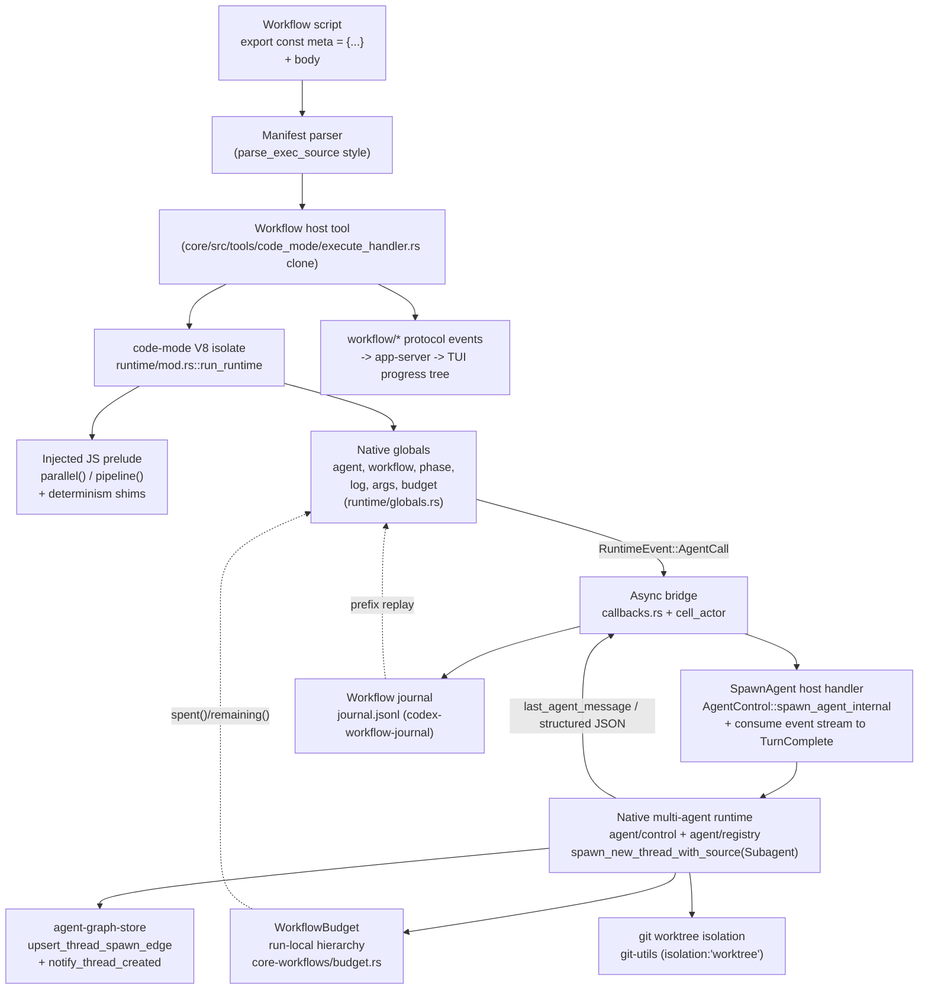

# Dynamic Workflows for OpenAI Codex — Engineering Spec

## 1. Summary

We are adding **Dynamic Workflows** to Codex at feature parity with Claude Code's Workflow runtime: a host-authored JavaScript program that begins with a pure `export const meta = {name, description, phases}` literal, is executed **once** to completion by a host JS engine (not as a chat turn), and orchestrates a fleet of subagents through a small deterministic hook surface — `agent()`, `parallel()`, `pipeline()`, `phase()`, `log()`, `args`, `budget`, `workflow()`. Runs are backgrounded, journaled per `runId`, and resumable by longest-unchanged-prefix replay.

> **Rescue reconciliation (2026-07-18).** This document is the design of record for the rescued implementation. Where old milestone/ticket prose conflicts with this note, the reconciled decisions win: workflow accounting is a run-local hierarchical `WorkflowBudget` and never reconfigures the session-wide `RolloutBudget`; detached CLI watch polls the bounded atomic `progress.json` projection; lifecycle display timing comes only from event-supplied integer Unix seconds; and a parity claim requires the real built-TUI PTY driver/judge evidence plus the workflow-control surface described below.

**The chosen approach is to bridge two subsystems Codex already ships:** the `codex-rs/code-mode` V8 isolate becomes the deterministic workflow engine, and the native multi-agent runtime (`codex-rs/core/src/agent/control` + `agent/registry` + `thread_manager`) becomes the `agent()` fan-out backend. The workflow host is thin: it registers new isolate globals that dispatch through the *existing* promise/resolver async bridge, drives subagents through the *existing* multi-agent spawn path (`AgentControl::spawn_agent_internal`, which registers each child thread, fires `notify_thread_created`, and writes the spawn edge), meters output tokens through a run-local hierarchical `WorkflowBudget`, and adds two genuinely new layers — a determinism harden of the isolate and a `(prompt,opts)`-keyed journal + prefix-replay loop. We explicitly reject the out-of-core Node/Python SDK harness (`sdk/typescript/src/thread.ts`) because it cannot deliver single-isolate deterministic replay, an in-process hard token ceiling, or the "one program the host runs" contract that *defines* parity.

---

## 2. Goals / Non-goals

### Goals (v1 parity scope)

- **Authoring model**: parse `export const meta = {name, description, phases}` statically; run the body once as an ES module in a fresh V8 isolate.
- **Hooks**: `agent(prompt, opts?)`, `parallel(thunks[])`, `pipeline(items, ...stages)`, `phase(title)`, `log(msg)`, `args`, `budget{total, spent(), remaining()}`, `workflow(nameOrRef, args)`.
- **agent() opts**: `label`, `phase`, `schema` (forced StructuredOutput + validated object), `model`, `effort('low'..'max')`, `isolation:'worktree'`, `agentType`. `null` on death/skip.
- **Execution semantics**: concurrency cap `min(16, cores-2)` with excess queued; lifetime cap ~1000 agents; max 4096 items per `parallel`/`pipeline`; `pipeline` is no-barrier (item A in stage 3 while B in stage 1); `parallel` is a barrier.
- **Determinism**: `Date.now()`, argless `new Date()`, `Math.random()` disabled inside the isolate.
- **Resume**: `resumeFromRunId` replays the longest unchanged prefix of `agent()` calls from a `journal.jsonl` keyed by `(prompt, opts)`; first divergence onward runs live.
- **Budget**: run-local hierarchical hard output-token ceiling with cancellation-safe reservations; nested spend rolls up through ancestors without mutating the session-wide governor, and `agent()` throws once the effective remaining budget is exhausted.
- **Surfacing**: background execution, completion notification, script persisted and re-invocable by `scriptPath` or saved name. (The live progress tree is owned by the dedicated "Live monitor view" goal below — Surfacing = background/notify/persist; Monitor view = live tree.)
- **Live monitor view (parity)**: a `codex workflow watch <runId>` subcommand plus a TUI attach that render a live, in-place-updating progress tree of phases + agents for *running* background workflows — the Codex analog of Claude Code's `/workflows` live progress tree. The tree is **seeded up front from the statically-declared `meta.phases`** so pending phases are visible ahead of execution (`pending → active → done`), and it remains viewable for completed runs (§9). The TUI consumes typed `workflow/*` app-server notifications and the per-thread `Item*`/`Turn*` notifications already buffered per thread (`tui/src/app/thread_events.rs`, `tui/src/app/app_server_events.rs:143-158`); the detached CLI consumes the same workflow-event semantics through the bounded atomic `progress.json` projection and journal/rollout fallback (§7). The feeds see workflow subagents **because** `agent()` spawns through the registering spawn path (§6), which is the only path that fires `notify_thread_created` and writes the spawn edge.
- **Workflow controls (parity)**: explicit run selection plus whole-run stop, checkpoint pause/resume, and script-only save; selected-agent stop/skip and retry are distinct controls. Control requests are idempotent, thread-authorized, race-safe, and acknowledge only after joined cleanup and durable projection. Claude's `r` retries the selected agent—it is not a whole-workflow restart.
- **Agent event-stream swap (parity)**: from the monitor or an agent picker, drill into any specific running (sub)agent and watch **its** live event stream — tool calls, reasoning deltas, command output, MCP progress — as it streams, then swap back to the monitor without losing the parent subscription (§9). Grounded in the app-server per-thread subscription primitive `thread/resume` (`app-server/src/thread_state.rs:48`) + the existing TUI focus/attach path (`select_agent_thread` → `attach_live_thread_for_selection`, `tui/src/app/session_lifecycle.rs:348,262`), with a monitor-scoped focus stack for background runs (§9 feature 2).
- **Per-agent session saving (parity)**: every subagent persists its **own full rollout/session file** — the complete event stream (final reasoning, tool calls, tool output, messages), not just its journaled return value — because each `agent()` spawns a first-class thread via `spawn_new_thread_with_source(ThreadSource::Subagent)` (`core/src/agent/control/spawn.rs:230-329`) with its own `RolloutRecorder`-backed file (`rollout/src/recorder.rs`), linked to the workflow root both by `agent-graph-store` spawn edges (`agent-graph-store/src/local.rs`) and by the per-call `child_thread_id` + `rollout_path` recorded in the run journal (§7), and discoverable per run (§9).
- **Feature-gated** behind a new `Feature::Workflow`.

### Non-goals (out of scope for v1)

- Multi-level workflow nesting. `workflow()` is **one level deep** only (depth guard rejects deeper).
- `Promise.race`/first-wins branching on `parallel()` results across resume — v1 authoring model **forbids racing** on fan-out results (see §7). Barrier/no-barrier only.
- Distributed/multi-host execution. A run lives on one host.
- Journal compaction/retention tuning — uncompressed JSONL in v1.
- Cross-process mutation from `codex workflow watch`. The detached watcher is deliberately read-only; app-server/TUI controls operate through the owning live thread/session. A future daemon-authenticated shell control channel is a separate product decision.
- Non-git isolation backends (only `isolation:'worktree'`).
- Byte-reproducible V8 (JIT-disabled) builds — determinism is at the `agent()`-result level, not machine-code level.

---

## 3. Chosen architecture

**Decision: reuse the `codex-rs/code-mode` V8 host as the deterministic workflow engine, driving the native multi-agent runtime via the registering `AgentControl` spawn path (`spawn_agent_internal` → `spawn_new_thread_with_source`) for `agent()` fan-out — consuming each child's event stream to completion rather than using `wait_agent`'s mailbox.**

### Why the V8 host already fits

`codex-rs/code-mode/src/runtime/mod.rs::run_runtime` compiles the `source` string as an ES module (`module_loader.rs::evaluate_main_module` → compile → instantiate → evaluate), runs a microtask checkpoint, and drives the top-level-await promise to `Fulfilled`/`Rejected` via a `RuntimeCommand`/`RuntimeEvent` loop. Nothing in that path assumes the source was model-authored — `ExecuteRequest.source` is just a `String` (`code-mode-protocol`), so a host-authored workflow script is admitted identically. Tool calls are already deterministically ordered by a monotonic `RuntimeState.next_tool_call_id`, and the isolate runs on one dedicated OS thread. That is precisely the deterministic skeleton the parity spec demands.

### Why `agent()` is just another async bridge op

`callbacks.rs::tool_callback` is the template for every host-await hook: it mints a `v8::PromiseResolver`, stores the `Global` resolver in `RuntimeState.pending_tool_calls` under an id, emits `RuntimeEvent::ToolCall{id,...}`, and returns the promise to JS. The cell actor (`cell_actor/mod.rs::run_cell`) receives the event, spawns a tokio task that calls the host delegate, and feeds the answer back as `RuntimeCommand::ToolResponse{id,result}`, which `module_loader.rs::resolve_tool_response` resolves into the stored promise. **`agent()` is structurally identical**: a new `agent_callback` mints a resolver, stores it, and emits a new `RuntimeEvent::AgentCall{id, prompt, opts}`. The bridge is capability-agnostic; a "spawn subagent" op is just a different event variant flowing through the same resolver/response machinery. This is the single strongest reusable asset in the codebase.

### Why this beats the out-of-core SDK harness

The SDK path (`sdk/typescript/src/thread.ts` + `outputSchemaFile.ts`) can spawn schema-constrained threads over JSON-RPC, but it runs in Node/Python with **live `Date`/`Math`/IO**, no single-isolate replay, and no in-process budget governor. It structurally cannot deliver deterministic-resume, a hard token ceiling, or "one program the host runs." Adopting it partially would silently diverge from parity. We use the SDK/CLI only as a thin front door that forwards to the core tool.

### Component diagram



---

## 4. Authoring API

The prelude + native globals expose exactly this surface. Signatures and semantics mirror Claude's Workflow runtime.

### `agent(prompt, opts?) -> Promise<string | object | null>`

Spawns a subagent, runs it to completion, and returns its final assistant text. With `opts.schema` (a JSON Schema), it forces a StructuredOutput final answer and returns the **validated parsed object**. Natural child failure, explicit user Skip, and retry-cap exhaustion settle the logical call as `null` after cleanup while preserving the exact terminal reason in progress and the journal. Admission errors such as an exhausted workflow budget reject before spawn (§8); persistence failure rejects instead of returning an unauditable result.

```ts
opts = {
  label?: string,        // progress-tree leaf label (cosmetic; excluded from cache key)
  phase?: string,        // progress grouping tag (cosmetic; excluded from cache key)
  schema?: JSONSchema,   // forces StructuredOutput; return is validated object
  model?: string,        // resolved against ModelsManager.list_models
  effort?: 'low'|'medium'|'high'|'xhigh'|'max',  // -> ReasoningEffort
  isolation?: 'worktree',// run in a fresh git worktree with its own cwd
  agentType?: string,    // -> role_name via apply_role_to_config
}
```

### `parallel(thunks: (() => Promise<T>)[]) -> Promise<(T|null)[]>`

Runs all thunks concurrently; **barrier** — awaits all. A thunk that throws resolves to `null` in the results array (position-preserving). Implemented purely in the JS prelude: `Promise.all(thunks.map(t => t().catch(() => null)))`. No new host op — it composes `agent()` promises. Concurrency is bounded host-side by the scheduler semaphore (§5); "excess queued" is automatic. Validates `thunks.length <= 4096`.

### `pipeline(items: T[], ...stages: ((x) => Promise<any>)[]) -> Promise<(any|null)[]>`

Runs each item through **all stages independently, with NO barrier between stages** — item A can be in stage 3 while item B is still in stage 1. Each item is its own promise chain: `items.map(i => stages.reduce((p, s) => p.then(s), Promise.resolve(i)).catch(() => null))`. A stage throw drops **that** item to `null` without blocking siblings. Global concurrency still bounded by the scheduler semaphore. Validates `items.length <= 4096`.

### `phase(title: string) -> void`

Progress grouping. Emits `RuntimeEvent::Phase` → `WorkflowPhaseBegin/End` protocol events for the live tree. Also journaled as a `phase` line so the tree reconstructs on resume. Runtime `phase()` markers are mapped onto the statically-declared `meta.phases` list in the monitor (§9 feature 1); a title with no declared match appends a new phase node.

### `log(msg: string) -> void`

Narrator line to the user. Thin alias over the existing `notify_callback` path (`globals.rs`), routed to a `WorkflowLog` event. Journaled.

### `args: JsonValue`

The JSON value passed into the workflow, injected read-only as a global via `value.rs::json_to_v8` in `install_globals`, exactly like `build_tools_object` injects tool metadata. `args` is also where any script-visible timestamps/seeds must come from (since time/random are disabled — §7). `workflow.runId` is exposed read-only here too.

### `budget: { total: number, spent(): number, remaining(): number }`

Native-backed object over the run-local `WorkflowBudget`. `total` comes from the invocation; `spent()`/`remaining()` read the live effective run/ancestor view. `agent()` reserves budget before spawning and throws when the effective remaining value is exhausted (§8). An unmetered child inherits its parent's view.

### `workflow(nameOrRef: string, args: JsonValue) -> Promise<any>`

Runs another **saved** workflow inline, **one level deep**. Loads the named script from the workflows directory and re-enters the runtime as a nested cell/subagent. Depth enforced by `agent/registry.rs::exceeds_thread_spawn_depth_limit` / `next_thread_spawn_depth`. Nesting deeper than one level throws.

---

## 5. Execution semantics

A single host-side **`WorkflowScheduler`** owns three independent governors, all backed by existing Codex primitives. Do not invent new token accounting.

### Concurrency cap — `min(16, cores-2)`, excess queued

A `tokio::sync::Semaphore(cap)` where `cap = min(16, std::thread::available_parallelism().saturating_sub(2))`, further clamped to `effective_agent_max_threads` (`config/mod.rs:1428`) via the existing `normalize_concurrency` clamp (`agent_jobs.rs:130`). Each admitted `agent()` acquires a permit before spawning the child (via the registering spawn path, §6) and drops it on finalize. Excess `agent()` calls await a permit — that *is* "excess queued." This mirrors the working admit/reap loop in `agent_jobs.rs::run_agent_job_loop` (`:160-315`), but uses a semaphore instead of manual `HashMap` slot arithmetic because the workflow host is in-process and structured (not DB-persisted and crash-recoverable). `AgentRegistry::reserve_spawn_slot` (`registry.rs:82`) remains the hard backstop; on `CodexErr::AgentLimitReached` the scheduler requeues.

> **Cap override note:** `effective_agent_max_threads` defaults to 6 (V1) / `max_concurrent_threads_per_session - 1` (V2). To actually reach `min(16, cores-2)`, the workflow-owned subagent tree raises the clamp — the `min(16,cores-2)` policy is the intended ceiling for workflow runs, not the session default.

### Lifetime cap — ~1000 agents/run

A workflow-scoped `AtomicUsize lifetime_spawned` on `WorkflowScheduler`, ceiling 1000, CAS-incremented (copying `registry.rs:289 try_increment_spawned`) at `agent()` admission **before** the concurrency permit. It **never decrements** (lifetime, not active — distinct from `AgentRegistry.total_count` which decrements on release, `registry.rs:99`). Exceeding it throws `AgentCapReached`. Kept separate from the session registry so the cap is per-workflow-run.

### Item cap — 4096 per `parallel`/`pipeline`

Validated in the JS prelude before dispatch.

### `pipeline` no-barrier pipelining

Each item is an independent promise chain (§4). Because the tasks are independent and the single global semaphore bounds *total* concurrent agents (not per-stage), items advance at their own pace — the staggered-progress semantic falls out for free. No cross-stage barrier exists.

### Admission order inside host `agent()`

1. `budget.remaining() <= 0` → throw `BudgetExceeded`.
2. lifetime CAS to 1000 → throw `AgentCapReached` if over.
3. journal check (resume): if replaying and this ordinal's `(prompt,opts)` key matches → resolve from cache, skip spawn.
4. await concurrency permit.
5. reserve a cancellation-safe estimate against this run and every workflow ancestor, then spawn via the shared `AgentControl` registering path (fires `notify_thread_created` + spawn edge).
6. consume the child's event stream to `TurnComplete`/`TurnAborted`, reap, drop permit.
7. journal return value + token cost + `child_thread_id` + `rollout_path`.

---

## 6. `agent()` → subagent mapping

**Build `agent()` on the registering multi-agent spawn path — `AgentControl::spawn_agent_with_communication` → `spawn_agent_internal` → `spawn_new_thread_with_source(ThreadSource::Subagent)` (`core/src/agent/control/spawn.rs:100,230,314`) — then block on the child's event stream to completion. Do NOT build it on `codex_delegate::run_codex_thread_one_shot`, and do NOT use the V2 `spawn_agent`/`wait_agent` tool pair as-is.**

Two constraints force this choice:

- **The `wait_agent` mailbox is wrong.** The V2 pair is fire-and-mailbox — `wait_agent` (`multi_agents_v2/wait.rs`) only signals mailbox activity, it never returns the child's final text. `agent()` needs the child's final assistant message as its return value.
- **The one-shot delegate is observability-blind.** `run_codex_thread_one_shot` → `run_codex_thread_interactive` calls `Codex::spawn` **directly** (`codex_delegate.rs:94-136`) and never (a) inserts the child into `thread_manager.threads` (that insert lives only in `ThreadManager::spawn_thread_with_source`, `thread_manager.rs:1662`), (b) calls `notify_thread_created` (`thread_manager.rs:1679`), or (c) persists an `agent-graph-store` spawn edge (`persist_thread_spawn_edge_for_source`, `control.rs:682`). Those three side effects exist **only** on the `AgentControl` spawn path (`spawn.rs:216,383,385,745,759`). Every §9 observability feature depends on them: `subscribe_thread_created` (the monitor's aggregate feed, `thread_processor.rs:2600`) never fires; `thread/resume` degrades to static rollout replay because `resume_running_thread` requires `thread_manager.get_thread(...)` to succeed (`thread_processor.rs:3033`); and `list_thread_spawn_descendants` walks an empty graph so the run has no topology. Building `agent()` on the one-shot delegate would silently strand all three features (only feature 3's narrow per-file persistence would survive, since `Codex::spawn` still receives a `thread_store` and creates a per-thread `RolloutRecorder`).

So `agent()` spawns through `spawn_agent_internal` — which registers the child in `thread_manager.threads`, fires `notify_thread_created`, persists the spawn edge, and reserves a registry slot (`reserve_spawn_slot`) — and then **replaces `wait_agent`'s mailbox wait with a direct consume of the child's bridged event stream to `TurnComplete`/`TurnAborted`**, returning `last_agent_message` / `null`. This yields `agent()`'s blocking "run to completion, return final text" contract *and* full live-observability. The consume-to-`TurnComplete` loop mirrors the pattern in `tasks/review.rs::process_review_events` (`:126`), but runs over the registering spawn path rather than the one-shot delegate.

Per `agent()` call, the host handler:

1. **Build child config**: `build_agent_spawn_config(base_instructions, parent_turn)` (`multi_agents_common.rs:161`) so the child inherits provider/model/reasoning/developer-instructions and runtime state.
2. **Apply opts in `spawn_agent` order**:
   - `opts.model` + `opts.effort` → `apply_requested_spawn_agent_model_overrides` (`multi_agents_common.rs:234`); validates effort against the model's `supported_reasoning_levels` via `validate_spawn_agent_reasoning_effort`. Map `'low'..'max'` onto Codex's `ReasoningEffort` enum; reject unsupported.
   - `opts.agentType` → `apply_role_to_config` (`agent/role.rs`), trimmed to `role_name`, `DEFAULT_ROLE_NAME` fallback (`multi_agents_v2/spawn.rs:82`).
   - service tier / approval / cwd / permissions inherited via `apply_spawn_agent_service_tier` (`:285`) and `apply_spawn_agent_runtime_overrides` (`:210`).
3. **Spawn** via `spawn_agent_internal` with `SubAgentSource::ThreadSpawn` and `final_output_json_schema = opts.schema`. Because this is the registering spawn path, depth + registry accounting, `notify_thread_created`, and the `agent-graph-store` spawn edge **all fire** (unlike the `Codex::spawn`/one-shot path, where none of them do).
4. **Consume the bridged event stream** (replacing `wait_agent`'s mailbox-only signal): on `EventMsg::TurnComplete` return `TaskCompleteEvent.last_agent_message`; on `EventMsg::TurnAborted` or any spawn error return `None` → JS `null`.

### Structured output (`opts.schema`)

`opts.schema` passes straight into `final_output_json_schema` → `TurnContext.final_output_json_schema` (`turn_context.rs:138`) → `build_prompt` sets `Prompt.output_schema` + `output_schema_strict = true` (`session/turn.rs:1096`). The model is forced to emit schema-conformant JSON; `last_agent_message` is that JSON string. `agent()` does `serde_json::from_str` and returns the object via `value.rs::json_to_v8`. **Defense-in-depth**: re-validate against the JSON Schema with the `jsonschema` crate before returning (strict mode is engine-enforced for OpenAI providers but not guaranteed for all providers). This is the same path `exec --output-schema` (`exec/src/cli.rs:53`, `lib.rs::load_output_schema`) and `guardian/review_session.rs:806` rely on.

### Depth (`workflow()` one level)

`next_thread_spawn_depth` / `exceeds_thread_spawn_depth_limit(child_depth, agent_max_depth)` (`registry.rs:71`, `multi_agents/spawn.rs:66`) gate nested spawns automatically because `agent()`/`workflow()` spawn with `SubAgentSource::ThreadSpawn` through the registering path. One-level `workflow()` maps directly onto `agent_max_depth`.

### `isolation:'worktree'` (the one genuinely NEW piece — open issue #18969)

No spawn path sets a per-child cwd today: `apply_spawn_agent_runtime_overrides` hard-copies `config.cwd = turn.cwd` (`multi_agents_common.rs:224`), and `SpawnAgentOptions` has no cwd field (`agent/control.rs:66`). Build:

1. Add `cwd: Option<AbsolutePathBuf>` to `SpawnAgentOptions` and make `apply_spawn_agent_runtime_overrides` **respect an override** instead of unconditionally copying `turn.cwd`.
2. A `git-utils` helper `worktree_add(repo_root, dest) -> WorktreeGuard` using `git worktree add --detach`, plus a `Drop`/finalizer that runs `git worktree remove` **iff the worktree is unchanged** versus a baseline snapshot (reuse `git-utils/src/baseline.rs` / `info.rs`).
3. The scheduler, for `opts.isolation == 'worktree'`, allocates a **deterministic** worktree dir (index-derived name — no `Date.now`/`Math.random`), sets it as the child cwd, and adds it to `permissions.workspace_roots` so the sandbox permits writes.

This makes parallel file-mutating agents conflict-free. Cleanup-on-unchanged must be robust to child crashes.

### `label` / `phase` progress attribution

Carry `opts.label` / `opts.phase` as metadata on the spawn source (`task_name` already threads through, `multi_agents_v2/spawn.rs:142`); surface them in the progress tree the same way `AgentMetadata.last_task_message` is surfaced. **Excluded from the cache key** (§7) so re-labeling doesn't bust cache.

> **Determinism caveat:** `AgentRegistry` nickname selection uses `rand::rng()` (`registry.rs:232`). For deterministic replay, pass a preferred nickname derived from the agent index via `reserve_agent_nickname_with_preference` to bypass randomness.

---

## 7. Determinism, journal & resume

Build a dedicated **`codex-workflow-journal`** crate that clones the rollout recorder's proven append-only JSONL machinery. Do **not** extend `RolloutItem` (`protocol.rs:3141`) — it is conversation-shaped and every rollout consumer would have to handle new variants. Reuse the *infrastructure*: `RolloutRecorder`'s background mpsc JSONL writer with monotonic `ordinal_state` (`rollout/src/recorder.rs`), `ReverseJsonlScanner` for tail/prefix reads (`rollout/src/reverse_jsonl_scanner.rs`), and the newline-terminated append discipline (`recorder.rs:1792`). The in-isolate `store`/`load` KV (`callbacks.rs:184-242`) is an unordered in-memory map — unsuitable as the journal, but fine as user scratch state.

### Determinism hardening (implemented prerequisite)

The workflow runtime installs a frozen bootstrap before evaluating the body and removes the nondeterministic surfaces below. Both the in-process and process-owned hosts exercise the same prelude:

- Replace `Math.random` with a **throwing stub** (opt-in `args.seed`-derived splitmix64 PRNG only if explicitly requested).
- Replace `Date.now` with a throw.
- Wrap the `Date` constructor so **argless** `new Date()`/`Date()` throw, while explicit-arg `new Date(x)` and `Date.parse` survive (scripts still parse timestamps handed in via `args`). Doing the argless-vs-args distinction in JS is far cleaner than in native V8.
- Extend the delete list with `WeakRef` and `FinalizationRegistry` (default-present in bare V8, GC-order nondeterministic).
- **Neutralize wall-clock timers.** `setTimeout`/`setInterval` are backed by an OS thread that sleeps real time and enqueues `RuntimeCommand::TimeoutFired` (`runtime/timers.rs:39-42`), which the command loop drains interleaved with `ToolResponse` in *arrival* order (`runtime/mod.rs:234-256`). That interleaving is wall-clock-dependent, so a script that branches on "did the timer fire before agent-2 resolved" diverges on resume **even with an unchanged agent prefix** — a nondeterminism the `Date`/`Math` harden does *not* fix (it lives in host-side command ordering, not a JS global). v1 resolution: **remove `setTimeout`/`setInterval` from the workflow isolate entirely** (workflows orchestrate via `await agent()`/`parallel()`/`pipeline()`, never sleeps; a `sleep` need is served by `args`-provided delays only). Deferred alternative if timers are ever required: a virtual/logical clock that deterministically merges timer and tool-response events into the command loop.

`runId` is minted host-side in Rust with `uuid::Uuid::now_v7()` (`items.rs:414` pattern — safe because it runs outside the isolate) and injected read-only via `workflow.runId`. The script must never derive ids/time/random itself.

> **Verified against code (Phase-1/3 de-risk):** two invariants this design leans on are confirmed. (a) **Ordinal determinism** — `tool_callback` stamps the id *synchronously before returning the promise* (`callbacks.rs:61-62`, `:71`) with no host round-trip in between, and the isolate is single-threaded (`mod.rs:177`), so `Promise.all([a(),b(),c()])` deterministically yields `tool-1/2/3` in source order regardless of which host response returns first; resolution is by id lookup, never arrival order (`module_loader.rs:66-77`). `agent_callback` inherits this exactly. (b) The pre-workflow base delete list omitted `Date`/`Math`/`WeakRef`/`FinalizationRegistry`; the implemented workflow bootstrap now closes that gap and removes wall-clock timers, with conformance tests in both hosts.

### Invocation ordinal (the spine of prefix-replay)

Add `agent_callback` modeled on `tool_callback`. It stamps `ordinal = state.next_agent_ordinal++` **synchronously before returning the promise**, exactly as `tool_callback` bumps `next_tool_call_id` (`callbacks.rs:61-62`). Because the isolate is single-threaded and `parallel`/`pipeline` fire thunks in array order up to the first `await`, the ordinal sequence is fully deterministic across concurrency. **We key cache on invocation ordinal, never completion order.**

### `(prompt, opts)` cache key

```
key = blake3(canonical_json({ prompt, model, effort, agentType, isolation, schema }))
```

Canonicalized with **sorted object keys** and a **stable JSON-Schema serialization**. `label` and `phase` are deliberately **excluded** so cosmetic re-labeling does not bust cache. The key algorithm is versioned and stored in `run_meta` so hash changes across Codex versions are detectable.

### Journal format (`journal.jsonl`)

Line 0 = run meta; subsequent lines share an envelope `{timestamp, ordinal, type, ...}` (timestamp from the Rust host, never the isolate):

```json
{"type":"run_meta","run_id":"...","parent_run_id":null,"resumed_from_run_id":null,"owner_thread_id":"...","script_hash":"...","args_hash":"...","name":"triage","budget_total":500000,"key_algo_version":1,"created_at":"...","execution_fingerprint":"blake3:..."}
{"type":"agent_bound","ordinal":0,"child_thread_id":"00000000-0000-0000-0000-000000000001","rollout_path":"/home/u/.codex/sessions/2026/07/16/rollout-2026-07-16-00000000-0000-0000-0000-000000000001.jsonl"}
{"type":"agent_call","ordinal":0,"attempt":0,"key":"blake3:...","prompt_hash":"...","opts":{"model":"...","effort":"high","agentType":"reviewer","isolation":null,"schema_hash":"..."},"phase":"analyze","label":"file-a","child_thread_id":"00000000-0000-0000-0000-000000000001","rollout_path":"/home/u/.codex/sessions/2026/07/16/rollout-2026-07-16-00000000-0000-0000-0000-000000000001.jsonl","status":"completed","control_reason":null,"return":{"...":"validated object or string or null"},"tokens_spent":8123,"completion_seq":2}
{"type":"phase","ordinal":null,"title":"analyze"}
{"type":"log","ordinal":null,"message":"narrator line"}
```

`status` records the natural execution result; `attempt` and `control_reason` preserve user Skip, bounded Retry, and retry-cap exhaustion without rewriting the logical source ordinal. `return` round-trips string, validated object, or `null` identically. `completion_seq` records concurrent completion order defensively.

**The journal is the authoritative run→agent link.** A dedicated `agent_bound` line is flushed after the child rollout is materialized and **before the child's first turn is submitted**; the terminal `agent_call` repeats `child_thread_id` and the absolute `rollout_path` alongside its result. Keeping binding separate prevents a fast child from racing a late in-flight `agent_call` append. This makes a run reconstructable from `journal.jsonl` **alone** — the set of member transcripts, their paths, and their return values — independent of `agent-graph-store`. The spawn edge written by the registering spawn path (§6) and the `run_agents` SQLite projection are convenience indexes over the same facts and are rebuildable, but the journal does not depend on them; run-level transcript grouping is therefore as durable as the pre-turn binding flush, not only as durable as the spawn-edge write.

### Storage layout

```
$CODEX_HOME/workflows/runs/<runId>/
  journal.jsonl   # source of truth for replay AND run->agent linkage
  script.js       # the executed program (re-invoke by scriptPath)
  invocation.json # bounded private canonical args + execution fingerprint
  meta.json
  progress.json   # bounded atomic live-tree projection (never an event log)
  lease.lock      # advisory live-owner lease; released automatically on process exit
```

Mirrors rollout's per-run file layout. Every run directory is private (`0700` on Unix) and every artifact is private (`0600`). `invocation.json` is never exposed by discovery or notifications; it stores the canonical bounded invocation needed for exact checkpoint resume without re-entering secret-bearing args. `progress.json` is reduced from the same bounded `WorkflowEvent` family sent to clients and atomically replaced behind a process-global writer lock; it has hard file/phase/node/text caps, so it cannot become an unbounded second log. `lease.lock` carries an exclusive advisory OS file lock for the full production run lifetime, including foreground yields, detached execution, cancellation, and terminal cleanup. On supported restart/read surfaces, a bounded UUID-directory scan attempts each running run's lease: contention proves another Codex process still owns the run and leaves it untouched; acquisition proves the former owner exited, so recovery terminalizes progress as interrupted before marking metadata failed. A terminal progress snapshot already written before a crash is preserved and used to finish metadata instead. Detached readers reject symlink, non-regular, over-cap, and malformed snapshots, then fall back explicitly to terminal `meta.json`, journal bindings, and bounded tails of child rollout files. The rebuildable `workflow_runs` projection stores run identity, script identity/path, nesting parent, owner thread, resume lineage, status, recovery attempts, and publication state. New, nested, and resumed runs persist their current root thread as `ownerThreadId`; a resumed run retains the authorized owner while recording `resumed_from_run_id` separately from ordinary nesting. Authenticated mutation surfaces compare that owner and fail closed rather than infer authority from absence. Legacy records remain nullable, readable, and rebuildable, but ownerless records are never controllable. Replay never needs SQLite; JSONL and the private invocation are authoritative, while SQLite and `progress.json` are rebuildable projections. Each subagent additionally gets its own full-transcript rollout file, and the `agent-graph-store` spawn edge supplies topology and live counters; the journal's `child_thread_id`/`rollout_path` remain the authoritative grouping fallback.

### Resume algorithm

1. On `resumeFromRunId`, load the prior journal tail-first via `ReverseJsonlScanner` into `entries[0..M]`. Validate `script_hash`/`args_hash`/`key_algo_version` and the run-level `execution_fingerprint` over the effective non-secret model/provider/router/role environment (a structural or execution-environment change simply produces early divergence). A legacy run without this fingerprint diverges at ordinal 0 rather than risking a cache hit from another backend.
2. Mint a **fresh** `runId` for the resumed run (itself resumable). Seed `RuntimeState` with `replay_entries`, `replay_active = true`.
3. In `agent_callback` at ordinal `i` with computed key `k`:
   - If `replay_active && i < M && entries[i].key == k && entries[i].status == completed`: resolve the promise from `entries[i].return` (reusing `module_loader::resolve_tool_response`'s resolve path, `:66-101`) and append the entry to the new journal. **Also re-add `entries[i].tokens_spent` to the budget counter** (replay-only `add_spent` path) so `spent()`/`remaining()` and the ceiling throw land at the identical ordinal.
   - Else: set `replay_active = false` (never re-enables), dispatch live via `RuntimeEvent::AgentCall`, append a fresh entry.
4. Concurrency: a parallel batch issues several ordinals synchronously; each is served from cache the instant its ordinal is issued — reproducing barrier/no-barrier semantics without special-casing.

This is precisely "longest unchanged prefix; first changed/new call and everything after runs live."

---

## 8. Budget & governance

Use `codex-rs/core-workflows/src/budget.rs::WorkflowBudget` as the workflow governor. It is intentionally independent from Codex's session-wide `RolloutBudget`: workflow invocation must never reset or reconfigure a user's ambient session budget.

### Run-local hierarchy and real-time aggregation

Each run owns an `Arc<WorkflowBudget>` with either `Unmetered` or `Limited(total)`. A nested `workflow()` receives a child meter whose spend rolls up through every ancestor. An unmetered child inherits the parent's effective view; an explicitly limited child reports local spend while effective remaining is clamped by its tightest ancestor. Sibling-local spend remains isolated while the enclosing run still governs its whole nested tree.

Completed child output-token usage is recorded into the run meter and every ancestor. The runtime receives a bounded snapshot in `ExecuteRequest`; host callbacks refresh an atomic monotonic mirror before resolving JS promises, so `budget.spent()` and `budget.remaining()` change live without coupling the isolate to the in-process or stdio host.

### Cancellation-safe admission and hard ceiling

- **Pre-admission:** `reserve(estimate)` acquires ancestors before descendants under one lock order. A run at its limit rejects with `WorkflowBudgetExceeded` before spawn.
- **In flight:** the reservation is an RAII guard. Cancellation, spawn failure, panic, and ordinary completion release reserved capacity; actual completed output tokens are reconciled separately.
- **Parallel calls:** reservations prevent a burst of concurrently admitted calls from all observing the same stale remaining value. Saturating arithmetic and explicit zero limits keep the bound deterministic.
- **Session governor:** child agents remain subject to the independent ambient `RolloutBudget`; whichever governor exhausts first can stop work, but workflow code never mutates that session-wide configuration.

### Resume determinism

Journaled `tokens_spent` per call is re-added to the run-local hierarchy during unchanged-prefix replay (§7), so `spent()`/`remaining()` and the rejection boundary match the original execution. Replayed spend is not double-counted as live spend.

### Reporting

Workflow progress events carry the effective budget snapshot used by the monitor and `progress.json` projection. Thread-goal/session-budget reporting remains independent; clients must not conflate ambient session exhaustion with the workflow run's own ceiling.

---

## 9. Observability, progress, background, entrypoint & persistence

This section specifies the three observability capabilities implemented for Claude comparison: **(1)** a live monitor for running and retained workflows, **(2)** agent event-stream drill-in and return, and **(3)** per-agent session persistence. Every agent—root and subagent—is a first-class app-server thread with its own `thread_id`, rollout/session file, and notification stream. All three features depend on `agent()` spawning through the registering multi-agent path (§6), which inserts the child into `thread_manager.threads`, fires `notify_thread_created`, and writes the graph edge. The final implementation adds the bounded aggregate run/phase model and monitor on top of those existing thread primitives.

### New protocol events

Add one stable `EventMsg::Workflow(WorkflowEvent)` seam next to the `CollabAgent*` family in `protocol.rs`. `WorkflowEvent` is an exhaustively tagged union in a focused protocol module, reusing `ReasoningEffortConfig` and `TokenUsage`, with these payload variants:

- `WorkflowRunBegin{run_id, name, phases, args_digest}` / `WorkflowRunEnd{run_id, status, spent, total}`
- `WorkflowPhaseBegin/End{run_id, phase_index, title}`
- `WorkflowGroupBegin{run_id, group_id, parent_node_id, kind: parallel|pipeline, item_count}` / `WorkflowGroupEnd{run_id, group_id, kind, item_count}`
- `WorkflowAgentBegin{run_id, node_id, parent_node_id, label, phase, model, effort}`
- `WorkflowAgentUpdated{run_id, node_id, token_usage, tool_call_count}` (streams the two numbers the tree needs, rolled up from the subagent's own thread `TokenCount`/tool events)
- `WorkflowAgentEnd{run_id, node_id, status, token_usage, tool_call_count, returned_null}`
- `WorkflowLog{run_id, message}`

`node_id` and `group_id` share one **deterministic per-run topology counter** (never `Date.now`/random), so the `parent_node_id` carried by both group-start and agent-start events can refer unambiguously to either kind and every relationship survives resume replay. Explicit group parentage is required because async group lifetimes may overlap and cannot be reconstructed from begin/end stack order alone. `phase_index` is a separate zero-based counter in declared/dynamic phase order. `WorkflowRunBegin.phases` carries the full statically-declared `meta.phases` list up front so a monitor can seed the phase skeleton before execution reaches any phase.

### App-server notifications

Bridge to `ServerNotification` (macro at `app-server-protocol/src/protocol/common.rs:1613`) under an explicitly experimental `workflow/*` wire namespace: `workflow/started`, `workflow/phase/changed`, `workflow/group/started|completed`, `workflow/agent/started|updated|completed`, `workflow/log`, `workflow/completed`. Group notifications are required because empty groups and nested/overlapping topology cannot be reconstructed from agent events alone. Payload structs go in a new `app-server-protocol/src/protocol/v2/workflow.rs` (modeled on `v2/notification.rs`, `#[serde(rename_all="camelCase")]`, `JsonSchema`, TS export), reusing the generated `CollabAgentStatus` enum for node status. Every payload carries its owning `threadId`, and lifecycle payloads carry an app-server-observed integer Unix-seconds timestamp (`startedAt`, `changedAt`, `updatedAt`, `completedAt`, or `emittedAt`) so clients never invent display timing. Map the nested union exhaustively in `app-server/src/bespoke_event_handling.rs`. **Batch all workflow/* variants into one PR** to avoid repeated JSON+TS schema churn. Experimental schema generation gives opted-in SDK clients typed progress without prematurely freezing the fork API.

### TUI live progress tree

Add a `WorkflowProgressCell` in `tui/src/app/agent_status_feed.rs`, built like the existing `AgentStatusHistoryCell` ("Sub-agents running") but maintaining a real tree keyed by `run_id`: workflow name → phases → (group nodes →) agent leaves. Reuse `multi_agents.rs` helpers (`agent_picker_status_dot_spans` for the status dot, `format_agent_picker_item_name` for the `[role]` label) and `render/line_utils::prefix_lines` for indentation. Each leaf: dot, label, live tokens, tool-call count. **Bound height** (constants like `AGENT_STATUS_PREVIEW_*`) by collapsing finished phases to one summary line. Re-render on each `workflow/*` notification via `request_redraw`. Any spinner/elapsed uses only notification-supplied lifecycle timestamps (workflow code cannot access `Date.now`).

### Feature (1) — Live monitor view for RUNNING workflows (Codex analog of `/workflows`)

**Status: IMPLEMENTED AND UAT-PROVEN.** The retained monitor redraws in place from bounded workflow events and durable projections, seeds declared phases before execution, adds dynamic phases as they occur, distinguishes concurrent UUIDv7 runs, and retains completed cards. It maps registered child threads onto deterministic run/phase/group nodes and can fall back to bounded durable state after restart.

**Run/phase model.** The monitor tree is **seeded up front from the statically-parsed `meta.phases` list** (§1/§2, carried on `WorkflowRunBegin.phases`) so the full run skeleton — every declared phase — is visible before execution reaches it, each phase rendered `pending → active → done`. The live thread-spawn tree is then **mapped onto** the declared phases: the workflow root thread plus its descendants from `agent-graph-store` (`list_thread_spawn_descendants`, `agent-graph-store/src/local.rs`) attach as agent leaves under the phase active at spawn time, and runtime `phase(title)` markers (§4, journaled per §7) advance the active-phase cursor. A `phase()` title with no match in `meta.phases` appends a new phase node (scripts may phase dynamically); a run authored with neither `meta.phases` nor any `phase()` call collapses to a single implicit "root" group. This gives phases → (group nodes →) agent leaves, with **upcoming/pending phases shown ahead of the cursor**, without inventing a second topology store.

**Invocation — two entrypoints, same data:**
- **Non-interactive / CI / detached terminal:** `codex workflow watch <runId>` polls the run's hard-bounded, atomically replaced `progress.json` projection and redraws only when its revision changes. `--json` emits those same changed projections as NDJSON. Missing or corrupt projections fall back in a bounded way to terminal `meta.json`, the authoritative journal bindings, and fixed-size rollout tails; the watcher does not open an app-server control channel.
- **Interactive:** inside the TUI, the `WorkflowProgressCell` becomes a **persistent, in-place-redrawn monitor panel** (not the one-shot scrollback cell). It is opened by `/workflow` with a running run selected, redraws on every `workflow/*` notification, and can be attached to a background run at any time — including one started earlier in the session — because the panel is a pure consumer of the buffered per-thread event stores and the aggregate subscriptions above.

> **Run-scoping note:** `subscribe_running_assistant_turn_count` is a *global* running-turn count across the whole manager; scoping it to one run is done by intersecting with the run's `list_thread_spawn_descendants`. That descendant set is non-empty precisely because §6 uses the spawn-edge-writing path — so run-scoping is downstream of the §6 spawn-path choice.

**What it renders (live, in place):** workflow name; every declared phase (pending/active/done) with agent count, rolled-up token total, elapsed (from event-supplied integer Unix seconds); per agent leaf — status dot, `label`, live token count, and tool-call count (streamed via `WorkflowAgentUpdated{token_usage, tool_call_count}`, rolled up from each subagent's own thread `TokenCount`/tool events). Finished phases collapse to one summary line to bound height.

**Works for background runs.** The workflow host runs as a long-lived app-server task off the TUI thread (§"Background execution" below); the monitor is a pure notification consumer, so the primary session stays responsive while agents work and the user can open, close, and re-open the monitor at will. **Completed runs remain viewable**: the run's `journal.jsonl` (which records each agent's `child_thread_id` + `rollout_path`, §7) + per-agent rollout files (feature (3) below) let `codex workflow watch <runId>` reconstruct and render a finished run after the fact — independent of whether the graph-store edges are still present — and the `workflow_runs` discovery index (§7) lists prior runs by name/id.

### Feature (2) — Agent event-stream swap (drill into a running subagent, then swap back)

**Status: IMPLEMENTED AND UAT-PROVEN.** Bound workflow children are exposed through the existing live-thread selector, and Escape restores the same subscribed monitor run and selection.

**The attach primitive.** The app-server streams per-thread notifications, each carrying `thread_id`/`turn_id`: `turn/started`, `item/started`, `item/completed`, `item/agentMessage/delta`, `item/reasoning/textDelta`, `item/commandExecution/outputDelta`, `item/mcpToolCall/progress`, etc. (the `ServerNotification` list, `app-server-protocol/src/protocol/common.rs:1613-1710`). `thread/resume` "sends the thread's history to the client and atomically subscrib[es] for new updates" (`app-server/src/thread_state.rs:48`) — i.e. it is exactly "attach to this agent's live stream (with backfill)." Live attach requires the child to be registered in `thread_manager.threads` (`resume_running_thread` checks `get_thread(...).is_ok()`, `thread_processor.rs:3033`); this holds because §6 spawns via the registering path (had `agent()` used the one-shot delegate, `thread/resume` would silently degrade to static `thread/read` replay). Subscription is per-connection-per-thread (`thread_state.rs` `subscribed_connection_ids` / `unsubscribe_connection_from_thread` / `wait_for_thread_subscriber`), and a client detaches with `thread/unsubscribe` (`ClientRequest::ThreadUnsubscribe`, `common.rs:510`). **Attaching to a child never drops the parent subscription** — subscriptions are independent per thread, which is what makes "swap back without losing the parent" free.

**The swap-and-swap-back path (TUI reference impl to reuse):**
- `AppEvent::SelectAgentThread` (`tui/src/app_event.rs:153`) → dispatched at `tui/src/app/event_dispatch.rs:1905` → `select_agent_thread` (`tui/src/app/session_lifecycle.rs:348`).
- `select_agent_thread` calls `attach_live_thread_for_selection` (`session_lifecycle.rs:262`), which invokes `app_server.resume_thread(...)` (= `thread/resume`) to subscribe to the **child** thread's LIVE stream, falling back to `thread/read` replay-only if resume fails.
- It stores the previously active receiver via `store_active_thread_receiver` (swap-back state), sets `active_thread_id` to the target, rebuilds the `ChatWidget`, then `replay_thread_snapshot` + `drain_active_thread_events` to paint the child's backfilled history and drain its buffered live events.
- **Selector UI:** `open_agent_picker` (`session_lifecycle.rs:10`) lists the subagents, and `previous_agent_shortcut` / `next_agent_shortcut` (`tui/src/multi_agents.rs`) cycle between them.

**Swap-back target for background runs (the one non-verbatim change).** The reused primitive (`activate_thread_channel` / `store_active_thread_receiver`, `thread_routing.rs:57-104`) restores the *previously foregrounded thread*'s receiver. That is correct when the user drilled in from a workflow they were already foregrounding. But a workflow launched in the background (via the `workflow_run` tool or `codex workflow run` while the user is in their own interactive session) has the **user's session thread — not the monitor — as the "previous" foreground thread**, and the monitor is a **panel/cell, not a thread**. Verbatim thread↔thread swap-back would therefore land the user in their own chat, not back in the workflow tree. So the monitor maintains a **monitor-scoped focus stack**: when a leaf is selected from the `WorkflowProgressCell`, the return target pushed is the monitor panel itself (its `run_id` + scroll state), not `thread_routing`'s previous foreground thread. `Esc`/back detaches the child (`thread/unsubscribe`) and **pops back to the monitor panel**; only when the workflow root *is* the user's foreground thread does this degenerate to the plain thread↔thread swap and the `sync_active_agent_label` (`thread_routing.rs:190`) footer applies unchanged. This is the single place feature 2 needs more than verbatim reuse of the thread-receiver swap.

**Workflow parity requirement.** A client MUST be able to attach to any workflow child `thread_id`'s live stream, watch its tool calls / reasoning deltas / command output / MCP progress **as they stream**, and detach back to the **monitor** without losing the parent subscription. Concretely: the workflow monitor (feature 1) is the breadcrumbed entry point — selecting an agent leaf raises `AppEvent::SelectAgentThread` for that subagent's `thread_id`, reusing the whole attach path above; the agent picker is populated from the run's `list_thread_spawn_descendants`. The detail view updates **live** (it is a `thread/resume` subscription, not a cached snapshot). No new transport, no new buffering — only wiring the workflow run's thread ids into `open_agent_picker`/the monitor's leaf-select handler, plus the monitor-scoped focus stack above.

### Feature (3) — Per-agent session saving (independent full rollout per subagent)

**Status: HAVE — each subagent already persists its own complete rollout file.** This is Codex's structural equivalent of Claude Code's per-agent transcript (`~/.claude/projects/.../subagents/agent-{agentId}.jsonl`). The workflow journal of §7 records each `agent()`'s **return value + tokens + child_thread_id + rollout_path** for deterministic replay and run→agent linkage; feature (3) is the orthogonal, stronger guarantee that each subagent's **entire event stream** is independently persisted and recoverable after the fact.

**Every `agent()` spawn is a full thread with its own session file.** Per §6, the registering spawn path `agent_control.spawn_agent_with_communication` → `spawn_agent_internal` (`core/src/agent/control/spawn.rs:230-329`) → `state.spawn_new_thread_with_source(... ThreadSource::Subagent ...)` gives the subagent a brand-new `thread_id` and session. Each thread is created with its own `RolloutRecorder` (`thread-store/src/local/create_thread.rs:10-33`, `RolloutRecorderParams{ thread_id, parent_thread_id, ... }`), which writes `~/.codex/sessions/YYYY/MM/DD/rollout-<date>-<thread_id>.jsonl` (`rollout/src/recorder.rs:1509-1526`, header at `recorder.rs:80`). So **every subagent `thread_id` gets its own file**. (This narrow per-file guarantee actually survives even the one-shot delegate — `Codex::spawn` receives the parent's `thread_store` and creates a per-thread recorder regardless — but the *linkage/grouping* half below does not, which is the other reason §6 uses the registering path.)

**The FULL event stream is persisted as coalesced FINAL items — not the raw delta stream.** The recorder writes the `RolloutItem` stream (`protocol/src/protocol.rs:3141`): `SessionMeta`, `ResponseItem`, `InterAgentCommunication(+Metadata)`, `Compacted`, `TurnContext`, `WorldState`, `EventMsg`. The persist policy (`rollout/src/policy.rs:38-53`) keeps **final items** — `Message`, `AgentMessage`, `Reasoning`, `LocalShellCall`, `FunctionCall` (tool calls), `FunctionCallOutput`, `CustomToolCall(+Output)`, `WebSearchCall`, `ImageGenerationCall`, `Compaction`, plus `EventMsg` protocol events (`policy.rs:13`). Note the distinction from the live drill-in: feature (2) renders **streaming deltas** (`item/reasoning/textDelta`, `item/commandExecution/outputDelta`, `item/mcpToolCall/progress`), whereas the rollout file coalesces those into the **final** `Reasoning`/`FunctionCall`/`FunctionCallOutput`/`CustomToolCall(+Output)`/`EventMsg` items. So the same **final content** (reasoning, tool calls, tool output, messages) is persisted and fully recoverable/audit-able/resumable, but post-hoc rendering **reconstructs** the transcript from coalesced final items rather than byte-faithfully **re-streaming** the original deltas.

**Topology + recoverability (durable in two independent places).** Run→agent linkage is persisted redundantly: (a) `agent-graph-store` spawn edges (`agent-graph-store/src/lib.rs` — "storage-neutral parent/child topology for thread-spawned agents"; `local.rs` `upsert_thread_spawn_edge` / `list_thread_spawn_children` / `list_thread_spawn_descendants`, with `Open`/`Closed` status), written by the §6 spawn path — the analog of a run graph that both the monitor (feature 1) and picker (feature 2) enumerate; and (b) the per-call `child_thread_id` + `rollout_path` in the run's `journal.jsonl` (§7), which is **authoritative** — a run's transcript set is reconstructable from the journal alone even if the graph store is unavailable. Files are read back via `rollout/src/{list.rs,search.rs}` and the app-server `thread/read` + `thread/turns/list` + `thread/items/list` (`common.rs:638-651`), and each subagent is independently resumable from its rollout file.

**Layout (guaranteed) and the difference vs Claude Code.** Guaranteed per-subagent layout:

```
~/.codex/sessions/YYYY/MM/DD/rollout-<date>-<thread_id>.jsonl   # one per subagent thread — FULL final-item event stream
$CODEX_HOME/workflows/runs/<runId>/journal.jsonl               # per-run return/ordinal journal + child_thread_id + rollout_path (§7)
```

Claude Code colocates each `agent-<id>.jsonl` **with** a `journal.jsonl` in one per-run transcript directory, so a run is self-describing on disk. Codex keys transcripts by `thread_id` under a global date-partitioned `sessions/` dir. To reach exact Claude-Code parity (a self-describing per-run grouping) **without a second copy of the transcripts**, this spec makes the grouping durable via the journal itself (authoritative `child_thread_id`/`rollout_path`) plus a rebuildable `run_agents` projection over `list_thread_spawn_descendants` that records, for each `runId`, the member subagent `thread_id`s and the absolute path of each one's rollout file. Tooling can thus enumerate "all transcripts for this run" and `codex workflow watch <runId>` can render a completed run **from the journal alone** — run-level grouping is as durable as the journal write, not solely dependent on spawn-edge writes. The per-agent rollout files remain the single source of truth for each agent's event stream; the graph store and SQLite projection are rebuildable indexes.

### Background execution + completion notification

Codex turns already run in the app-server off the TUI thread; the TUI is a pure notification consumer (`tui/src/app.rs:253-290`). The workflow host runs as a long-lived task emitting `workflow/*`; the TUI stays interactive. On completion, add `Notification::WorkflowComplete{name, status, agents, spent}` (`tui/src/chatwidget/notifications.rs`), raised on `workflow/completed`, reusing the coalesced desktop-notification path (`tui.notify()`, `tui/src/tui.rs:690`) and the `tui_notifications` allowlist. Give it **higher priority** than `AgentTurnComplete(0)` since the user is typically away.

### Workflow controls and Claude parity

Control is part of the parity claim, not monitor polish. Authenticated Claude 2.1.201 evidence establishes whole-run Stop, checkpoint Pause/Resume, and script-only Save. Installed artifacts expose separate selected-agent Stop/Retry controls, but the live child raced terminal, so their exact semantics remain an empirical §Missing§ row rather than an observed fact. No whole-workflow restart control was observed. `.github/DYNAMIC_WORKFLOWS_CLAUDE_PARITY.md` is authoritative for the evidence classification.

- **Whole-run stop:** target an explicitly selected active `runId`, request its session-owned cancellation token once, join the existing isolate/broker/child/worktree/journal/recorder/lease cleanup chain, and persist `Stopped`. Duplicate stop requests join the same cleanup and report an idempotent disposition. Natural completion and stop race under first-terminal-wins semantics.
- **Checkpoint pause/resume:** pause uses the same joined cleanup but persists quiescent `Paused`, not `Failed`. Resume requires a paused source with no live lease, executes the exact persisted `script.js`, mints a new UUIDv7, records `resumed_from_run_id`, and replays the completed prefix. The invocation args must be available from a separately bounded/private invocation artifact or be resupplied and hash-verified; args can contain secrets.
- **Selected-agent stop/skip and retry:** these are `(runId,nodeId)` operations, not aliases for whole-run cancellation. Controllers must preserve journal ordinals, budget accounting, worktree cleanup, retry caps, and deterministic null/retry behavior. They may land after run-level controls, but exact Claude control parity cannot be claimed while they are absent.
- **Script-only save:** copy only the exact bounded run `script.js` into Codex roots (`<repo>/.codex/workflows` or `$HOME/.agents/workflows`), never silently into `.claude`. Validate a portable name, reject traversal/symlinks/reparse points/non-regular targets and overwrite races, require explicit overwrite, and use private directory/file modes where supported. Do not save args, results, transcripts, journals, or secrets-bearing invocation metadata.

The app-server v2 surface remains experimental and thread-authorized. Its
control requests are deliberately path/source/args-free:

- `workflow/stop {threadId, runId}` and `workflow/pause {threadId, runId}`
  return typed `applied | alreadyRequested` dispositions only after joined
  cleanup;
- `workflow/resume {threadId, runId}` resolves the checkpoint's durable name and
  private invocation server-side, returning the one idempotently claimed fresh
  successor run ID (retries never fork the checkpoint);
- `workflow/save {threadId, runId, name, scope, overwrite}` accepts only the
  exact durable name and the closed `project | personal` scope enum; and
- `workflow/agent/control {threadId, runId, nodeId, attempt, action}` uses an
  exact live attempt and the closed `skip | retry` action enum. A stale attempt
  cannot affect its replacement.

Unknown, malformed, legacy-ownerless, completed, and wrong-thread identifiers
return the same bounded public unavailable error. Notifications retain the
coarse legacy status but add workflow-specific terminal reason, resume lineage,
attempt number, and retry reason fields so clients never infer them from local
timing. The TUI offers state-aware keys only after explicit full-run or live-agent
selection, confirms destructive stop/pause/skip/retry/overwrite operations with
Cancel selected by default, and never exposes control on an overflow summary
without authenticated run state. `codex workflow watch` remains read-only.

Durable run status is workflow-specific: `Running`, `Paused`, `Completed`, `Failed`, `Stopped`, `Interrupted`, or `Unknown`. A legacy markerless running record is `Unknown`; absence of a lease is not evidence of completion or failure. Such a record cannot be resumed safely because an older process may still own it without participating in the lease protocol. Local CLI callers receive explicit guidance to start a fresh run only after confirming that no older Codex process remains; model and remote callers retain the non-enumerating generic resume error.

### Entrypoint decision — ship all three, clear division of labor

1. **Primary (load-bearing): a structured model-callable `workflow_run` tool** registered alongside the code-mode spawn/wait handlers. It lets the authoring model launch an exact statically discovered saved workflow mid-turn with bounded JSON args and optional resume provenance, returns a durable run ID immediately, and deliberately rejects inline source and arbitrary paths. The JS `workflow(name, args)` global is a separate isolate-internal composition hook with the one-level depth guard.
2. **Human-interactive: ONE `SlashCommand::Workflow` variant** (`tui/src/slash_command.rs`). The slash enum is compile-time strum, order-sensitive ("DO NOT ALPHA-SORT") — so named workflows **cannot** each be a variant. `/workflow` with no arg opens a runtime-populated picker (exact `SlashCommand::Skills → open_skills_menu` pattern in `slash_dispatch.rs:421`); `/workflow <name> [json]` dispatches by name with the rest of the line as args, opening the monitor panel for the running run.
3. **Non-interactive/CI: `codex workflow run <name|path> --args <json> [--resume <runId>]`** in the clap `Subcommand` enum (`cli/src/main.rs:124`), mirroring `Exec`/`Cloud`. The same `workflow` subcommand also exposes **`codex workflow watch <runId> [--json]`** — a read-only detached monitor that polls the bounded atomic `progress.json` projection (`--json` emits changed frames as NDJSON) — and **`codex workflow ls`** to list runs from the `workflow_runs` discovery index.

### Saved-workflow discovery

Clone the skills loader (`core-skills/src/loader.rs:280-410`) into a new `core-workflows` loader. Discover `*.js` / `*.workflow.js` and **statically parse only the leading `export const meta = {...}` literal for the picker WITHOUT executing the body** (fail-open, like `load_skill_metadata` at `loader.rs:760` — security-critical: never eval during discovery). Roots in precedence order:

- `<repo>/.codex/workflows` (project-scoped, checked in, **recommended default**)
- `$HOME/.agents/workflows` (personal)
- `$CODEX_HOME/workflows`

Dedupe by path/name with scope precedence (like `dedupe_skill_roots_by_path`). Wire directory changes to the existing file-watcher, emitting `WorkflowsChanged => "workflows/changed"` next to `SkillsChanged`.

### Config / feature gating

Add a `Feature::Workflow` in `codex-rs/features/src/feature_configs.rs` (alongside `CodeMode`/`CodeModeOnly`/`CodeModeHost`), gated Experimental. Because a workflow bridges `code-mode` and the multi-agent runtime, `Feature::Workflow` **transitively requires** `CodeMode` + `MultiAgentV2`, validated in config resolution (`core/src/config/mod.rs`).

---

## 10. File-level touch list

| Crate / file | Add / Modify | Purpose |
|---|---|---|
| `codex-rs/code-mode/src/runtime/globals.rs` | Modify | Register `agent`/`workflow`/`phase`/`log`/`args`/`budget`; disable `Date.now`/argless `Date`/`Math.random`/`WeakRef`/`FinalizationRegistry`; inject prelude |
| `codex-rs/code-mode/src/runtime/callbacks.rs` | Modify | New `agent_callback` (ordinal stamp, cache key, budget pre-check); `phase_callback` |
| `codex-rs/code-mode/src/runtime/mod.rs` | Modify | `RuntimeEvent::AgentCall`/`Phase`; `RuntimeState.next_agent_ordinal`, replay cache, budget accumulator |
| `codex-rs/code-mode/src/runtime/module_loader.rs` | Modify | Run frozen determinism prelude before `evaluate_main_module`; cached-agent resolve reuses `resolve_tool_response` |
| `codex-rs/code-mode/src/runtime/value.rs` | Reuse | `json_to_v8` for `args` + structured returns |
| `codex-rs/code-mode/src/cell_actor/mod.rs` | Modify | Spawn path for `AgentCall` (like `spawn_tool`) |
| `codex-rs/code-mode-protocol/src/description.rs` | Modify | Parse `export const meta` (like `parse_exec_source`) |
| `codex-rs/core/src/tools/code_mode/execute_handler.rs` | Clone | `workflow` handler: parse meta, submit body, wire SpawnAgent delegate |
| `codex-rs/core/src/tools/code_mode/delegate.rs` | Modify | `DispatchMessage::SpawnAgent`; journal read/write (incl. `child_thread_id` + `rollout_path`) |
| `codex-rs/core/src/agent/control/spawn.rs` | Modify | `agent()` spawns via `spawn_agent_internal`/`spawn_new_thread_with_source(ThreadSource::Subagent)` (registers thread + `notify_thread_created` + spawn edge); add consume-child-event-stream-to-`TurnComplete`/`TurnAborted` driver returning `last_agent_message`/`null` (features 1,2,3 all depend on this registering path) |
| `codex-rs/core/src/codex_delegate.rs` | Reuse | Consume-to-completion contract pattern (mirrors `tasks/review.rs::process_review_events`); explicitly **NOT** the `agent()` spawn primitive — `run_codex_thread_one_shot`/`Codex::spawn` skips thread registration, `notify_thread_created`, and spawn edges |
| `codex-rs/core/src/agent/control.rs` | Modify | `SpawnAgentOptions.cwd`; preserve the independent session-wide rollout governor |
| `codex-rs/core/src/tools/handlers/multi_agents_common.rs` | Modify | Respect override cwd in `apply_spawn_agent_runtime_overrides` |
| `codex-rs/core/src/agent/registry.rs` | Modify | Deterministic nickname; keep spawn caps as backstop |
| `codex-rs/core-workflows/src/budget.rs` | Add | Run-local hierarchical `WorkflowBudget`, cancellation-safe reservations, replay spend, effective snapshots |
| `codex-rs/git-utils/src/*` | Add | `worktree_add` + `WorktreeGuard` (create/dirty-check/remove) |
| `codex-rs/workflow-journal/` (new crate) | Add | `JournalRecorder`/`JournalLine`/`WorkflowRunMeta`, `key.rs`, `replay.rs` |
| `codex-rs/core-workflows/` (new crate) | Add | Saved-workflow loader, run-local budget, run model, and safe exact-script save primitive |
| `codex-rs/protocol/src/protocol.rs` | Modify | `Workflow*` EventMsg variants + From impls |
| `codex-rs/app-server-protocol/src/protocol/v2/workflow.rs` | Add | `workflow/*` notification payloads |
| `codex-rs/app-server-protocol/src/protocol/common.rs` | Modify | `ServerNotification` variants + `WorkflowsChanged` |
| `codex-rs/app-server/src/bespoke_event_handling.rs` | Modify | EventMsg → ServerNotification mapping |
| `codex-rs/tui/src/app/agent_status_feed.rs` | Add | `WorkflowProgressCell` as a **persistent in-place-redrawn monitor panel** (feature 1), not the one-shot scrollback cell; seed phase skeleton from `meta.phases`; reuse `AgentStatusThreadPreview::from_store` for leaf content |
| `codex-rs/tui/src/app/thread_events.rs` | Reuse | `ThreadEventStore`/`ThreadEventChannel` per-thread buffers feed the monitor's per-agent rows (feature 1) |
| `codex-rs/tui/src/app/app_server_events.rs` | Reuse | Per-thread notification routing (`:143-158`) that keeps subagent streams buffered while another thread is foregrounded |
| `codex-rs/app-server/src/request_processors/thread_processor.rs` | Reuse | `subscribe_thread_created` (`:2600`) + `subscribe_running_assistant_turn_count` (`:2628`) as the monitor's aggregate lifecycle feed (fires for workflow subagents only because §6 uses the registering spawn path) |
| `codex-rs/core/src/tools/handlers/multi_agents_v2/list_agents.rs` | Reuse | Enumerate a run's subagent threads for `workflow watch` / the agent picker |
| `codex-rs/app-server/src/thread_state.rs` | Reuse | `thread/resume` (`:48`, atomic history + live subscribe) = agent event-stream attach; `thread/unsubscribe` to detach (feature 2) |
| `codex-rs/tui/src/app/session_lifecycle.rs` | Modify | Extend `select_agent_thread`/`attach_live_thread_for_selection`/`open_agent_picker` to the workflow run's subagent threads (feature 2 swap-in) |
| `codex-rs/tui/src/app/thread_routing.rs` | Modify | `activate_thread_channel`/`store_active_thread_receiver` (`:57-104`) swap-back + monitor-scoped focus stack so background-run swap-back returns to the monitor panel, not the user's foreground thread; `sync_active_agent_label` (`:190`) footer |
| `codex-rs/tui/src/app/event_dispatch.rs` | Reuse | `AppEvent::SelectAgentThread` dispatch (`:1905`) raised from monitor leaf-select |
| `codex-rs/tui/src/multi_agents.rs` | Modify | `previous_agent_shortcut`/`next_agent_shortcut` extended to workflow monitor agent cycling |
| `codex-rs/thread-store/src/local/create_thread.rs` | Reuse | Per-thread `RolloutRecorder` (`:10-33`) so every subagent `thread_id` gets its own session file (feature 3) |
| `codex-rs/rollout/src/recorder.rs` | Reuse | Per-thread `rollout-<date>-<thread_id>.jsonl` full final-item event stream persisted per `policy.rs` (feature 3) |
| `codex-rs/agent-graph-store/src/local.rs` | Modify | Run-scoped grouping/index over `upsert_thread_spawn_edge`/`list_thread_spawn_descendants` tying a run's subagent rollouts together (features 1 & 3; journal remains authoritative link) |
| `codex-rs/tui/src/app.rs` | Modify | `workflow/*` notification match arms |
| `codex-rs/tui/src/chatwidget/notifications.rs` | Modify | `Notification::WorkflowComplete` |
| `codex-rs/tui/src/slash_command.rs` + `chatwidget/slash_dispatch.rs` | Modify | One `Workflow` variant + runtime picker dispatch; opens the monitor panel for a running run |
| `codex-rs/cli/src/main.rs` | Modify | `Subcommand::Workflow` with `run` / `watch <runId> [--json]` (detached live monitor, feature 1) / `ls` |
| `codex-rs/features/src/feature_configs.rs` | Modify | `Feature::Workflow` (requires CodeMode + MultiAgentV2) |
| `codex-rs/state/migrations/` + `state/src/model/` | Add | `workflow_runs` discovery index + `run_agents` projection (member subagent `thread_id`s + rollout paths per run) |

---

## 11. Implementation phasing

Each milestone is independently shippable behind `Feature::Workflow` (Experimental).

### Phase 0 — Foundations & feature gate
`Feature::Workflow` (requires CodeMode + MultiAgentV2). Meta manifest parser + persisted-script registry (`core-workflows` loader, static parse). **Exit:** a script with `meta` parses, saves, and runs its body once in the existing isolate; a trivial `log()`/`phase()`-only workflow runs end-to-end; existing code-mode tests green.

### Phase 1 — MVP orchestration (the 80/20 value core)
Bind `agent(prompt, opts)` on the **registering spawn path** — `spawn_agent_internal` → `spawn_new_thread_with_source(ThreadSource::Subagent)` (`core/src/agent/control/spawn.rs:100,230,314`) — consuming the child's event stream to `TurnComplete`/`TurnAborted` for final text / null. **NOT `run_codex_thread_one_shot`**, whose `Codex::spawn` path would skip the thread registration, `notify_thread_created`, and spawn edge that features 1–3 require. Wire `opts.schema` → `final_output_json_schema` (nearly free). Ship `parallel()`, item cap 4096, concurrency cap `min(16,cores-2)`, lifetime cap 1000, `args`, `log()`, `phase()`, plus `opts.model`/`opts.effort`/`opts.agentType` overrides. **Per-agent session saving (feature 3) lands here for free**: because `agent()` spawns via `spawn_new_thread_with_source(ThreadSource::Subagent)`, each subagent already gets its own `RolloutRecorder` file (`rollout/src/recorder.rs`) capturing its full final-item event stream, and the spawn edge + `child_thread_id`/`rollout_path` linkage are written — verify and assert this in Phase 1 tests. **Exit:** fan-out workflows (map N prompts → N structured results) with live progress; each subagent has its own recoverable `rollout-<date>-<thread_id>.jsonl` and is linked to the run. Covers ~11 of the parity capabilities.

### Phase 2 — Advanced scheduling & governance
`pipeline()` no-barrier scheduler (prelude async chains + shared semaphore). `budget` hard ceiling: use a run-local hierarchical `WorkflowBudget`, cancellation-safe reservations, and a monotonic runtime mirror; do not reconfigure the session-wide `RolloutBudget`. `workflow()` nests one level through the Phase-0 registry + depth guard and child budget. **Exit:** bounded, composable multi-stage workflows.

### Phase 3 — Determinism & resume (highest novelty; depends on 3a)
**3a** Neutralize `Date.now`/argless `Date`/`Math.random`/`WeakRef`/`FinalizationRegistry`. **3b** `journal.jsonl` per `runId` (reuse RolloutRecorder append + ReverseJsonlScanner), recording `child_thread_id` + `rollout_path` per call. **3c** `resumeFromRunId` prefix-replay loop keyed by `(prompt,opts)` ordinal; budget re-add on replay. **Exit:** crash/edit-resume of long runs.

### Phase 4 — Observability, controls, background UX + worktree isolation
`workflow/*` protocol events + app-server notifications + TUI `WorkflowProgressCell` + completion notification. Entrypoints (`workflow_run` tool, `/workflow`, `codex workflow run`) are fully wired. Run-level stop/save land first; pause/resume and selected-agent stop/retry follow as reviewable control stages. `isolation:'worktree'` remains an independent workstream (`SpawnAgentOptions.cwd` + `git-utils` worktree lifecycle + workspace_roots).

The three observability capabilities of §9 land in this phase:
- **4a — Live monitor view (feature 1).** Build the run/phase model, **seeding the phase skeleton from the statically-declared `meta.phases`** (carried on `WorkflowRunBegin.phases`) and mapping the live thread-spawn tree (`agent-graph-store` `list_thread_spawn_descendants`) + runtime `phase()` markers onto it. Turn `WorkflowProgressCell` into a persistent in-place-redrawn panel driven by `subscribe_thread_created` + `subscribe_running_assistant_turn_count` (`thread_processor.rs:2600,2628`) and the per-thread `Item*`/`Turn*` notifications already buffered in `thread_events.rs`. Ship `codex workflow watch <runId> [--json]` (`cli/src/main.rs:124`) for detached/CI monitoring and `codex workflow ls`. Completed runs remain viewable via journal (authoritative `child_thread_id`/`rollout_path`) + per-agent rollouts. **This is the only genuinely new observability surface** — the data plane already exists (given the §6 registering spawn path).
- **4b — Agent event-stream swap (feature 2).** Wire the monitor's agent leaves and `open_agent_picker` to raise `AppEvent::SelectAgentThread` for a subagent `thread_id`, reusing `select_agent_thread`/`attach_live_thread_for_selection` (`session_lifecycle.rs:348,262` — `thread/resume` attach). Add the **monitor-scoped focus stack** in `thread_routing.rs` so swap-back returns to the monitor panel for background runs (not the user's foreground thread); detach via `thread/unsubscribe`. Mostly wiring; no new transport.
- **4c — Per-agent session grouping (feature 3 completion).** The transcripts + journal linkage themselves ship in Phase 1; here add the run-scoped `run_agents` projection (member `thread_id`s + rollout paths per `runId`) so tooling and `codex workflow watch` can enumerate "all transcripts for this run" (rebuildable index over the journal-authoritative linkage). The `Notification::WorkflowComplete` completion-notification path also lands here.

**Exit:** full parity requires the live monitor, drill-in/swap-back, independently persisted per-agent sessions, whole-run stop, checkpoint pause/resume, selected-agent stop/retry, and safe script-only save, all verified against the installed Claude behavior. Monitor parity alone is not control parity.

---

## 12. Parity matrix

This table records the implementation target inferred from Claude's installed
surface and documentation; it is not, by itself, authenticated comparator
evidence. The row-complete evidence classifications in
`.github/DYNAMIC_WORKFLOWS_CLAUDE_PARITY.md` are authoritative. A target below
remains unverified wherever that matrix says `Missing`.

| Capability | Claude target / installed-surface claim | Codex v1 | Effort | Notes |
|---|---|---|---|---|
| `meta`/phases authoring; run body once | JS module run once by host | V8 isolate runs source once; add meta parser + registry | M | `module_loader.rs`; strongest reusable asset |
| `agent(prompt) -> final text; null on death` | Blocking, returns final text | Registering spawn path (`spawn_agent_internal`/`spawn_new_thread_with_source`) + consume event stream to `TurnComplete` → `last_agent_message`; None→null | L | Registering path fires `thread_created` + spawn edge (required by monitor/swap/per-agent features); NOT one-shot delegate, NOT `wait_agent` mailbox |
| `opts.schema` validated object | Forced StructuredOutput | `final_output_json_schema` + strict; `serde_json` + jsonschema recheck | S | `turn.rs:1096`; `exec --output-schema` precedent |
| `opts.model` / `opts.effort` | Model/effort override | `apply_requested_spawn_agent_model_overrides` | S | validate effort vs `supported_reasoning_levels` |
| `opts.agentType` | Agent role | `apply_role_to_config` role_name | S | fork spawns reject overrides |
| `opts.label`/`opts.phase` | Progress attribution | metadata on spawn source; excluded from cache key | S | surface like `last_task_message` |
| `isolation:'worktree'` | Fresh git worktree, auto-remove if unchanged | **NEW**: `SpawnAgentOptions.cwd` + `git-utils worktree_add` guard | L | open issue #18969 |
| `parallel(thunks)` barrier; fail→null | Concurrent, awaits all | Prelude `Promise.all` + `.catch(()=>null)` | S | no native op |
| `pipeline(items,...stages)` no-barrier | Independent per-item staging | Prelude per-item promise chains + shared semaphore | M | staggered progress falls out |
| `phase(title)` | Progress grouping | `RuntimeEvent::Phase` → `WorkflowPhase*` | S | journaled for resume tree; mapped onto declared `meta.phases` |
| `log(msg)` | Narrator line | Alias over `notify_callback` → `WorkflowLog` | S | already present |
| `args` | JSON injected | `json_to_v8` global | S | one `set_global` |
| `budget{total,spent(),remaining()}` hard ceiling | agent() throws at ceiling | Run-local hierarchical `WorkflowBudget` + cancellation-safe reservation + live atomic mirror | M | nested spend rolls up; ambient session budget is not reconfigured |
| `workflow(name,args)` one level | Nested inline run | Registry load + re-enter runtime; depth guard | M/L | `agent_max_depth` |
| Concurrency `min(16,cores-2)`, queued | Cap + queue | `tokio::Semaphore(cap)` clamp; registry backstop | S/M | raise `effective_agent_max_threads` clamp |
| Lifetime cap ~1000 | Monotonic run cap | New `AtomicUsize`, never decrements | S | separate from registry `total_count` |
| Item cap 4096 | Per parallel/pipeline | Prelude guard | S | |
| Subagent returns raw data | Final text is return value | Prompt/preamble convention + `opts.schema` for typing | S | prefer schema for consumers |
| MCP reachable from subagents | On demand | Inherited `mcp_manager`/skills/plugins | S | already first-class |
| Determinism: disable time/random | Date/Math off | **IMPLEMENTED** workflow-only frozen prelude and timer removal | M | prerequisite for resume |
| journal.jsonl per return | Records each agent return | **IMPLEMENTED** `codex-workflow-journal`, including pre-turn child binding and terminal attempt/control records | M/L | authoritative run→agent link; subagents keep own rollout files |
| Resume by prefix (`resumeFromRunId`) | Longest unchanged prefix replays | **IMPLEMENTED** ordinal + canonical key/fingerprint + replay loop | XL/L | depends on determinism |
| Background exec + saved/re-invocable | Backgrounded, saved, re-runnable | **IMPLEMENTED** events + notify + saved dir + `codex workflow run`/`ls` | L | live auto-updating tree is the **Monitor view** row below, not this row |
| **Workflow monitor view (live, RUNNING)** | `/workflows` live progress tree of phases+agents, declared-phase skeleton shown ahead, updates in place, viewable running & completed | **IMPLEMENTED**: retained bounded in-place monitor plus `codex workflow watch <runId>` over durable projections | M | Final-hash PTY and snapshots pass |
| **Agent event-stream swap / drill-in** | Drill into a running agent, watch its live event stream, swap back | **IMPLEMENTED**: bound-child live attach plus monitor-scoped focus stack and retained parent subscription | S/M | Visual driver and independent judge pass |
| **Per-agent session saving** | Each subagent transcript persisted independently, recoverable after the fact | **HAVE**: each `agent()` is a full thread (`spawn_new_thread_with_source(ThreadSource::Subagent)`, `control/spawn.rs:230-329`) w/ own `RolloutRecorder` `rollout-<date>-<thread_id>.jsonl` (`recorder.rs`) capturing FINAL-item event stream per `policy.rs`; add run-scoped grouping index | S | vs Claude Code: keyed by `thread_id` not colocated in a run dir; journal `child_thread_id`/`rollout_path` + `agent-graph-store` edges serve as the run graph; final items persisted, deltas coalesced |
| **Whole-run stop** | `x` stops immediately; installed durable record uses `killed` | Explicit selected-run stop through owner session; Cancel-default confirmation; idempotent joined cleanup; durable `Stopped` | M | Final-hash control UAT passes; transient pending frame remains too brief to capture |
| **Checkpoint pause/resume** | `p` pauses immediately; resume requires a surfaced invocation | Cancel-default Pause; direct same-process `r`; exact private invocation; fresh successor and cross-process immutable replay | L | Same-process and restart UAT pass |
| **Selected-agent stop/skip** | Installed artifact advertises selected-attempt `x`; live comparator raced terminal | Exact `(runId,nodeId,attempt)` controller; deterministic user-skip null; sibling isolation | L | Codex final-hash UAT passes; Claude row remains `Missing` |
| **Selected-agent retry** | Installed artifact advertises bounded selected-attempt `r`; live comparator raced terminal | Exact-attempt retry controller with fresh child, same logical node, bounded attempts, aggregate spend, and journal semantics | L | Codex final-hash UAT passes; Claude row remains `Missing` |
| **Script-only save** | Project/User scope, conflict, Cancel, and project overwrite were visible; User write/privacy were not exercised | Safe exact-script writer to Codex roots with explicit overwrite and private modes | M | `.claude` roots are comparison fixtures, not Codex destinations |
| **Agent-driven UAT coverage** | Human operates the installed feature | Hermetic in-process gate plus a real built-TUI fixed-size PTY driver and a separate no-source judge agent; sanitized frames and exact keystrokes are retained | M | PTY/judge is required release/parity evidence even if it remains non-gating CI |

---

## 13. Risks & open questions

### Risks (ranked)

- **R1 — Resume determinism is load-bearing and fragile (Critical, mitigated).** Prefix replay is meaningless if the script is nondeterministic. The pre-workflow base left `Date.now`/`Math.random`/`WeakRef`/`FinalizationRegistry` available, and a code deep-dive also surfaced wall-clock `setTimeout` interleaving (`timers.rs:39-42` versus the command loop at `mod.rs:234-256`). The implemented workflow bootstrap disables those surfaces and removes `setTimeout`/`setInterval`; both hosts share the hardening and its tests. Cache keys use canonical content plus invocation ordinal rather than wall-clock state. Residual risk is future introduction of a nondeterministic surface or an unversioned key change, so the hardening, cross-host conformance, and `key_algo_version` remain release gates.
- **R2 — ~~Blocking a JS promise on a long-running subagent in a single isolate~~ (RESOLVED — was High).** A code deep-dive confirms the existing bridge already supports many concurrently-suspended host awaits with **no structural change**: `pending_tool_calls` is an id-keyed map (`mod.rs:148`), resolution is out-of-order by id (`module_loader.rs:66-101`), and `run_cell` spawns **one independent tokio task per call** into an unbounded `JoinSet` (`cell_actor/mod.rs:399-417`, `cell_actor/callbacks.rs:52-76`) over unbounded channels with no serializing mutex. Focused concurrency tests and strict fresh-server `parallel`/`pipeline` UAT validate that the consume-to-completion path does not serialize calls. The deliberate scheduler semaphore remains the only workflow concurrency ceiling.
- **R3 — Concurrent budget admission can race (High, mitigated).** Reading remaining and then spawning is not atomic under fan-out. Mitigation: the run-local `WorkflowBudget` reserves estimated capacity across ancestors before spawn, releases through an RAII guard on every cancellation/error path, reconciles actual completed output usage, and never reconfigures the ambient session governor. Keep adversarial parallel/nested/cancellation tests as a release gate.
- **R4 — Worktree isolation intersects sandbox + concurrent cwd (Medium).** Many concurrent worktrees multiply disk usage; cleanup-if-unchanged can leak dirs or corrupt the repo on child crash. Mitigation: independent workstream, dirty-check before removal, namespaced index-derived dirs, robust `Drop` guard.
- **R5 — Progress event volume at 1000-agent scale (Medium).** Can flood the app-server/TUI. Mitigation: aggregate per phase, throttle, collapse finished phases, reuse `TokenCount` batching, bound like `AGENT_STATUS_PREVIEW_*`.
- **R6 — Bridging two flag-gated subsystems (Medium).** A workflow inherits both `CodeMode` and `MultiAgentV2` flag matrices. Mitigation: single `Feature::Workflow` that transitively requires both, validated at config resolution.
- **R7 — Hash stability across Codex versions (Medium).** Nondeterministic JSON/schema serialization silently busts the whole prefix. Mitigation: canonical sorted-key JSON + stable schema encoding; store `key_algo_version` in `run_meta`.
- **R8 — Two source-of-truth (Low).** journal.jsonl vs SQLite index vs `agent-graph-store` edges. Mitigation: JSONL authoritative for both replay **and** run→agent linkage (`child_thread_id`/`rollout_path`); SQLite `run_agents` and graph edges are rebuildable projections.

### Open questions

1. ~~**Isolate concurrency**: does `cell_actor`/`runtime.rs` support many simultaneously-suspended `agent()` promises?~~ **RESOLVED — yes, as-is.** Id-keyed `pending_tool_calls`, out-of-order id resolution, one tokio task per call in an unbounded `JoinSet`, unbounded channels, no serializing mutex, and fresh-server parallel/pipeline UAT cover the per-call consume path (see R2).
2. **Structured output provider coverage**: does `TurnComplete.last_agent_message` reliably carry strict-schema JSON for **non-OpenAI** providers, or only those honoring `output_schema_strict`? Determines how load-bearing the belt-and-suspenders `jsonschema` recheck is.
3. **Budget token source**: the implementation records child output-token usage at completion and re-adds journaled usage on replay. Before stabilization, verify provider parity for partial usage on aborted turns and define whether such partial usage is journaled or conservatively reserved.
4. ~~**Nickname randomness**: can indexed agents bypass `rand::rng()`?~~ **RESOLVED.** Workflow calls reserve source-ordered preferred nicknames; the random fallback remains only for unrelated callers.
5. **Racing**: does v1 truly forbid `Promise.race`/first-wins on `parallel` results? If later allowed, `completion_seq` journaling becomes mandatory for deterministic replay.
6. ~~**Execution location**: in-process app-server versus `code-mode-host` sidecar for background runs.~~ **RESOLVED.** Both hosts implement the same workflow callback/event contract and pass cross-host conformance; app-server maps the canonical events rather than inventing a provider-specific path.
7. **Cap policy**: the orchestration layer owns the `min(16,cores-2)` semaphore and nested budgets form a parent/child hierarchy. Before stabilization, decide whether nested runs also share or subdivide concurrency and lifetime caps, and document the chosen fairness policy.
8. ~~**Worktree cleanup ownership**: the `AgentCall` host handler on completion, or session-scoped cleanup at shutdown?~~ **RESOLVED.** A run-owned guard joins ordinary completion/control cleanup, while durable recovery handles process interruption; cleanup remains fail-closed when ownership cannot be proven.
9. ~~**Consume-loop versus `wait_agent`**: bespoke driver or reusable helper?~~ **RESOLVED.** The workflow path uses a narrow registering-spawn-and-await helper while retaining workflow-specific deterministic return/null semantics rather than mailbox behavior.

---

## 14. Testing & user acceptance

This section defines how every capability in §12 is verified, and — the headline requirement — specifies an **agent-driven TUI User Acceptance Testing (UAT) harness** in which a Codex driver agent operates the **real built** TUI end-to-end (runs `/workflow`, watches the live monitor tree, drills into a subagent's live event stream and swaps back, exercises the state-appropriate controls, and confirms persisted artifacts) while a separate agent judges explicit acceptance criteria. This complements rather than replaces deterministic tests.

**Framing constraint (grounded in the existing repo).** The merge-gating interactive tests remain in-process: a real `App`/`ChatWidget` is driven against a real embedded app-server with crossterm `KeyEvent`s, rendered through `VT100Backend`, and checked with `insta` plus whole-state assertions. The repository did not originally provide an expect-style compiled-TUI harness, so the rescue's fixed-size PTY/tmux procedure is an additional release-evidence lane, not a claim about pre-existing house infrastructure. A fresh Codex pass is required before a Codex release/readiness handoff because it catches packaging, terminal, key-routing, focus, and timing defects that an in-process harness can miss. Equivalent Claude runs are required for exhaustive parity signoff, not as a reason to erase an independently evidenced Codex-readiness result. The live-model driver/judge may remain non-blocking CI.

### 14.1 Test pyramid mapped to components

Three layers, all built on harness primitives that already exist. Each row names the component under test, the harness it uses, and the gate.

#### Layer 1 — Unit tests (per touched crate; deterministic, no model, no app-server)

| Component (spec ref) | What is asserted | Harness / precedent |
|---|---|---|
| Determinism shims (§7; `code-mode/src/runtime/globals.rs`) | `Date.now()`, argless `new Date()`/`Date()`, `Math.random()`, `WeakRef`, `FinalizationRegistry` all **throw**; `new Date(x)`, `Date.parse(x)` **survive** (behaviour defined §7 lines 219-223) | in-isolate eval assertions in `code-mode` `#[cfg(test)]` modules |
| Cache-key stability (§7; `workflow-journal/key.rs`) | `blake3(canonical_json({prompt,model,effort,agentType,isolation,schema}))` is byte-stable across sorted-key/schema-serialization permutations; `label`/`phase` **excluded** so re-labeling does not bust cache; changes when `key_algo_version` changes | pure-fn unit tests; R7 mitigation |
| Journal read/replay (§7; `workflow-journal/replay.rs`) | `ReverseJsonlScanner` prefix reads; identical script → full-prefix cache hit with **no re-spawn**; edited script → longest-unchanged-prefix replays then first-divergence-onward runs live; `tokens_spent` re-add makes `spent()`/`remaining()` and the throw ordinal **byte-identical** original vs resumed | reuse rollout append + `ReverseJsonlScanner` (`rollout/src/reverse_jsonl_scanner.rs`); property/fuzz test over random `parallel`/`pipeline` shapes for ordinal determinism |
| Budget ceiling (§8; `core-workflows/src/budget.rs`) | local/effective snapshots; ancestor roll-up; cancellation-safe reservations; zero vs unmetered; replay spend; parallel/nested admission; ambient session budget unchanged | `core-workflows` budget units + core workflow integration tests |
| Schema validation (§6; structured output) | `opts.schema` → `final_output_json_schema`; `serde_json::from_str` + `jsonschema` recheck rejects non-conformant JSON before return | precedent `exec/src/cli.rs:53`, `exec/src/lib.rs::load_output_schema` (`:1798`) |
| Model/effort/agentType overrides (§6; `opts`) | `opts.model`+`opts.effort` → `apply_requested_spawn_agent_model_overrides` (`multi_agents_common.rs:234`) sets child model + `ReasoningEffort`, rejecting effort outside `supported_reasoning_levels`; `opts.agentType` → `apply_role_to_config` resolves `role_name` with `DEFAULT_ROLE_NAME` fallback | spawn-config unit tests over `build_agent_spawn_config` |
| `workflow()` depth guard (§4/§6) | Nested `workflow()` at depth 1 admitted; a second nesting level rejected by `exceeds_thread_spawn_depth_limit`/`next_thread_spawn_depth` (`registry.rs:71`, `multi_agents/spawn.rs:66`) mapped onto `agent_max_depth` | registry depth-guard unit tests |
| Loader (§9; `core-workflows`) | Static `export const meta` parse **without body eval** (fail-open like `core-skills/src/loader.rs:760`); layered-root precedence/dedupe | clone of `core-skills/src/loader.rs:280-410` |
| Prelude JS semantics (§5) | `parallel` barrier + thunk-throw→`null` position-preserving; `pipeline` no-barrier staggering; 4096 item cap; concurrency semaphore `min(16,cores-2)`; lifetime cap 1000 never-decrement | in-isolate prelude eval tests |
| Worktree lifecycle (§6; `git-utils`) | `worktree_add`/`WorktreeGuard` create + dirty-check + remove-iff-unchanged; robust to child crash | `git-utils` unit tests (`baseline.rs`/`info.rs`) |
| Completion notification (§9; `tui/src/chatwidget/notifications.rs`) | `workflow/completed` raises `Notification::WorkflowComplete{name,status,agents,spent}` through the coalesced `tui.notify()` path with priority above `AgentTurnComplete(0)`, gated by the `tui_notifications` allowlist | notification unit test (precedent: existing `notifications.rs` tests) |

#### Layer 2 — Integration tests (`agent()`/`parallel()`/`pipeline()` against the app-server harness with a **fixture model**)

Driven at the protocol layer with **no live model**, so CI is hermetic and reproducible.

- **Deterministic SUT model plane.** Every workflow subagent turn is a **scripted, ordered SSE fixture**. Use `app-server/tests/common/mock_model_server.rs::create_mock_responses_server_sequence(Vec<String>)` (serves canned responses in order via `SeqResponder`, `:14`, struct at `:52`, deterministic ordering via `AtomicUsize::fetch_add` `:52-60`) built from the SSE builders in `core/tests/common/responses.rs` — `ev_response_created` (`:659`), `ev_assistant_message` (`:696`), `ev_reasoning_item` (`:739`), `ev_function_call` (`:844`), `ev_custom_tool_call` (`:886`), `ev_completed` (`:648`) or, when a fixture must set per-response token counts, `ev_completed_with_tokens(id, total_tokens)` (`:679`). Point the SUT at it with the config override `openai_base_url={mock_url}` + dummy `CODEX_API_KEY` (pattern `core/tests/common/test_codex_exec.rs::cmd_with_server`). Because all `agent()` spawns share the workflow root `AgentControl`/provider config (§6 `build_agent_spawn_config`), an N-agent `parallel()` run is an N-entry response vector; `ev_function_call` fixtures let a scripted subagent emit tool calls / StructuredOutput.
- **Protocol driver.** `app-server/tests/common/test_app_server.rs::TestAppServer` (`:135`) is a full JSON-RPC driver: `thread/start`, `turn/start` (`start_turn_and_wait_for_completion`, `:957`), `thread/resume` (`:488`), `thread/unsubscribe` (`:551`), and `read_stream_until_matching_notification` (`:1592`). **Driving the app-server IS driving the same layer the human TUI drives** — every §9 feature is grounded in exactly these primitives (`thread/resume` attach = `app-server/src/thread_state.rs:48`; `subscribe_thread_created` monitor feed = `app-server/src/request_processors/thread_processor.rs:2600`; `thread/unsubscribe` detach).
- **What is asserted.** `agent()` returns `last_agent_message` on `TurnComplete` and `null` on `TurnAborted`/spawn-error; `opts.schema` returns a validated object; `opts.model`/`opts.effort`/`opts.agentType` overrides produce the expected child config (asserted via the spawn-config path above); the spawn goes through the **registering** path so `notify_thread_created` fires and an `agent-graph-store` spawn edge + `child_thread_id`/`rollout_path` are written (assert the exact §6 side effects); `parallel` fan-out returns N structured results position-preserving with a dead agent → `null`; a nested `workflow()` at depth 1 runs and a second level is rejected; each subagent writes its own `rollout-<date>-<thread_id>.jsonl` with the expected final items.

#### Layer 3 — TUI snapshot tests (the monitor cell, agent-swap rendering)

In-process real-TUI renders asserted with `insta` goldens (workspace dep `insta = 1.46.3`, `codex-rs/Cargo.toml:333`; `.snap` files checked in and CI `cargo test` fails on drift — update via `cargo insta review`).

- **Monitor cell render.** Direct precedent is `codex-rs/tui/src/app/agent_status_feed_tests.rs` (whole file) + `agent_status_feed.rs`: seed per-thread stores, build `AgentStatusThreadPreview::from_store(path, &store)` (`:72`), render the cell → `display_lines(80)` → `insta::assert_snapshot!`. Extend this for the `WorkflowProgressCell` phase-tree: assert the `meta.phases` skeleton renders (`pending`) **before** any agent starts, then `pending → active → done` per-phase with per-agent rows (dot, `label`, live tokens, tool-call count).
- **Full-frame acceptance snapshot.** Precedent `codex-rs/tui/src/chatwidget/tests/status_and_layout.rs:3992` (`chatwidget_exec_and_status_layout_vt100_snapshot`): `let backend = VT100Backend::new(w,h); let mut term = crate::custom_terminal::Terminal::with_options(backend); term.draw(|f| chat.render(...)); assert on term.backend().vt100().screen().contents()`.
- **Picker ordering.** `AgentNavigationState` traversal (`codex-rs/tui/src/app/agent_navigation.rs`, `mod tests` at `:327`, cases span ~`:362-407`): `record_sub_agent_activity` (`:107`) / `ordered_thread_ids` (`:318`) / `adjacent_thread_id(Next|Previous)` (`:230`) cycle workflow agents in **stable first-seen spawn order**.
- **Determinism for stable goldens.** Workflow runs inject a fixed seed/clock via `args` (§7 already disables `Date`/`Math`); `node_id` is a deterministic per-run counter (§9); normalize `thread_id`s/paths in snapshots via `normalize_snapshot_paths` (`codex-rs/tui/src/chatwidget/tests/helpers.rs:37`).

### 14.2 Agent-driven TUI UAT (the headline requirement)

**Goal.** An automated harness in which a **Codex driver agent** operates the real TUI end-to-end and emits a machine-checkable acceptance **verdict** — the same sequence a human would perform: launch `/workflow`, watch the monitor tree seed and advance, drill into a running subagent's live stream and swap back, and confirm per-agent sessions were saved and are recoverable.

#### Harness architecture — three planes, one clean seam each

The three model endpoints (SUT / driver / judge) are **distinct** so no plane can contaminate another.

1. **Plane 1 — SUT model (fixture, deterministic).** The workflow's own subagents are **never** backed by a live model in CI. A per-scenario ordered SSE fixture (`create_mock_responses_server_sequence` over `responses.rs` builders, §14.1 Layer 2) drives all fan-out subagents; `SeqResponder` yields responses in deterministic ordinal order (`AtomicUsize::fetch_add`), matching the deterministic agent-ordinal spine (§7). Fixed per-response token counts via `ev_completed_with_tokens(id, total_tokens)` (`responses.rs:679` — the plain `ev_completed` at `:648` carries **no** token usage) make `budget.spent()`/`remaining()` and the ceiling-throw ordinal identical every run.
2. **Plane 2 — driver (operates the app).** Two interchangeable drivers behind one scenario definition:
   - **(2a) Deterministic driver — CI default, gating, no LLM.** The in-process real-TUI stack: build `App` via `make_test_app_with_channels()` (`codex-rs/tui/src/app/tests.rs:4109`) + a real embedded app-server via `start_embedded_app_server_for_picker(config)` (`codex-rs/tui/src/lib.rs:507`) + a real terminal via `tui::test_support::make_test_tui()` (`codex-rs/tui/src/tui/test_support.rs:12`). It scripts the exact human sequence: dispatch `/workflow` (a `SlashCommand::Workflow` variant via `chat.dispatch_command_with_args`, precedent `codex-rs/tui/src/chatwidget/tests/slash_commands.rs:86,145,205`, or typed into the composer via `queue_composer_text_with_tab`); seed each subagent thread by inserting a `ThreadEventChannel` (`new_with_session`) and pushing `WorkflowPhaseBegin/End` + `Item*`/`Turn*` notifications into `store.lock().await` (pattern `codex-rs/tui/src/app/tests.rs:1281-1307`, `thread_events.rs:41,290`, `push_notification`/`record_sub_agent_activity` seeding); advance `agent_navigation` via `record_sub_agent_activity`; then render the monitor cell and assert. Swap in/out via `app.select_agent_thread(&mut tui, &mut app_server, child_thread_id)` (`codex-rs/tui/src/app/session_lifecycle.rs:348` → `attach_live_thread_for_selection` `:262` → `thread_routing.rs` `store_active_thread_receiver`/`drain_active_thread_events`/`replay_thread_snapshot` `:72,1259,1314`) and swap back with `primary_thread_id`. **Note:** unlike the existing `open_agent_picker` picker tests (which run without a `Tui`, `app/tests.rs:1218+`), the swap UAT **must** construct `make_test_tui()` because `select_agent_thread` requires a `tui::Tui` argument. This driver has **zero** model entropy and is the gating job. **It is the *only* driver that exercises the in-TUI monitor/drill-in/swap-back path** — the whole feature-2 TUI operation (open monitor tree, `select_agent_thread` into a live child, swap back to the monitor panel with the parent subscription intact) is realized here, deterministically and without an LLM.
   - **(2b) Human-style built-TUI driver — required Codex release evidence.** A fresh no-context agent operates the shipped `codex` binary in a fixed-size PTY/tmux session using only visible frames and keystrokes. Launch with `RUST_LOG=trace` and a disposable `-c log_dir=...`; send text and Enter as separate input writes; record dimensions, timestamps, frames, exit status, and sanitized trace evidence. The driver must not inspect source, logs, run artifacts, or the acceptance implementation while operating the UI. CLI/NDJSON and artifact checks remain a separate headless twin, not a substitute for in-TUI keystrokes. This lane can be non-gating CI, but it is mandatory for Codex readiness/release evidence.
3. **Plane 3 — judge (renders the verdict).** `codex exec --output-schema uat_verdict.schema.json` (`exec/src/cli.rs:53`) forces a schema-conformant verdict `{criteria:[{id, passed:bool, evidence}], overallPass:bool, notes}` — the same strict-schema path `agent()`'s `opts.schema` uses. Two modes:
   - **Deterministic assertions (preferred, gating).** Most criteria are decided by **code**, not a model — e.g. "journal has N `agent_call` entries with `status=completed`", "N rollout files exist each containing a `FunctionCall` + `AgentMessage` item", "monitor NDJSON showed phase `pending→active→done`", "`thread/resume` for child produced ≥1 reasoning delta then `thread/unsubscribe` succeeded". The harness computes these booleans and emits the verdict itself.
   - **LLM judge (fuzzy criteria only, non-gating).** For criteria like "the live monitor visibly showed a phase-grouped tree of agents," a `codex exec --output-schema` judge reads only **deterministic artifacts** (the `watch --json` NDJSON, `journal.jsonl`, VT100 screen dumps) — never the SUT model's raw creative output — keeping the lane low-flake.

**The gating CI job = fixture SUT + deterministic driver (2a) + deterministic-assertion judge — fully hermetic.** The built-TUI driver (2b) and separate LLM judge may run outside required CI, but a fresh Codex pass with preserved evidence is a readiness/release gate. Repeat equivalent disposable scenarios against the pinned installed Claude build for exhaustive parity, recording its version, executable hash, fixture hash, exact actions, observations, and inconclusive cases. Required Claude `Missing` rows block exhaustive parity signoff, not the separately judged Codex-readiness classification. Nextest serialization/timeouts (`test-groups` + `slow-timeout`) follow `codex-rs/.config/nextest.toml`.

#### CI reproducibility rules

1. **SUT determinism:** ordered fixture SSE (`SeqResponder`) + the §7 harden (`Date`/`Math`/`WeakRef`/`FinalizationRegistry` disabled); `runId` minted host-side; `node_id` a per-run counter → event streams and journal ordinals are byte-stable.
2. **Assert on artifacts, not transcripts:** `journal.jsonl` (`child_thread_id` + `rollout_path` + `return` + `tokens_spent`) and `workflow watch --json` NDJSON are engine-emitted and stable; never assert on model free text.
3. **Budget/replay determinism:** fixed fixture token counts via `ev_completed_with_tokens` make the ceiling-throw ordinal identical every run; doubles as the resume/prefix-replay UAT.
4. **TUI stability:** fixed-size `VT100Backend` (deterministic wrap/layout) + snapshot; PTY runs pin terminal size, and all elapsed/duration values derive only from event-supplied integer Unix seconds (`Date.now` forbidden); normalize ids/paths like `normalize_snapshot_paths` (`helpers.rs:37`).
5. **Driver/judge separation:** the PTY driver sees only the application frame and can send keystrokes. A different no-context judge receives sanitized frames/transcript, rubric, dimensions, checkpoints, and exit status—never source or internal logs. Preserve both reports; do not let one agent drive and self-grade.
6. **Isolation:** each scenario gets a fresh `CODEX_HOME`/`CODEX_SQLITE_HOME` tempdir (`test_config()`, `codex-rs/tui/src/chatwidget/tests/helpers.rs:6`; `test_codex_exec.rs` `cmd_with_server`) so runs/journals/rollouts never collide; `Feature::Workflow` enabled via config override.

#### UAT scenarios (≥ one acceptance scenario per feature)

Each scenario ships as: `fixture_responses.json` (SUT), `scenario.md` (natural-language acceptance criteria), a Rust deterministic assertion (gating), a headless NDJSON twin where applicable, and fresh built-TUI driver plus independent judge reports for release evidence. "Driver actions" are what plane 2 performs; "pass criteria" are explicit assertions.

| ID | Feature (spec ref) | Driver actions | Pass criteria (asserted) |
|---|---|---|---|
| **UAT-1** | Live monitor of a RUNNING workflow (§9 feature 1) | Dispatch `/workflow triage {json}` (or `workflow watch --json`); seed subagent stores as fixtures complete | Phase skeleton from `meta.phases` renders **pending BEFORE any agent starts**; phases transition `pending→active→done`; each spawned agent appears as a leaf with live token + tool-call counts; panel **redraws in place** (frame N+1 mutates the same region, not appended to scrollback). Full-frame `VT100Backend` snapshot = the acceptance frame. **Gated at Phase 4** (needs the `workflow/*` events + `WorkflowProgressCell` monitor panel built in §11 Phase 4a) |
| **UAT-1-min** | Live subagent visibility, Phase-1 runnable (§9 feature 1, minimal) | Run a `parallel()` fan-out; render the existing "Sub-agents running" snapshot (`AgentStatusHistoryCell` + `AgentStatusThreadPreview::from_store`) with **no** `workflow/*` events | Each spawned subagent appears as a live leaf (dot + `label` + token count) in the existing agent-status snapshot as fixtures complete — proves agent leaves are observable using only the Phase-1 data plane, ahead of the Phase-4 phase-tree. Snapshot via `agent_status_feed_tests.rs` pattern |
| **UAT-2** | Agent event-stream swap / drill-in-and-back (§9 feature 2) | From the monitor select a **still-running** child (fixture with delayed/streaming response): `select_agent_thread(&mut tui, &mut app_server, child)`; then `select_agent_thread(..., primary)` | `active_thread_id == child` after swap-in; rendered frame shows the child's live stream (tool call / reasoning / command-output deltas pushed into its store); `thread/resume` delivered ≥1 live delta; after swap-back `active_thread_id == primary`, monitor restored, and the **parent subscription survived** (parent channel still in `thread_event_channels`); background-run swap-back returns to the **monitor panel**, not the user's foreground thread (§9 monitor-scoped focus stack). Realized by deterministic driver 2a (in-TUI) |
| **UAT-3** | Per-agent session saved & recoverable (§9 feature 3) | Run UAT-1's fan-out to completion; resolve each subagent `thread_id`'s `ThreadSession` path | N `rollout-<date>-<thread_id>.jsonl` files exist under the tempdir `CODEX_HOME` (one per agent), each replays the expected turns and contains final `Reasoning`/`FunctionCall`/`AgentMessage` items (per `rollout/src/policy.rs`); `journal.jsonl` records matching `child_thread_id` + `rollout_path` per leaf; `codex workflow watch <runId>` reconstructs the **completed** run from the journal alone. Reuse `replay_thread_snapshot` assertions (`app/tests.rs:500-1074`) |
| **UAT-4** | Fan-out + structured output + opts overrides (§4/§5/§6 `agent()`/`parallel()`/`schema`/`model`/`effort`/`agentType`) | Dispatch a `parallel()` workflow; fixture = N ordered StructuredOutput responses, one agent scripted to abort; agents carry distinct `opts.model`/`opts.effort`/`opts.agentType` | N structured results returned position-preserving; the dead agent → `null`; `opts.schema` objects pass the `jsonschema` recheck; each child config reflects the requested model/effort/role (assert via the spawn-config path) |
| **UAT-5** | Budget hard ceiling (§8) | Fixture token counts (`ev_completed_with_tokens`) sum past `budget.total` mid-run | `agent()` throws `BudgetExceeded` at the **exact** ordinal; `ThreadGoalStatus::BudgetLimited` surfaces in the tree; no further subagents spawn |
| **UAT-6** | Resume by prefix (§7) | Run UAT-4, kill after k of N, relaunch `--resume <runId>` | First k resolved from journal (**no new fixture hits**); only the N−k divergent tail re-dispatches live; budget `spent()`/`remaining()` byte-identical to the un-interrupted run; TUI shows the unchanged prefix resolving from cache (no duplicate spawns) |
| **UAT-7** | `pipeline()` no-barrier (§5) | Dispatch a `pipeline(items, ...stages)` workflow with staggered fixture latencies | Staggered progress observable (item A in stage 3 while item B in stage 1); a stage throw drops **that** item to `null` without blocking siblings |
| **UAT-8** | Worktree isolation (§6 `isolation:'worktree'`) | Dispatch parallel file-mutating agents with `isolation:'worktree'` | Each agent got a **distinct deterministic** worktree cwd (index-derived, no `Date.now`/random); parallel mutations are conflict-free; clean worktrees removed on completion (dirty ones retained) |
| **UAT-9** | Entrypoint parity (§9 entrypoints) | Same scenario driven three ways: `workflow_run` tool, `/workflow` slash, `codex workflow run` CLI | `journal.jsonl` **equivalent after normalizing** the necessarily-per-run fields (`runId`, `child_thread_id`, `rollout_path`, host timestamps — §7) and identical verdict across all three — proves the UAT is entrypoint-agnostic. Normalization uses the same `normalize_snapshot_paths` discipline as §14.1/§14.3 |
| **UAT-10** | Nested `workflow()` one level (§4/§6 depth guard) | Dispatch a workflow whose body calls `workflow('child', args)`; a second scenario nests two levels | Depth-1 nested run executes and journals its child run (`parent_run_id` set); the depth-2 attempt is rejected by the depth guard (`exceeds_thread_spawn_depth_limit`) with the agent surfaced as an error, not a silent hang |
| **Control-UAT** | Claude workflow-control parity (§9 controls) | With explicit run/agent selection, exercise whole-run stop, pause/new-run resume, selected-agent stop/skip and retry, save conflict then overwrite, and natural-completion races | Correct state-aware keys and confirmations; idempotent joined cleanup; durable `Stopped`/`Paused` lineage; no cross-thread control leak; exact script-only save; retry/skip journal and budget invariants; separate Claude run documents equivalent behavior or an explicit intentional divergence |

Every interactive UAT has a **scriptable NDJSON twin**: `codex workflow watch <runId> --json` (§9) emits the same tree as newline-delimited JSON, so scenarios run in CI lanes where even the in-process TUI render is unnecessary (protocol-only assertions via `TestAppServer`).

### 14.3 Per-phase UAT exit gates

Amend each §11 phase's **Exit** to require the matching automated tests, not just behaviour. Resume stays experimental until its gates are green (R1). Gates cite tests whose prerequisites exist by that phase (per §11 phasing: determinism shims are built in Phase 3a, and the `workflow/*` events + `WorkflowProgressCell` monitor panel in Phase 4a).

Active rescue status: the Phase 0–4 deterministic gates below are green. The
bullets retain the normative staged requirements for reconstruction and future
upstream delivery.

- **Phase 0** — add: `core-workflows` meta-parser + loader unit tests pass (static-parse-without-eval; layered-root dedupe). *(Determinism-shim tests are gated in Phase 3, since the shims do not exist until Phase 3a — see R1.)*
- **Phase 1** — add: Layer-2 integration test asserts the **registering-spawn side effects** (`notify_thread_created` + spawn edge + `rollout_path`) and the `opts.model`/`opts.effort`/`opts.agentType` override child-config; **UAT-3** (per-agent sessions saved & recoverable) and **UAT-4** (fan-out + structured output + opts overrides, incl. dead-agent → `null`) pass on the gating lane; **UAT-1-min** (subagent leaves appear live in the existing "Sub-agents running" snapshot, no `workflow/*` events) passes.
- **Phase 2** — add: prelude barrier/no-barrier + cap unit tests and the `workflow()` depth-guard unit test pass; **UAT-7** (`pipeline` no-barrier), **UAT-5** (budget hard ceiling), and **UAT-10** (nested `workflow()` one level; depth-2 rejected) pass.
- **Phase 3** — add: determinism-shim unit tests (§14.1 Layer 1; `Date`/`Math`/`WeakRef`/`FinalizationRegistry` throw, arg'd `Date`/`Date.parse` survive) pass; journal/replay determinism unit + property tests (identical-script full-prefix cache hit; edited-script longest-prefix) pass; **UAT-6** (resume by prefix, budget byte-identical) passes. Resume ships experimental until these are green.
- **Phase 4** — add: **UAT-1** (in-place redraw + `meta.phases` skeleton shown ahead of the cursor), **UAT-2** (drill-in / swap-back to the monitor panel with parent subscription intact), and **UAT-8** (worktree isolation) all pass on the in-process real-TUI gating lane; the `WorkflowComplete` completion-notification unit test (§14.1 Layer 1) passes; each scenario's `--json` NDJSON twin passes; **UAT-9** (entrypoint parity, normalized journal) passes across the `workflow_run` tool, `/workflow`, and `codex workflow run`.

Every §12 capability is tied to a named passing test (unit / integration / UAT id) that gates it — including `workflow()` nesting (UAT-10 + depth-guard unit), the `opts.model`/`effort`/`agentType` overrides (Phase-1 override unit + UAT-4), and the `WorkflowComplete` notification (Phase-4 unit). The entire UAT suite runs against the deterministic fixture backend (no live model, no wall-clock) so UAT itself honours the §7 determinism contract.

### 14.4 Parity-matrix note

The §12 matrix carries an **Agent-driven UAT coverage** row so UAT is itself tracked: the hermetic in-process `App` + embedded app-server + `VT100Backend` lane remains the deterministic merge gate, and a fresh real built-TUI PTY driver plus separate no-context judge is mandatory release/parity evidence. The same fixture/rubric is repeated against the pinned Claude build for an evidence-backed parity matrix; an NDJSON twin covers headless protocol assertions.
---

## 15. Phase 0–1 implementation tickets

Issue-sized breakdown of the first two milestones (§11). Each ticket is independently reviewable; effort is S/M/L. All land behind `Feature::Workflow` (Experimental, transitively requires `CodeMode` + `MultiAgentV2`, §9).

### Phase 0 — Foundations & feature gate

- **T0.1 — `Feature::Workflow` gate (S).** Add the feature in `features/src/feature_configs.rs` alongside `CodeMode`; enforce the transitive `CodeMode` + `MultiAgentV2` requirement in config resolution (`core/src/config/mod.rs`). *Done when:* enabling the flag without its deps errors with an actionable message; unit test covers the requirement.
- **T0.2 — Meta manifest parser (S).** Parse the leading `export const meta = {name, description, phases}` pure literal without executing the body (`code-mode-protocol/src/description.rs`, mirroring `parse_exec_source`); reject non-literal `meta`. *Done when:* valid/invalid `meta` fixtures parse/reject; body is never evaluated during parse.
- **T0.3 — `core-workflows` loader (M).** New crate cloning `core-skills/src/loader.rs:280-410`: discover `*.workflow.js` under `<repo>/.codex/workflows`, `$HOME/.agents/workflows`, `$CODEX_HOME/workflows`; static meta-parse only (fail-open like `loader.rs:760`); layered-root precedence + dedupe. Wire `WorkflowsChanged` to the file-watcher. *Done when:* loader lists saved workflows by name with correct precedence; discovery never evals a body (security test).
- **T0.4 — Workflow host tool skeleton (M).** Clone `core/src/tools/code_mode/execute_handler.rs` into a `workflow` handler that parses `meta`, submits the body to a fresh isolate via `code_mode_service.execute`, and returns the top-level result. No `agent()` yet. *Done when:* a `log()`/`phase()`-only workflow runs body-once end-to-end; existing code-mode tests stay green.
- **T0.5 — `phase()` + `log()` globals + events (S).** Register `phase`/`log` isolate globals over the existing `notify_callback` path; emit `RuntimeEvent::Phase`/`WorkflowLog`. *Done when:* phases/logs surface as protocol events and are journaled (journal lands in Phase 3, so here just emit).

### Phase 1 — MVP orchestration

- **T1.1 — `agent_callback` + `RuntimeEvent::AgentCall` (M).** Add `agent_callback` modeled on `tool_callback`: mint resolver, stamp `next_agent_ordinal` synchronously (§7), store in `pending_tool_calls`, emit `AgentCall{id, prompt, opts}`. *Done when:* an isolate test shows N `AgentCall` events with source-ordered ordinals from one `Promise.all`.
- **T1.2 — SpawnAgent host dispatch + consume-to-completion (L).** In `cell_actor` + a new `DispatchMessage::SpawnAgent`, spawn via the registering `AgentControl::spawn_agent_internal` → `spawn_new_thread_with_source(ThreadSource::Subagent)` (`core/src/agent/control/spawn.rs:230-329`) and **consume the child event stream to `TurnComplete`** (return `last_agent_message`) / `TurnAborted` (return `null`). Factor a shared "spawn-and-await-final-message" helper (open Q9). *Done when:* integration test (fixture model) asserts `notify_thread_created` fires, a spawn edge + `child_thread_id`/`rollout_path` are written, and final text / null returns correctly.
- **T1.3 — `opts` overrides: model / effort / agentType (S).** Apply via `apply_requested_spawn_agent_model_overrides` (`multi_agents_common.rs:234`, validate effort vs `supported_reasoning_levels`) and `apply_role_to_config`. Pass deterministic nickname preference to bypass `rand::rng()` (`registry.rs:232`). *Done when:* spawn-config unit tests assert child model/effort/role; unsupported effort rejected.
- **T1.4 — `opts.schema` structured output (S).** Thread `opts.schema` → `final_output_json_schema` → `output_schema_strict`; `serde_json::from_str` + `jsonschema` recheck before returning the object. *Done when:* schema fixture returns a validated object; malformed JSON is rejected (belt-and-suspenders test).
- **T1.5 — `parallel()` prelude + scheduler semaphore (M).** JS prelude `Promise.all(thunks.map(t => t().catch(() => null)))` with a 4096 item-cap guard; host `tokio::sync::Semaphore(min(16,cores-2))` clamped by `effective_agent_max_threads`; monotonic lifetime cap (`AtomicUsize`, ceiling 1000, never decrements). *Done when:* fan-out returns position-preserving results with dead-agent → `null`; concurrency never exceeds the cap; caps throw as specified.
- **T1.6 — `args` injection (S).** Inject the invocation JSON read-only via `json_to_v8` (`value.rs`); expose `workflow.runId`. *Done when:* a workflow reads `args` and `runId`.
- **T1.7 — Phase-1 UAT gates (M).** UAT-3 (per-agent sessions saved & recoverable), UAT-4 (fan-out + structured output + opts overrides, dead-agent → null), UAT-1-min (subagent leaves live in the existing "Sub-agents running" snapshot) — per §14.3. *Done when:* all three pass on the hermetic fixture lane.

**Phase-1 exit = a `parallel()` fan-out of schema-typed subagents runs, returns structured results, persists per-agent rollouts, and passes UAT-1-min/3/4 — no journal/resume, no monitor tree yet.**
